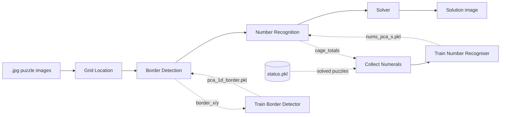
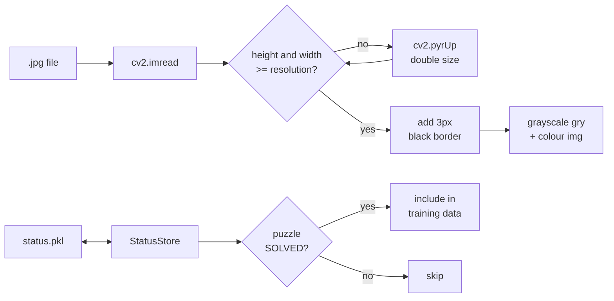
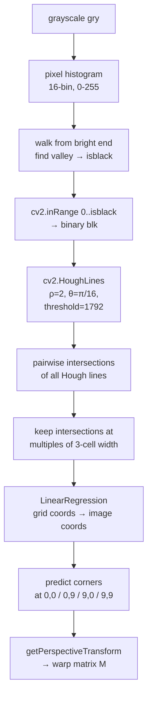
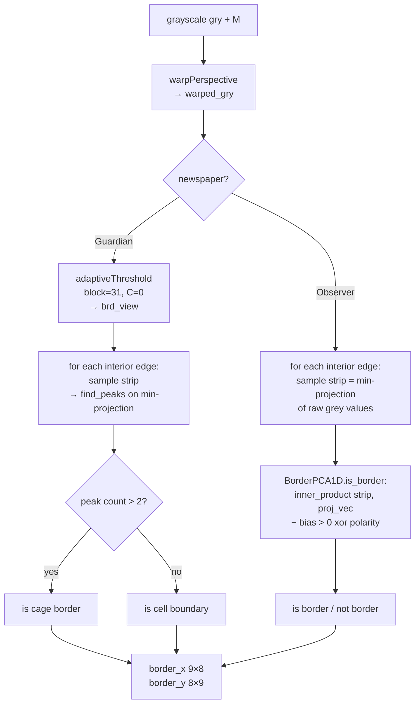
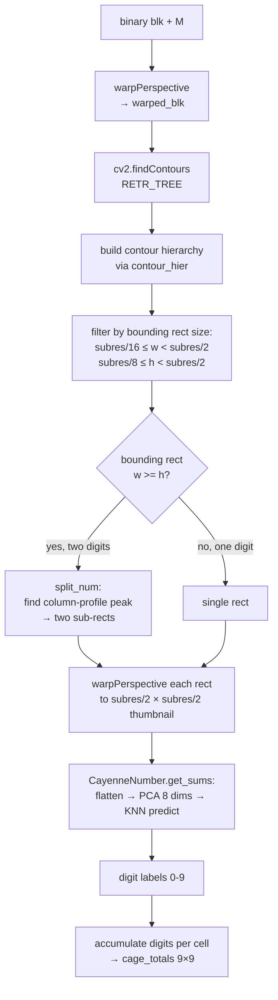
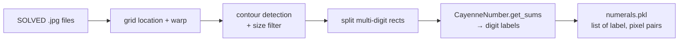
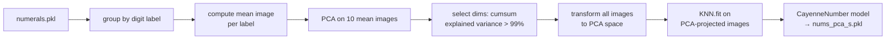

# Cagedoku Architecture

This document describes each processing stage as a self-contained unit: what goes in,
what comes out, how it works, and how any tuning parameters should be derived.

---

## System Overview

The system has two operating modes that share a common image-to-cage-data pipeline.

**Inference mode** (normal use): photograph → solved sudoku grid.

**Training mode**: human-verified solved puzzles → updated ML models → improved inference.

The feedback loop — training the recogniser on its own predictions from solved puzzles —
is a form of self-supervised learning. It only works once an initial model exists; the
existing `nums_pca_s.pkl` is the seed that starts the chain. Each solve improves the
training set, which improves the model, which improves solves.

---

## Stage 1: Image Acquisition and Status Tracking

Puzzle images are downloaded manually (or via `scrape_puzzles`) and stored as `.jpg`
files in `guardian/` or `observer/`. A companion `status.pkl` file maps each image path  # [gb] move pkl to something more robust - represent the path in an os-indpendent way?
to a string status label: `"SOLVED"`, `"CHEATED"` (CSP fallback used), `"ProcessingError"`,
or `"AssertionError"`. Only `"SOLVED"` puzzles are used as training data.  # [gb] could use "CHEATED" puzzles for training as well

`get_gry_img` reads a `.jpg`, upscales it with `cv2.pyrUp` until both dimensions exceed
the target resolution (1152 px by default), then adds a 3-pixel black border. The border
ensures Hough lines near the true image edge are picked up by the transform. It returns
both the grayscale and BGR versions.

**Parameters**: `resolution = 9 × subres = 1152 px`. Increasing `subres` gives more pixels
per cell — useful if digit images are blurry, at the cost of memory and compute.

---

## Stage 2: Grid Location

The goal is to find the four corners of the 9×9 grid in the photograph so the image
can be warped into a clean square. This uses the Hough line transform, which finds
straight lines as peaks in a 2D accumulator over (ρ, θ) space.

The grayscale image is first binarised: a pixel histogram identifies the darkest
significant tone (the grid lines), and `cv2.inRange` keeps only those dark pixels.
`cv2.HoughLines` then votes for lines. All pairwise line intersections are computed,
and only the 16 major intersections — those that align to multiples of 3 cell widths —
are kept. Linear regression maps (row, col) grid coordinates to (y, x) image
coordinates, and the four corners are the regression predictions at (0,0), (0,9),
(9,0), (9,9). These become the input to `cv2.getPerspectiveTransform`, producing
warp matrix **M**.

**Parameters and derivation:**

[gb] the threshold for the Hough line detection seems to be particularly fragile.  How can we improve this part of the detection process?

| Parameter | Value | Derivation |
|-----------|-------|------------|
| `rho` | 2 px | Line position resolution. Coarser than 1 px reduces noise sensitivity without losing precision. Should be ≤ line width (~3 px). |
| `theta_divisor` | 16 → θ=π/16 | Angular resolution. π/16 ≈ 11° steps. Coarse enough for speed; the actual grid lines are within ±1° of horizontal/vertical. |
| `hough_threshold` | 1792 | Minimum accumulator votes = minimum line length in pixels (at ρ=2 spacing). A 3-box grid segment is ~384 px / 2 ≈ 192 votes. 1792 is ~9× that, requiring lines spanning at least a full box row. **Derive as**: `int(resolution / (2 * rho))` — half the grid width in votes. |
| `isblack_offset` | 56 | After finding the histogram valley, back off by this many grey levels to account for JPEG compression smearing dark ink. **Derive as**: the mean difference between Otsu's optimal threshold and the histogram-valley estimate, measured on a representative image set. |

---

## Stage 3: Border Detection

Interior borders between cells are cage boundaries; the absence of a border means two
cells are in the same cage. There are `8 × 9 + 9 × 8 = 144` interior edges to classify.
For each, a pixel strip is sampled from the warped grayscale image, centred on the edge.

**Guardian** puzzles use cage borders made of thick dashed lines, which the adaptive
threshold turns into a distinctive multi-peak signal. The peak count in the sampled strip
distinguishes cage borders (≥ 3 peaks) from cell boundaries (≤ 2 peaks).

**Observer** puzzles use finer borders that are harder to distinguish by peak counting.
Instead, a trained `BorderPCA1D` model is used: pixel values along the strip are
projected onto a single discriminant axis (the product of two PCA stages, collapsed into
one inner product), and the sign of the result determines the border label.

[gb] Can we unify the way the detection is done?  Why doesn't the PCA transform work for the Guardian?

**Parameters and derivation:**

| Parameter | Value | Derivation |
|-----------|-------|------------|
| `adaptive_block_size` | 31 | Neighbourhood radius for adaptive threshold. Must be larger than the widest cage border (~5 px) but smaller than a cell (128 px). **Derive as**: `max(3, subres // 4)` rounded to nearest odd integer. |
| `adaptive_c` | 0 | Constant subtracted from the neighbourhood mean. Zero means threshold = mean. Increase if background is slightly darker than expected. |
| `sample_fraction` | 4 → ±32 px | Half-width of the sampled strip in px = `subres / 4`. Must cover the border line plus context, without reaching digit ink. **Derive as**: measure border width in pixels on representative images; set to ~6× that. |
| `sample_margin` | 16 → ±8 px | Pixels removed from each end of the strip (avoids sampling into the adjacent cell). **Derive as**: the minimum margin such that the sample never overlaps the adjacent digit region. |
| `> 2 peaks` | Guardian only | Non-border edges produce 0-2 peaks (just the strip edges); cage borders produce 3+. **Derive by**: plotting peak-count distributions for known-border vs. known-non-border strips from manually labelled images; the threshold sits between the two modes. |

---

## Stage 4: Number Recognition

Cage totals are printed in the top-left of the cage's top-left cell. Recognition has
two sub-steps: finding candidate digit regions (contour detection) and classifying each
digit (PCA + KNN).

The binary warped image is searched for contours using OpenCV's full hierarchy mode.
Candidate contours are filtered by bounding-box size: width between `subres/16` and
`subres/2`, height between `subres/8` and `subres/2`. This range admits digits but
rejects the grid lines themselves and stray specks. Wide bounding boxes (two adjacent
digits that merge in the contour tree) are split at the peak of the column profile.
Each digit thumbnail is warped to a canonical `(subres/2) × (subres/2)` square.

[gb] all the subres fractions are derived by trial and error.  Is there a better way?  How can we deal with rotated puzzles?
[gb] PCA + KNN does not seem to be as accurate as the literature suggest.  Is there a better way altogether?
[gb] the training is done by labelling clusters by hand.  Can we be cleverer about this, eg injecting some known integers into the process and seeing which cluster they end up in?

`CayenneNumber.get_sums` projects each flattened thumbnail through the trained PCA
transform (8 components), then classifies with the stored KNN.

**Parameters and derivation:**

| Parameter | Value | Derivation |
|-----------|-------|------------|
| `subres/16 ≤ w < subres/2` | 8–63 px | Width bounds for digit bounding rect. Lower bound excludes thin lines (~2 px). Upper bound excludes whole-cell features. **Derive by**: measuring actual digit widths in a representative image set; set bounds to 2× below minimum and 2× above maximum observed. |
| `subres/8 ≤ h < subres/2` | 16–63 px | Height bounds. Slightly taller lower bound than width (digits are taller than wide). Same derivation method. |
| `height=4` in `find_peaks` | 4 px | Minimum peak height when splitting two-digit bounding rects. Filters noise in the column profile. **Derive as**: the minimum ink density expected at the centre of a digit (empirically ~4 px at subres=128). |
| PCA dims | 8 (auto) | Chosen automatically as the minimum dims explaining 99% of variance in mean digit images. The 99% threshold is a standard heuristic; could be tuned by cross-validating KNN accuracy at 95%, 99%, 99.9%. |
| KNN k | 5 (default) | sklearn default. **Derive by**: k-fold cross-validation on `numerals.pkl`; plot accuracy vs. k and select the elbow. |

---

## Stage 5: Solving

The solver receives `cage_totals` (a 9×9 array where non-zero cells are cage heads) and
`brdrs` (a 9×9×4 boolean array of [up, right, down, left] borders per cell). It first
identifies connected regions (cages) using flood-fill through open borders, then applies
constraint propagation, and falls back to a generic CSP solver if propagation stalls.

Each cage becomes an `Equation` with a known sum and number of cells. `Equation.solve`
eliminates impossible digit combinations; `Equation.avoid` propagates exclusions from
other constraints. `Grid.solve` iterates until either all 81 cells have a unique value
(`alts_sum == 81`) or no further progress can be made. In the latter case,
`Grid.cheat_solve` hands the remaining partial assignment to `python-constraint`.

The solver has no tunable thresholds — it is exact by construction. The only soft
decision is the fallback trigger (`alts_sum != 81`), which is correct: if constraint
propagation does not uniquely determine all 81 cells, the CSP is the only sound fallback.

---

## Solver Rules Reference

This section enumerates every rule the solver applies, in the order they are applied
within `Grid.solve`. Rules marked **[MISSING]** are standard killer sudoku techniques
that are not yet implemented.

### Setup: equation generation (`Grid.set_up`)

**R1 — Row sum**: Each of the 9 rows must sum to 45 and contain each digit 1–9 exactly
once. One `Equation(row_cells, 45)` is created per row.

**R2 — Column sum**: Same as R1 for each of the 9 columns.

**R3 — Box sum**: Same as R1 for each of the nine 3×3 boxes.

**R4 — Cage sum**: Each cage must sum to its printed total and contain distinct digits.
One `Equation(cage_cells, total)` is created per cage.

**R5 — Row/column window equations** (`add_equns`): A sliding window scans each row and
column to derive partial-sum equations from cage coverage. When cage cells span a
contiguous run of rows (or columns), any excess cells that extend beyond a complete set
of rows/columns form a new equation with a known sum. This is the "innies and outies"
rule: e.g. if all cages in rows 1–3 are known except for one cell that bulges into row 4,
that cell's value equals (sum of those cages) − 3×45. The window runs in both directions
(forward and reversed) to catch both innie and outie cases.

**R6 — Box window equations** (`add_equns_r`): A recursive expansion from each 3×3 box
accumulates cage cells and subtracts completed boxes (each summing to 45). Any remaining
cells form a new equation. This generalises innies/outies to box clusters: e.g. if all
cages within a 2×3 block of boxes are fully contained except for some cells that cross
box boundaries, those boundary cells have a determined sum. The recursion expands into
adjacent boxes that overlap the current cover.

**R7 — Difference constraints** (`DFFS`): When `add_equns` finds that two consecutive
windows differ by exactly one cell on each side, the difference between those two cells
is fixed. Formally: if cover_A and cover_B satisfy `|A − B| == 1` and `|B − A| == 1`,
then `cell_in_A_only − cell_in_B_only = sum_A − sum_B`. These constraints are stored as
`(cell_p, cell_q, delta)` triples and applied in `elim_must` to restrict both cells
simultaneously.

**R8 — Equation reduction** (`reduce_equns`): Whenever one equation's cell set is a
strict subset of another's, the smaller equation is subtracted from the larger: the
larger equation's cells become the set difference and its sum is reduced accordingly.
For example, if a cage lies entirely within a row, subtracting the cage equation from
the row equation gives an equation over the remaining row cells with sum = 45 − cage_total.
This simplification is applied repeatedly until no further reduction is possible.

### Iteration: candidate filtering (`Grid.solve`)

**R9 — Cage candidate intersection**: For each cage equation, a cell's candidate set is
intersected with `equation.poss` (the union of all digits appearing in any valid
assignment for that cage). This prunes candidates that cannot appear in any valid cage
solution.

**R10 — Naked single**: When a cell has exactly one remaining candidate, that digit is
placed and removed from all other cells sharing a row, column, box, or cage.

**R11 — Solution map filtering**: For each cage, every remaining complete digit
assignment is tested against current cell candidates. Assignments that contain a digit
no longer in a cell's candidate set are pruned from `equation.solns`. Any digit that
is no longer present in any valid assignment is removed from that cell's candidates.

**R12 — Hidden single**: For each row, column, and box, if a digit appears in the
candidate set of exactly one cell in that unit, that cell must contain that digit (the
digit is a "hidden single" because other candidates in that cell are not yet eliminated).
A singleton cage equation is added to propagate the placement.

**R13 — Hidden pair**: For each row, column, and box, if two digits each appear in the
candidate sets of exactly the same two cells (and no other cells in the unit), those
two cells can only contain those two digits. All other candidates are removed from
those cells, and a new 2-cell cage equation with sum = digit1 + digit2 is added.

**R14 — Must-contain propagation** (`elim_must`): For every pair of overlapping
equation sets (ei, ej), if ei requires a digit (i.e. that digit appears in every valid
assignment for ei — the `must` set) but that digit cannot appear in ei's exclusive cells
(cells in ei but not in ej), then it also cannot appear in ej's exclusive cells. This
handles "locked candidates": e.g. if a cage's required digit is confined to cells that
are also in a particular row, that digit can be eliminated from all other cells in that
row. The comparison is done exhaustively across all equation pairs, including rows,
columns, boxes, and cage equations.

**R15 — Difference constraint application**: The `DFFS` difference constraints from R7
are applied in each `elim_must` pass: `cell_p` and `cell_q` are restricted to only
those values where `cell_p = cell_q + delta` for some `cell_q` value still in
`cell_q`'s candidate set.

---

### Rules Not Yet Implemented

The following standard techniques are absent from the constraint-propagation solver.
They are handled by the CSP fallback (`cheat_solve`) for puzzles that cannot be solved
by R1–R15, but implementing them in the propagation loop would reduce CSP fallback usage.

**[MISSING] Naked pair**: When exactly two cells in a unit share the same two
candidates and no others, those candidates can be removed from all other cells in the
unit. The current solver detects *hidden* pairs but not naked pairs from the opposite
direction.

**[MISSING] Naked triple / quad**: Generalisation of naked pair to three or four cells.

**[MISSING] X-Wing**: When a digit's candidates in two rows (or columns) are confined
to the same two columns (or rows), that digit can be eliminated from all other cells in
those columns (or rows).

**[MISSING] Swordfish / Jellyfish**: Generalisations of X-Wing to three or four rows/columns.

---

### Linear equation analysis

The solver already builds a rich set of linear equations over cell values. The `DFFS`
mechanism handles the 2-variable case (`x − y = k`). There is potential to go further:

**2-variable determined cells**: When any pair of equations yields `x − y = k` (after
reduction), the solver already captures this via DFFS. If either `x` or `y` is later
determined, the other is immediately known. This mechanism could be extended to detect
when a newly placed cell propagates a determination to its DFFS partner.

**Multi-variable linear systems**: The full set of equations (R1–R8) defines a linear
system over 81 variables with integer constraints. In principle, Gaussian elimination
over the integers could reduce this system to identify cells that are uniquely determined
by the linear structure alone — before any combinatorial search. This would be a
significant enhancement for densely-constrained puzzles.

**Sum-range pruning from linear combinations**: Given a set of simultaneous equations,
it may be possible to derive tighter bounds on individual cell values by summing
subsets of equations and applying the min/max possible values. For example, if
`x + y = 7` and `x + z = 10` and `y + z = 11`, then `2(x+y+z) = 28` so `x+y+z = 14`,
giving `z = 7`, `y = 4`, `x = 3`. The solver does not currently exploit such
multi-equation sum relations beyond what equation reduction (R8) provides.

---

## Training Pipeline

The training pipeline converts solved puzzles into updated ML models. It should be run
whenever new solved puzzles are available (i.e. after a batch of inference runs). The
four steps are independent except for the sequencing constraint: number recogniser
training requires solved puzzles (which requires a working number recogniser). The
first model was trained on manually labelled data; subsequent models are trained on
the outputs of the previous model applied to solved puzzles.

### T1: Collect Numerals

For each `SOLVED` puzzle, re-run contour detection on the raw image and classify each
digit thumbnail using the current model. The resulting `(label, pixel_image)` pairs are
saved to `numerals.pkl`.

### T2: Train Number Recogniser

Groups digit images by label, computes the per-label mean image, fits PCA on those 10
means (capturing what varies between digit classes), selects the minimum PCA dims
explaining 99% of variance, then trains a KNN on all images projected into that space.

### T3: Train Border Detector (Observer only)

Guardian borders are detected purely by peak counting — no training required.
For Observer, the `BorderPCA1D` is trained on SOLVED puzzles where the ground-truth
border map (`border_x`, `border_y`) is already known. Two PCA stages are fitted on
the raw pixel strips, then algebraically collapsed into a single inner product plus
scalar threshold. The threshold is biased 25% towards the non-border class to reduce
false negatives (missed borders are more damaging than false borders).

```mermaid
flowchart LR
    A[SOLVED Observer .jpg] --> B[grid location + warp]
    B --> C[sample strip per\ninterior edge]
    C --> D[split by known label\nbrdrs 0 = not border\nbrdrs 1 = border]
    D --> E[PCA stage 1 on\nbrdrs_0 strips]
    E --> F[discard first dims\n99% variance\nkeep residual]
    F --> G[PCA stage 2\non residual, 2 components]
    G --> H[find breakpoint:\n0.25×max_class0\n+ 0.75×min_class1]
    H --> I[collapse two PCA stages\nto single inner-product\n+ scalar bias]
    I --> J[BorderPCA1D model\n→ pca_1d_border.pkl]
```

---

## Threshold Derivation Guide

Most numeric thresholds in `config.py` were set empirically by visual inspection and
trial-and-error. This section explains how each should be derived systematically, so
that the pipeline can be adapted to new image sources or resolutions without guesswork.

### Principle: Parameters Should Scale with `subres`

Many thresholds that currently appear as raw integers are really fractions of the cell
size (`subres = 128`). When re-expressing them as ratios, their derivation becomes clear:

| Parameter | Current | As fraction of subres | Principled derivation |
|-----------|---------|----------------------|----------------------|
| `adaptive_block_size` | 31 | ~subres/4 | Must be larger than the widest border line and smaller than a cell. Measure border width → set to 6× border width, rounded to odd integer. |
| `sample_fraction` (→ ±32 px strip) | 4 | subres/4 | Must cover the border transition without entering the digit region. Measure border width → set strip half-width to ~8× border width. |
| `sample_margin` (→ ±8 px inset) | 16 | subres/16 | Prevents the strip from sampling the adjacent digit's ink. Set to the maximum x-offset of any digit pixel from the digit bounding box. |
| digit min width | subres/16 | subres/16 | Should be just below the narrowest digit (typically "1"). Measure on a sample set. |
| digit max width/height | subres/2 | subres/2 | Cage totals occupy the top-left quarter of a cell; subres/2 is a safe upper bound. |

### Hough Threshold (`hough_threshold = 1792`)

This controls how prominent a line must be to be accepted. Too low → noise lines
contaminate the intersection set; too high → real grid lines are missed.

**Derivation**: A full grid line of length L pixels contributes `L / rho` votes.
At `subres=128`, `resolution=1152`, `rho=2`: a full grid line gives 576 votes.
The threshold of 1792 requires lines spanning at least 3584 px / 2 ≈ three times the
grid width, which is impossible for a real line — this means the threshold was not
set by this formula and is in fact selecting much shorter features. The correct
derivation is:

1. Run `cv2.HoughLines` with a very low threshold on a representative image.
2. Plot the vote counts for lines that are true grid lines vs. noise.
3. Set the threshold at the valley between the two distributions.
4. Validate that all 20 grid lines are found on every training image.

### Black Threshold Offset (`isblack_offset = 56`)

The histogram valley finding selects the bin where count first rises from the dark end.
JPEG compression smears the darkest ink, so the true grid-line pixels are somewhat
brighter than the nominal black. The offset shifts the threshold up by 56 grey levels
to capture more of these smeared-ink pixels.

**Derivation**: measure the actual pixel values of grid-line centres vs. adjacent
background on a dozen representative images. Set the offset to the 95th percentile of
grid-line brightness minus the histogram-valley estimate.

### Guardian Border Peak Threshold (`> 2 peaks`)

Non-border inter-cell edges produce 0–2 peaks (at most the two edges of the sampling
strip). A cage border adds the distinctive thick-dashed pattern of the Guardian grid,
producing 3 or more distinct peaks in the adaptive-threshold image.

**Derivation**: on a set of manually labelled interior edges (border vs. not-border),
plot the peak-count distribution. The two classes should be well-separated; the
threshold is set at the natural gap between them. If the gap is narrow, try widening
the sampling strip (`sample_fraction`).

### Observer Border Breakpoint Bias (`p = 0.25`)

The BorderPCA1D threshold is placed 25% of the way from the non-border class maximum
to the border class minimum. This biases the detector towards false positives (claiming
a border exists when it does not) rather than false negatives (missing a real border).

**Rationale**: a missed border silently merges two cages, producing an unsolvable or
incorrectly-solved puzzle. A false border creates an impossible constraint that the
solver will detect as a `NoSolnError`. False positives are therefore recoverable; false
negatives are not.

**Derivation**: use a held-out set of labelled border strips. Compute the full precision-
recall curve and select `p` to meet the desired false-negative rate (e.g. < 1 in 1000
border positions missed).

### PCA Variance Threshold (99%)

The number of PCA components kept is chosen to explain 99% of variance in the mean
digit images (for the number recogniser) or in the raw border strips (for the border
detector stage 1). This is a conventional value; it can be tuned by cross-validation:
train KNN (or BorderPCA1D) at 90%, 95%, 99%, 99.5%, and plot accuracy on a held-out
set. The optimal value is typically 99% for this kind of data but may differ.
