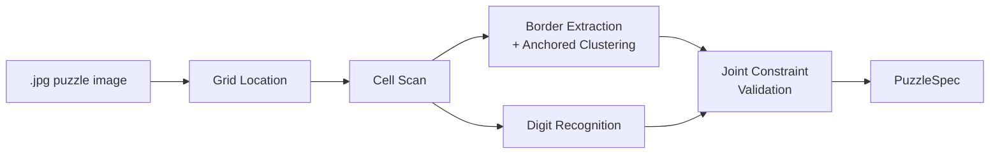
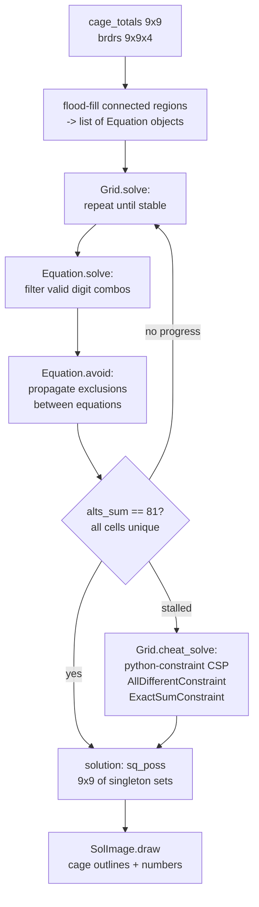

# Architecture

## Coaching Engine

The coaching engine is built on rules where each rule is derived from a class with
the following properties:

1. The constructor registers the rule in the rule database
2. There is a set of triggers which put the rule into the processing queue
3. There is an evaluation phase which determines where the rule applies and generates
   the set of solution state updates that the application would cause (this can be
   shared between hint and apply)
4. There is a hint method which forms a hint from the application state
5. There is an apply method which applies the generated updates

Each rule is configured to be auto-apply or hint-only.

The work queue contains rules which have triggered.  The queue is used in two modes:

1. In autonomous mode, all rules in the queue are processed until there are no more
2. In interactive mode, all auto-apply rules are drained from the queue, leaving
   hint-only rules (unless the puzzle is fully solved) and the user has the option
   which rule to apply, whether to apply it automatically or by hand or to ignore
   the hints and go ahead with their changes.

Possible puzzle state changes are:

1. Solve a cell
2. Remove a candidate from a cell
3. Remove a solution from a cage
4. Add a virtual cage — this probably needs CellElimination or SolutionMap to be
   applied to check that some actions from 1–3 above are triggered

The application of a puzzle state change updates the trigger state and adds any
triggered rules to the queue.

It is important to maintain as much sharing as possible between the autonomous and
interactive modes in order to assure correctness of the interactive mode.

---

## TypeScript Array Conventions

All 2-D arrays in the TypeScript codebase (`web/src/`) use **row-major `[row][col]`
ordering**, where `row` is the 0-based canvas row (y-axis, top = 0) and `col` is the
0-based canvas column (x-axis, left = 0).

This applies to every named array in `PuzzleSpec`, `BoardState`, and the engine:

| Array | Type | Convention |
|---|---|---|
| `PuzzleSpec.regions` | `number[][]` | `regions[row][col]` — 1-based cage index |
| `PuzzleSpec.cageTotals` | `number[][]` | `cageTotals[row][col]` — 0 except at cage head |
| `PuzzleSpec.borderX` | `boolean[][]` | `borderX[col][rowGap]` — wall between rows `rowGap` / `rowGap+1` in column `col` (shape 9×8) |
| `PuzzleSpec.borderY` | `boolean[][]` | `borderY[colGap][row]` — wall between cols `colGap` / `colGap+1` in row `row` (shape 8×9) |
| `BoardState.candidates` | `Set<number>[][]` | `candidates[row][col]` — remaining digit set |
| `BoardState.regions` | `number[][]` | `regions[row][col]` — 0-based cage index |
| `Cell` (engine type) | `[number, number]` | `[row, col]` — 0-based |

**Why the `[col][row]` comments in some source files are misleading:**
The internal helper `buildCageTotals` (in `inpImage.ts`) processes contours in
x-order and stores intermediate pixel data with `numPixels[col][row]`, but its
*reading* loop is transposed (`numPixels[row][col]`), yielding a `cageTotals`
array that is effectively `[row][col]`. The `[col][row]` annotation in the
`PuzzleSpec` interface is therefore incorrect and should be read as `[row][col]`.
The `borderX`/`borderY` annotations are correct; their shape alone (9×8 and 8×9)
distinguishes them from the square region/total arrays.

**No transposition at any boundary:** Python `PuzzleSpec` (NumPy, row-major) maps
directly to TypeScript `PuzzleSpec` without transposition. The frontend canvas
also reads `spec_data.regions[row][col]` row-major. No coordinate flip occurs at
any stage of the pipeline.

---

## UI

See **`docs/ui.md`** for the full UI specification: screen flow, component
descriptions, interaction design, help facilities, and known UI issues.

---

## Image Pipeline

The image pipeline converts a photograph of a killer or classic sudoku puzzle into a
`PuzzleSpec` (cage layout and totals) consumed by the solver and coaching engine.  It
is **format-agnostic**: no newspaper-specific configuration or pre-trained border
model is required.

See **`docs/image-pipeline.md`** for the full pipeline architecture, stage
descriptions, training pipeline (T1/T2), threshold derivation guide, and migration plan.
The [Training Pipeline](image-pipeline.md#training-pipeline) section covers the T1
(collect numerals) and T2 (fit PCA + classifier) steps in detail.

See **`docs/superpowers/specs/2026-04-08-bundled-number-recogniser-design.md`** for
the number recogniser sub-spec: RBFClassifier design, `.npz` bundle layout, inference
protocol, save/load contract, and re-training workflow.

### Web Recogniser Training

The web app uses a browser-side image pipeline with a bundled HOG + LinearSVC model
in `web/public/num_recogniser.{json,bin}`.  After a user corrects OCR errors and
confirms a puzzle, the app exports a training JSON file with digit thumbnails paired
with user-verified labels, accumulated in `web/browser_train.json`.

To retrain from accumulated browser data:

```bash
python web/train_recogniser.py --no-synthetic --svm-c 100000 web/browser_train.json
# Writes updated web/public/num_recogniser.{json,bin}
```

The script (`web/train_recogniser.py`):
1. Loads labelled digit thumbnails (64×64 binary, uint8) from `browser_train.json`
2. Optionally generates synthetic font samples (disabled with `--no-synthetic`)
3. Applies dithering (translation ±2 px, morphological step, 1% pixel noise)
4. Extracts HOG features — 64 px window / 8 px cells / 16 px blocks / 9 bins = 1764 dims
5. Fits a LinearSVC OvO classifier (45 binary SVMs for digits 0–9)
6. Saves updated model files; the web app picks them up on next page reload

`--svm-c 100000` forces memorisation of all browser samples (correct for small
datasets, < 100 samples).  For larger browser + synthetic mixes use
`--svm-c 100 --browser-weight 1000` instead.

See **`docs/classic-sudoku.md`** for the classic sudoku recognition feature design
(puzzle type detection, center digit reading, locked given digits, cage-structure
suppression in the UI).



---

## Solving

The image pipeline output (`PuzzleSpec` — cage layout + totals) is consumed by two
independent solvers that serve different purposes:

**Batch solver** (`solver/grid.py`, `solver/equation.py`): used for the original
command-line workflow and as the golden-solution oracle for the coaching app.  Runs
constraint propagation to completion and falls back to a CSP solver if it stalls.

**Coaching engine** (`web/src/engine/`): used by the web app for interactive
candidate tracking and hint generation.  Event-driven, rule-based, designed for
partial application and incremental updates.  Does not solve to completion.

The batch solver receives `cage_totals` (a 9×9 array where non-zero cells are cage
heads) and `brdrs` (a 9×9×4 boolean array of [up, right, down, left] borders per
cell).  It first identifies connected regions (cages) using flood-fill through open
borders, then applies constraint propagation, and falls back to a generic CSP solver
if propagation stalls.

Each cage becomes an `Equation` with a known sum and number of cells.
`Equation.solve` eliminates impossible digit combinations; `Equation.avoid` propagates
exclusions from other constraints.  `Grid.solve` iterates until either all 81 cells
have a unique value (`alts_sum == 81`) or no further progress can be made.  In the
latter case, `Grid.cheat_solve` hands the remaining partial assignment to
`python-constraint`.



The solver has no tunable thresholds — it is exact by construction.

---

## Rule Contract

All solver rules live in `web/src/engine/rules/`.  Every rule implements the
`SolverRule` interface (`web/src/engine/rule.ts`):

```typescript
interface SolverRule {
  readonly name: string;           // matches class name exactly
  readonly description: string;    // shown in the config modal (i) tooltip
  readonly priority: number;       // lower = higher priority = fired first
  readonly triggers: ReadonlySet<Trigger>;
  readonly unitKinds: ReadonlySet<UnitKind>; // empty = GLOBAL or cell-scoped

  apply(ctx: RuleContext): RuleResult;
  asHints(ctx: RuleContext, eliminations: readonly Elimination[]): HintResult[];
}
```

**`apply(ctx)`** must be pure — it reads `ctx.board` and returns a `RuleResult`
(eliminations, placements, solution eliminations, virtual cage additions).  It
must not mutate board state.

**`asHints(ctx, eliminations)`** converts the same deduction into human-readable
`HintResult[]` for the coaching UI.  It receives the eliminations that `apply()`
just produced, so both paths share the same detection logic.  Return `[]` if the
rule should not surface hints (always-apply-only rules).

**`RuleResult`** (`web/src/engine/types.ts`):

```typescript
interface RuleResult {
  eliminations:        readonly Elimination[];          // { cell, digit }
  placements:          readonly Placement[];            // { cell, digit }
  solutionEliminations: readonly SolutionElimination[]; // { cageIdx, solution }
  virtualCageAdditions: readonly VirtualCageAddition[]; // { cells, total }
}
```

Use `emptyResult()` to return no progress.

**`HintResult`** (`web/src/engine/hint.ts`):

```typescript
interface HintResult {
  ruleName:     string;
  displayName:  string;
  explanation:  string;                              // plain English; use cellLabel()
  highlightCells: readonly Cell[];                   // 0-based [row, col]
  eliminations: readonly Elimination[];
  placement:    readonly [number, number, number] | null;  // [row, col, digit] or null
  virtualCageSuggestion: readonly [readonly Cell[], number] | null;
}
```

**Adding a new rule:**

1. Create `web/src/engine/rules/<camelCaseName>.ts` — one class per file.
2. Implement `SolverRule`.  Import types from `../types.js`, `../rule.js`, `../hint.js`.
3. Add it to `defaultRules()` in `web/src/engine/rules/index.ts` at the right priority.
4. Co-locate tests as `<camelCaseName>.test.ts` using `makeTrivialSpec()` from
   `web/src/engine/fixtures.ts`.
5. Use `cellLabel([row, col])` from `web/src/engine/rules/_labels.ts` for all
   cell references in hint explanations — never inline `r${r+1}c${c+1}`.

The priority order and trigger assignments for all active rules are listed in the
comment block at the top of `web/src/engine/rules/index.ts`.
