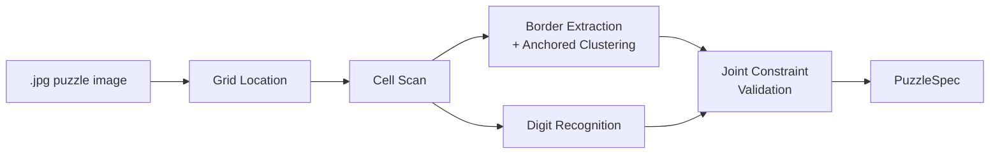
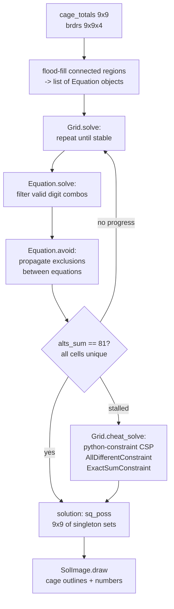
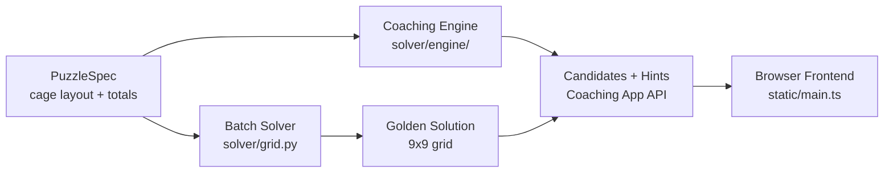

# Architecture

## Coaching Engine

The coaching engine is built on rules where each rule is derived from a class with
the following properties:

1. The constructor registers the rule in the rule database
2. There is a set of triggers which put the rule into the processing queue
3. There is an evaluation phase which determines where the rule applies and generates
   the set of solution state updates that the application would cause (this can be
   shared between hint and apply)
4. There is a hint method which forms a hint from the application state
5. There is an apply method which applies the generated updates

Each rule is configured to be auto-apply or hint-only.

The work queue contains rules which have triggered.  The queue is used in two modes:

1. In autonomous mode, all rules in the queue are processed until there are no more
2. In interactive mode, all auto-apply rules are drained from the queue, leaving
   hint-only rules (unless the puzzle is fully solved) and the user has the option
   which rule to apply, whether to apply it automatically or by hand or to ignore
   the hints and go ahead with their changes.

Possible puzzle state changes are:

1. Solve a cell
2. Remove a candidate from a cell
3. Remove a solution from a cage
4. Add a virtual cage — this probably needs CellElimination or SolutionMap to be
   applied to check that some actions from 1–3 above are triggered

The application of a puzzle state change updates the trigger state and adds any
triggered rules to the queue.

It is important to maintain as much sharing as possible between the autonomous and
interactive modes in order to assure correctness of the interactive mode.

---

## UI Updates

1. The flow in the UI should remove the puzzle selection widget once a puzzle has
   been selected and the image processing is successful.
2. Once a cell is selected, navigate around cells using arrow keys.
3. Classic sudoku recognition and coaching are in progress; see `docs/image-pipeline.md`
   for the image pipeline design and the migration plan.
4. There is a bug in the virtual cage addition — typing the total puts the last digit
   of the total into the last selected cage cell.
5. The configuration screen should have an (i) info modal that can be popped out to
   explain what each rule does.

---

## Image Pipeline

The image pipeline converts a photograph of a killer or classic sudoku puzzle into a
`PuzzleSpec` (cage layout and totals) consumed by the solver and coaching engine.  It
is **format-agnostic**: no newspaper-specific configuration or pre-trained border
model is required.

See **`docs/image-pipeline.md`** for the full pipeline architecture, stage
descriptions, training pipeline, threshold derivation guide, and migration plan.

---

## Solving

The image pipeline output (`PuzzleSpec` — cage layout + totals) is consumed by two
independent solvers that serve different purposes:

**Batch solver** (`solver/grid.py`, `solver/equation.py`): used for the original
command-line workflow and as the golden-solution oracle for the coaching app.  Runs
constraint propagation to completion and falls back to a CSP solver if it stalls.

**Coaching engine** (`solver/engine/`): used by the coaching app for interactive
candidate tracking and hint generation.  Event-driven, rule-based, designed for
partial application and incremental updates.  Does not solve to completion.
See `docs/rules.md`.

The batch solver receives `cage_totals` (a 9×9 array where non-zero cells are cage
heads) and `brdrs` (a 9×9×4 boolean array of [up, right, down, left] borders per
cell).  It first identifies connected regions (cages) using flood-fill through open
borders, then applies constraint propagation, and falls back to a generic CSP solver
if propagation stalls.

Each cage becomes an `Equation` with a known sum and number of cells.
`Equation.solve` eliminates impossible digit combinations; `Equation.avoid` propagates
exclusions from other constraints.  `Grid.solve` iterates until either all 81 cells
have a unique value (`alts_sum == 81`) or no further progress can be made.  In the
latter case, `Grid.cheat_solve` hands the remaining partial assignment to
`python-constraint`.

The solver has no tunable thresholds — it is exact by construction.

---

## Solver Rules Reference

[gb] This section should be changed at some point...  Each rule should be self-documenting in the config tab of the UI so we shouldn't need a reference in a doc.

This section enumerates every rule the solver applies, in the order they are applied
within `Grid.solve`.  Rules marked **[MISSING]** are standard killer sudoku techniques
not yet implemented.

### Setup: equation generation (`Grid.set_up`)

**R1 — Row sum**: Each of the 9 rows must sum to 45 and contain each digit 1–9 exactly
once.  One `Equation(row_cells, 45)` is created per row.

**R2 — Column sum**: Same as R1 for each of the 9 columns.

**R3 — Box sum**: Same as R1 for each of the nine 3×3 boxes.

**R4 — Cage sum**: Each cage must sum to its printed total and contain distinct digits.
One `Equation(cage_cells, total)` is created per cage.

**R5 — Row/column window equations** (`add_equns`): A sliding window scans each row
and column to derive partial-sum equations from cage coverage.  When cage cells span
a contiguous run of rows (or columns), any excess cells that extend beyond a complete
set of rows/columns form a new equation with a known sum.  This is the "innies and
outies" rule: e.g. if all cages in rows 1–3 are known except for one cell that bulges
into row 4, that cell's value equals (sum of those cages) minus 3×45.  The window runs
in both directions to catch both innie and outie cases.

**R6 — Box window equations** (`add_equns_r`): A recursive expansion from each 3×3
box accumulates cage cells and subtracts completed boxes (each summing to 45).  Any
remaining cells form a new equation.  This generalises innies/outies to box clusters.
The recursion expands into adjacent boxes that overlap the current cover.

**R7 — Difference constraints** (`DFFS`): When `add_equns` finds that two consecutive
windows differ by exactly one cell on each side, the difference between those two cells
is fixed.  Formally: if cover_A and cover_B satisfy `|A - B| == 1` and `|B - A| == 1`,
then `cell_in_A_only - cell_in_B_only = sum_A - sum_B`.  These constraints are stored
as `(cell_p, cell_q, delta)` triples and applied in `elim_must`.

**R8 — Equation reduction** (`reduce_equns`): Whenever one equation's cell set is a
strict subset of another's, the smaller equation is subtracted from the larger.  The
larger equation's cells become the set difference and its sum is reduced accordingly.
Applied repeatedly until no further reduction is possible.

### Iteration: candidate filtering (`Grid.solve`)

**R9 — Cage candidate intersection**: For each cage equation, a cell's candidate set
is intersected with `equation.poss` (the union of all digits appearing in any valid
assignment for that cage).  Prunes candidates that cannot appear in any valid cage
solution.

**R10 — Naked single**: When a cell has exactly one remaining candidate, that digit is
placed and removed from all other cells sharing a row, column, box, or cage.

**R11 — Solution map filtering**: For each cage, every remaining complete digit
assignment is tested against current cell candidates.  Assignments containing a digit
no longer in a cell's candidate set are pruned from `equation.solns`.  Any digit no
longer present in any valid assignment is removed from that cell's candidates.

**R12 — Hidden single**: For each row, column, and box, if a digit appears in the
candidate set of exactly one cell in that unit, that cell must contain that digit.  A
singleton cage equation is added to propagate the placement.

**R13 — Hidden pair**: For each row, column, and box, if two digits each appear in the
candidate sets of exactly the same two cells (and no others in the unit), those two
cells can only contain those two digits.  All other candidates are removed and a new
2-cell cage equation is added.

**R14 — Must-contain propagation** (`elim_must`): For every pair of overlapping
equation sets (ei, ej), if ei requires a digit (it appears in every valid assignment
for ei — the `must` set) but that digit cannot appear in ei's exclusive cells (cells
in ei but not ej), then it also cannot appear in ej's exclusive cells.  Handles
"locked candidates": e.g. if a cage's required digit is confined to cells also in a
particular row, that digit can be eliminated from all other cells in that row.

**R15 — Difference constraint application**: The `DFFS` difference constraints from R7
are applied in each `elim_must` pass: `cell_p` and `cell_q` are restricted to only
those values where `cell_p = cell_q + delta` for some `cell_q` value still in
`cell_q`'s candidate set.

### Rules Not Yet Implemented

**[MISSING] Naked pair**: When exactly two cells in a unit share the same two
candidates and no others, those candidates can be removed from all other cells in the
unit.  The current solver detects hidden pairs but not naked pairs.

**[MISSING] Naked triple / quad**: Generalisation of naked pair to three or four cells.

**[MISSING] X-Wing**: When a digit's candidates in two rows are confined to the same
two columns (or vice versa), that digit can be eliminated from all other cells in those
columns (or rows).

**[MISSING] Swordfish / Jellyfish**: Generalisations of X-Wing to three or four
rows/columns.

### Linear equation analysis

The solver builds a rich set of linear equations over cell values.  The `DFFS`
mechanism handles the 2-variable case (`x - y = k`).

**Multi-variable linear systems**: the full set of equations (R1–R8) defines a linear
system over 81 variables with integer constraints.  Gaussian elimination over the
integers could reduce this system to identify cells uniquely determined by linear
structure alone, before any combinatorial search.

**Sum-range pruning from linear combinations**: given simultaneous equations it may
be possible to derive tighter bounds on individual cell values by summing subsets and
applying min/max possible values.  The solver does not currently exploit such
multi-equation sum relations beyond what equation reduction (R8) provides.

---

## Coaching Layer

The image pipeline output (`PuzzleSpec`) feeds into a browser-based coaching app that
guides the user through solving interactively.  The coaching layer is a separate system
built on top of the image pipeline and sits alongside (not inside) the batch solver.

The coaching layer has its own architecture documentation:

- **`docs/COACH.md`** — session lifecycle, state model, API reference, frontend,
  known design issues
- **`docs/rules.md`** — coaching engine rules, hint system, trigger types,
  how to add or upgrade rules
