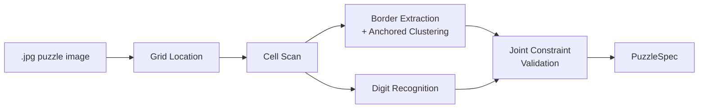
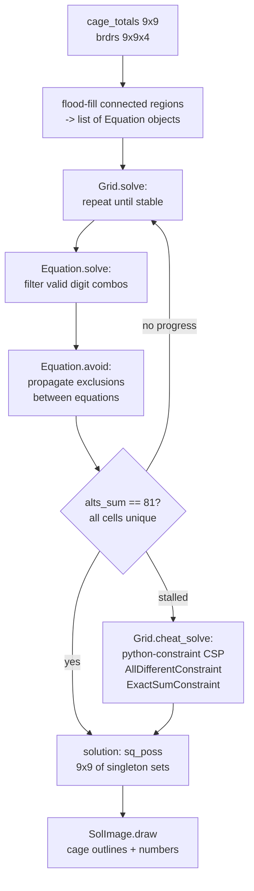

# Architecture

## Coaching Engine

The coaching engine is built on rules where each rule is derived from a class with
the following properties:

1. The constructor registers the rule in the rule database
2. There is a set of triggers which put the rule into the processing queue
3. There is an evaluation phase which determines where the rule applies and generates
   the set of solution state updates that the application would cause (this can be
   shared between hint and apply)
4. There is a hint method which forms a hint from the application state
5. There is an apply method which applies the generated updates

Each rule is configured to be auto-apply or hint-only.

The work queue contains rules which have triggered.  The queue is used in two modes:

1. In autonomous mode, all rules in the queue are processed until there are no more
2. In interactive mode, all auto-apply rules are drained from the queue, leaving
   hint-only rules (unless the puzzle is fully solved) and the user has the option
   which rule to apply, whether to apply it automatically or by hand or to ignore
   the hints and go ahead with their changes.

Possible puzzle state changes are:

1. Solve a cell
2. Remove a candidate from a cell
3. Remove a solution from a cage
4. Add a virtual cage — this probably needs CellElimination or SolutionMap to be
   applied to check that some actions from 1–3 above are triggered

The application of a puzzle state change updates the trigger state and adds any
triggered rules to the queue.

It is important to maintain as much sharing as possible between the autonomous and
interactive modes in order to assure correctness of the interactive mode.

---

## TypeScript Array Conventions

All 2-D arrays in the TypeScript codebase (`web/src/`) use **row-major `[row][col]`
ordering**, where `row` is the 0-based canvas row (y-axis, top = 0) and `col` is the
0-based canvas column (x-axis, left = 0).

This applies to every named array in `PuzzleSpec`, `BoardState`, and the engine:

| Array | Type | Convention |
|---|---|---|
| `PuzzleSpec.regions` | `number[][]` | `regions[row][col]` — 1-based cage index |
| `PuzzleSpec.cageTotals` | `number[][]` | `cageTotals[row][col]` — 0 except at cage head |
| `PuzzleSpec.borderX` | `boolean[][]` | `borderX[col][rowGap]` — wall between rows `rowGap` / `rowGap+1` in column `col` (shape 9×8) |
| `PuzzleSpec.borderY` | `boolean[][]` | `borderY[colGap][row]` — wall between cols `colGap` / `colGap+1` in row `row` (shape 8×9) |
| `BoardState.candidates` | `Set<number>[][]` | `candidates[row][col]` — remaining digit set |
| `BoardState.regions` | `number[][]` | `regions[row][col]` — 0-based cage index |
| `Cell` (engine type) | `[number, number]` | `[row, col]` — 0-based |

**Why the `[col][row]` comments in some source files are misleading:**
The internal helper `buildCageTotals` (in `inpImage.ts`) processes contours in
x-order and stores intermediate pixel data with `numPixels[col][row]`, but its
*reading* loop is transposed (`numPixels[row][col]`), yielding a `cageTotals`
array that is effectively `[row][col]`. The `[col][row]` annotation in the
`PuzzleSpec` interface is therefore incorrect and should be read as `[row][col]`.
The `borderX`/`borderY` annotations are correct; their shape alone (9×8 and 8×9)
distinguishes them from the square region/total arrays.

**No transposition at any boundary:** Python `PuzzleSpec` (NumPy, row-major) maps
directly to TypeScript `PuzzleSpec` without transposition. The frontend canvas
also reads `spec_data.regions[row][col]` row-major. No coordinate flip occurs at
any stage of the pipeline.

---

## UI

See **`docs/ui.md`** for the full UI specification: screen flow, component
descriptions, interaction design, help facilities, and known UI issues.

---

## Image Pipeline

The image pipeline converts a photograph of a killer or classic sudoku puzzle into a
`PuzzleSpec` (cage layout and totals) consumed by the solver and coaching engine.  It
is **format-agnostic**: no newspaper-specific configuration or pre-trained border
model is required.

See **`docs/image-pipeline.md`** for the full pipeline architecture, stage
descriptions, training pipeline, threshold derivation guide, and migration plan.

See **`docs/superpowers/specs/2026-04-08-bundled-number-recogniser-design.md`** for
the number recogniser sub-spec: RBFClassifier design, `.npz` bundle layout, inference
protocol, save/load contract, and re-training workflow.

See **`docs/classic-sudoku.md`** for the classic sudoku recognition feature design
(puzzle type detection, center digit reading, locked given digits, cage-structure
suppression in the UI).



---

## Solving

The image pipeline output (`PuzzleSpec` — cage layout + totals) is consumed by two
independent solvers that serve different purposes:

**Batch solver** (`solver/grid.py`, `solver/equation.py`): used for the original
command-line workflow and as the golden-solution oracle for the coaching app.  Runs
constraint propagation to completion and falls back to a CSP solver if it stalls.

**Coaching engine** (`solver/engine/`): used by the coaching app for interactive
candidate tracking and hint generation.  Event-driven, rule-based, designed for
partial application and incremental updates.  Does not solve to completion.
See `docs/rules.md`.

The batch solver receives `cage_totals` (a 9×9 array where non-zero cells are cage
heads) and `brdrs` (a 9×9×4 boolean array of [up, right, down, left] borders per
cell).  It first identifies connected regions (cages) using flood-fill through open
borders, then applies constraint propagation, and falls back to a generic CSP solver
if propagation stalls.

Each cage becomes an `Equation` with a known sum and number of cells.
`Equation.solve` eliminates impossible digit combinations; `Equation.avoid` propagates
exclusions from other constraints.  `Grid.solve` iterates until either all 81 cells
have a unique value (`alts_sum == 81`) or no further progress can be made.  In the
latter case, `Grid.cheat_solve` hands the remaining partial assignment to
`python-constraint`.



The solver has no tunable thresholds — it is exact by construction.

---

## Coaching App

The coaching app (`api/`, `static/`) bridges the image pipeline and coaching engine
with a browser-based interactive UI.

### Design Principles

The coach is organised around **rules and highlights**:

- **Always-apply rules** run automatically on every state change, keeping
  candidates current without user intervention.
- **Hint-only rules** are surfaced on demand when the user requests hints.
  They do not modify the board automatically.

**Essential highlight** (salmon colour): digits that must appear in a cage
regardless of which valid solution is chosen. Computed automatically from cage
solutions; configurable (show/hide) via the config modal.

**User actions** are limited to three things:
1. Enter a digit in a cell (or clear it)
2. Eliminate or restore a candidate digit in a cell
3. Eliminate or restore a solution combination for a cage

**Auto-application** is bootstrapped by two always-apply rules:
1. `CageCandidateFilter` — narrows each cell's candidates to the union of its
   cage's remaining solutions
2. `SolvedCellElimination` — eliminates a determined digit from all row/col/box
   peers

All other rules are hint-only by default. Users can promote rules to always-apply
via the config modal.

### Session Lifecycle

```
POST /api/puzzle?newspaper=guardian  (upload image)
         │
         ▼
   OCR Review Phase
   ─────────────────────────────────────────────────────
   User edits cage totals, subdivides cages
   PATCH /api/puzzle/{id}/cage/{label}
   POST  /api/puzzle/{id}/cage/{label}/subdivide
   POST  /api/puzzle/{id}/solve  (optional preview solve)
         │
         │  POST /api/puzzle/{id}/confirm
         ▼
   Playing Phase
   ─────────────────────────────────────────────────────
   Golden solution computed; candidate grid initialised
   POST /api/puzzle/{id}/cell              enter/clear a digit
   POST /api/puzzle/{id}/undo              undo last digit entry
   POST /api/puzzle/{id}/candidates/cell   cycle a candidate
   GET  /api/puzzle/{id}/cage/{l}/solutions          view solutions
   POST /api/puzzle/{id}/cage/{l}/solutions/eliminate toggle elimination
   GET  /api/puzzle/{id}/hints             get applicable hints
   POST /api/puzzle/{id}/hints/apply       apply a hint's eliminations
   POST /api/puzzle/{id}/refresh           recompute candidates from settings
```

Sessions are identified by UUID and persisted as JSON files in the sessions
directory (default: `sessions/`). The full session state is `PuzzleState`.

### State Model

All types are in `killer_sudoku/api/schemas.py`.

**`PuzzleState`** — complete session state

| Field | Type | Notes |
|---|---|---|
| `session_id` | `str` | UUID |
| `newspaper` | `"guardian"` \| `"observer"` | determines OCR model |
| `cages` | `list[CageState]` | label, total, cells, subdivisions, user-eliminated solutions |
| `spec_data` | `PuzzleSpecData` | serialised `PuzzleSpec` arrays for canvas rendering |
| `original_image_b64` | `str` | base64 JPEG of uploaded photo |
| `golden_solution` | `list[list[int]] \| None` | None before /confirm; 9×9 after |
| `user_grid` | `list[list[int]] \| None` | None before /confirm; 0 = unfilled cell |
| `move_history` | `list[MoveRecord]` | chronological digit entries/clears |
| `candidate_grid` | `CandidateGrid \| None` | None before /confirm |

**`CoachSettings`** — persisted user preferences

`always_apply_rules: list[str]` — names of rules applied automatically on every
state change. Stored in `sessions/settings.json` (or `COACH_SESSIONS_DIR`).

`show_essential: bool` — whether to render essential digits in salmon (default
`true`). Toggled via the config modal.

`DEFAULT_ALWAYS_APPLY_RULES` in `schemas.py` is the cold-start value:
`["CageCandidateFilter", "SolvedCellElimination"]`.

### Rules and Hints Integration

The coaching app touches the rules engine at three points in
`api/routers/puzzle.py`:

**1. Candidate computation** (`_build_engine`): called after every state change
(`/cell`, `/undo`, `/candidates/cell`, `/confirm`, `/refresh`). Builds a fresh
board, runs always-apply rules to convergence, then derives `auto_candidates`
and `auto_essential` per cell.

**2. Hint collection** (`GET /{id}/hints`): rebuilds board state, runs
always-apply rules, then reads `engine.pending_hints` — hint-only rules buffer
their results here during the solve loop rather than applying them. This ensures
the coaching and batch solver code paths share the same rule logic.

**3. Config modal** (`GET /api/settings`): returns all hintable rules with their
`display_name` and `description` fields. No hardcoded rule list anywhere in the
API or frontend.

For the full rules architecture — triggers, `HintResult`, `BoardState` API,
how to add or upgrade a rule — see `docs/rules.md`.

### API Reference

All endpoints are under `/api/`. Full request/response schemas at
`http://127.0.0.1:8000/docs`.

**Settings**

| Method | Path | Purpose |
|---|---|---|
| `GET` | `/api/settings` | Current settings + catalogue of all hintable rules (with descriptions) |
| `PATCH` | `/api/settings` | Update `always_apply_rules` and `show_essential` |

**Puzzle — OCR review phase**

| Method | Path | Purpose |
|---|---|---|
| `POST` | `/api/puzzle?newspaper=...` | Upload image; run OCR; create session |
| `GET` | `/api/puzzle/{id}` | Get full `PuzzleState` |
| `PATCH` | `/api/puzzle/{id}/cage/{label}` | Correct cage total |
| `POST` | `/api/puzzle/{id}/cage/{label}/subdivide` | Split cage into sub-cages |
| `POST` | `/api/puzzle/{id}/solve` | Run batch solver; return golden solution |
| `POST` | `/api/puzzle/{id}/confirm` | Confirm layout; transition to playing phase |

**Puzzle — playing phase**

| Method | Path | Purpose |
|---|---|---|
| `POST` | `/api/puzzle/{id}/cell` | Enter or clear a digit |
| `POST` | `/api/puzzle/{id}/undo` | Undo last digit entry |
| `POST` | `/api/puzzle/{id}/candidates/cell` | Cycle one candidate (possible ↔ removed) |
| `POST` | `/api/puzzle/{id}/refresh` | Recompute candidates from current settings |
| `GET` | `/api/puzzle/{id}/cage/{label}/solutions` | All/impossible/user-eliminated solutions |
| `POST` | `/api/puzzle/{id}/cage/{label}/solutions/eliminate` | Toggle a cage solution |
| `GET` | `/api/puzzle/{id}/hints` | All currently applicable hints, sorted by impact |
| `POST` | `/api/puzzle/{id}/hints/apply` | Apply a hint's eliminations to candidate grid |

### Frontend

**Source:** `killer_sudoku/static/main.ts` (TypeScript, committed).  
**Compiled output:** `killer_sudoku/static/main.js` (NOT committed — generate before running).

```bash
npm install -g typescript   # once
tsc                         # from project root
```

The frontend is intentionally thin. It handles:
- Canvas rendering: grid lines, cage borders, digit entries, candidates,
  essential highlights
- User interactions: digit entry, arrow-key navigation, candidate cycling, undo
- Config modal: reads hintable rules from `GET /api/settings`, POSTs updates
- Hint dropdown: reads hints from `GET /api/puzzle/{id}/hints`, POSTs applies

All business logic lives on the server.

### Developer Setup

```bash
pip install -e ".[dev]"
tsc                     # compile TypeScript (required before first run)
coach                   # start server + open browser
coach --no-browser      # start server only
# API:      http://127.0.0.1:8000
# OpenAPI:  http://127.0.0.1:8000/docs
```

Environment overrides:

| Variable | Default | Purpose |
|---|---|---|
| `COACH_GUARDIAN_DIR` | `guardian` | Guardian model/puzzle directory |
| `COACH_OBSERVER_DIR` | `observer` | Observer model/puzzle directory |
| `COACH_SESSIONS_DIR` | `sessions` | JSON session persistence directory |
| `COACH_HOST` | `127.0.0.1` | Bind address |
| `COACH_PORT` | `8000` | Port |

### Known Design Issues

1. **NakedSingle hints are vacuous when SolvedCellElimination is always-apply.**
   NakedSingle needs to be reconceived as a placement hint — highlight the cell,
   tell the user what digit to place — rather than an elimination hint.

2. **Rule triggers are not sensitive to user candidate changes.** When the user
   manually removes a candidate, always-apply rules do not re-fire.

3. **Some rules narrow solution sets internally without reflecting this in the
   candidate view.** A rule may prune `board.cage_solns` during `apply()` without
   emitting `SOLUTION_PRUNED` events, causing stale candidate display.

4. **19 rules in `default_rules()` have no hint implementations** and cannot be
   promoted via the config modal. They should either receive hint implementations
   or be removed from `default_rules()`. See `docs/rules.md`.
