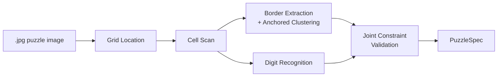
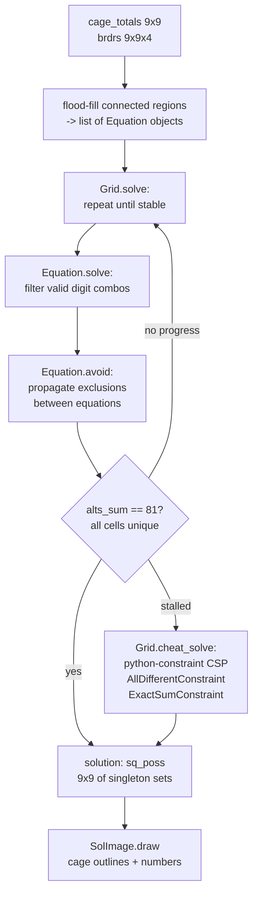

# Architecture

## Coaching Engine

The coaching engine is built on rules where each rule is derived from a class with
the following properties:

1. The constructor registers the rule in the rule database
2. There is a set of triggers which put the rule into the processing queue
3. There is an evaluation phase which determines where the rule applies and generates
   the set of solution state updates that the application would cause (this can be
   shared between hint and apply)
4. There is a hint method which forms a hint from the application state
5. There is an apply method which applies the generated updates

Each rule is configured to be auto-apply or hint-only.

The work queue contains rules which have triggered.  The queue is used in two modes:

1. In autonomous mode, all rules in the queue are processed until there are no more
2. In interactive mode, all auto-apply rules are drained from the queue, leaving
   hint-only rules (unless the puzzle is fully solved) and the user has the option
   which rule to apply, whether to apply it automatically or by hand or to ignore
   the hints and go ahead with their changes.

Possible puzzle state changes are:

1. Solve a cell
2. Remove a candidate from a cell
3. Remove a solution from a cage
4. Add a virtual cage — this probably needs CellElimination or SolutionMap to be
   applied to check that some actions from 1–3 above are triggered

The application of a puzzle state change updates the trigger state and adds any
triggered rules to the queue.

It is important to maintain as much sharing as possible between the autonomous and
interactive modes in order to assure correctness of the interactive mode.

---

## TypeScript Array Conventions

All 2-D arrays in the TypeScript codebase (`web/src/`) use **row-major `[row][col]`
ordering**, where `row` is the 0-based canvas row (y-axis, top = 0) and `col` is the
0-based canvas column (x-axis, left = 0).

This applies to every named array in `PuzzleSpec`, `BoardState`, and the engine:

| Array | Type | Convention |
|---|---|---|
| `PuzzleSpec.regions` | `number[][]` | `regions[row][col]` — 1-based cage index |
| `PuzzleSpec.cageTotals` | `number[][]` | `cageTotals[row][col]` — 0 except at cage head |
| `PuzzleSpec.borderX` | `boolean[][]` | `borderX[col][rowGap]` — wall between rows `rowGap` / `rowGap+1` in column `col` (shape 9×8) |
| `PuzzleSpec.borderY` | `boolean[][]` | `borderY[colGap][row]` — wall between cols `colGap` / `colGap+1` in row `row` (shape 8×9) |
| `BoardState.candidates` | `Set<number>[][]` | `candidates[row][col]` — remaining digit set |
| `BoardState.regions` | `number[][]` | `regions[row][col]` — 0-based cage index |
| `Cell` (engine type) | `[number, number]` | `[row, col]` — 0-based |

**Why the `[col][row]` comments in some source files are misleading:**
The internal helper `buildCageTotals` (in `inpImage.ts`) processes contours in
x-order and stores intermediate pixel data with `numPixels[col][row]`, but its
*reading* loop is transposed (`numPixels[row][col]`), yielding a `cageTotals`
array that is effectively `[row][col]`. The `[col][row]` annotation in the
`PuzzleSpec` interface is therefore incorrect and should be read as `[row][col]`.
The `borderX`/`borderY` annotations are correct; their shape alone (9×8 and 8×9)
distinguishes them from the square region/total arrays.

**No transposition at any boundary:** Python `PuzzleSpec` (NumPy, row-major) maps
directly to TypeScript `PuzzleSpec` without transposition. The frontend canvas
also reads `spec_data.regions[row][col]` row-major. No coordinate flip occurs at
any stage of the pipeline.

---

## UI

See **`docs/ui.md`** for the full UI specification: screen flow, component
descriptions, interaction design, help facilities, and known UI issues.

---

## Image Pipeline

The image pipeline converts a photograph of a killer or classic sudoku puzzle into a
`PuzzleSpec` (cage layout and totals) consumed by the solver and coaching engine.  It
is **format-agnostic**: no newspaper-specific configuration or pre-trained border
model is required.

See **`docs/image-pipeline.md`** for the full pipeline architecture, stage
descriptions, training pipeline (T1/T2), threshold derivation guide, and migration plan.
The [Training Pipeline](image-pipeline.md#training-pipeline) section covers the T1
(collect numerals) and T2 (fit PCA + classifier) steps in detail.

### Web Recogniser Training

The web app bundles a HOG + LinearSVC model in `web/public/num_recogniser.{json,bin}`.
When a user corrects OCR errors and confirms a killer puzzle, the app automatically
uploads the digit thumbnails (user-verified labels, 64×64 uint8) to a remote
collection pipeline. A consent modal is shown on first upload; "Always send" sets a
1-year cookie that silences it thereafter.

#### Remote collection pipeline

```
Browser  →  POST /  →  Cloudflare Worker (cagedoku-training.gbarrett28.workers.dev)
                              │
                         validates schema (version 1 or 2), checks R2 pending count (cap: 50)
                              │
                         R2 PUT  training/<timestamp>-<uuid>.json      (digit thumbnails)
                              or  puzzle-spec/<timestamp>-<uuid>.json  (backtracking specs)
                              │
                         GitHub Issue #1 comment  (gbarrett28/cagedoku)
```

Three payload schemas are accepted:

| Version | Type | Trigger | R2 prefix |
|---|---|---|---|
| 1 | `TrainingExport` | User confirms killer puzzle with manual OCR edits | `training/` |
| 2 | `PuzzleSpecExport` | Solver required MRV backtracking (rules alone stalled) | `puzzle-spec/` |
| 3 | `StallStateExport` | Solver stalled; full candidate grid captured | `stall/` |

`PuzzleSpecExport` uploads silently (no consent modal) but only when the user has already
granted consent for digit training. Puzzle specs contain cage layout + totals and are used
to identify hard puzzles where constraint propagation alone fails, to guide rule-engine
improvement.

`StallStateExport` (`web/src/image/trainingExport.ts`) captures the full candidate grid
(`number[][][]` — 9×9 of sorted remaining-digit arrays) at the moment the rule engine
stalls, before backtracking fills the cells. Unlike `PuzzleSpecExport`, this is
independent of the original cage spec, making replay fast and deterministic.
`initiateStallUpload()` and `uploadStallState()` in `trainingUpload.ts` mirror the
existing training-data upload helpers. The Worker stores the payload under `stall/`
in R2 and posts a comment to issue #1, same as the other upload types.

**Stall fixtures and replay** — `web/src/engine/rules/stall-fixtures.ts` stores known
stall states as named entries. `solveFromStall(candidates)` in `engine/index.ts` loads a
candidate grid into a fresh `BoardState`, runs the full rule engine, and returns a
`SolveResult`. Tests in `stall-fixtures.test.ts` assert each puzzle solves without
backtracking — they are skipped (`it.skip`) until the required rule is identified
and implemented. Removing the skip is the signal that a new rule is sufficient.

Key files:

| File | Purpose |
|---|---|
| `web/src/image/trainingExport.ts` | `TrainingExport`, `PuzzleSpecExport`, `StallStateExport`, `extractTrainingData`, `buildPuzzleSpecExport`, `buildStallStateExport` |
| `web/src/image/trainingUpload.ts` | `hasConsent`, `grantConsent`, `uploadTrainingData`, `uploadPuzzleSpec`, `uploadStallState`, `initiateUpload`, `initiateStallUpload` |
| `web/src/engine/rules/stall-fixtures.ts` | Known stall states as named `candidates` arrays |
| `web/src/engine/rules/stall-fixtures.test.ts` | Forward-failing replay tests (skipped until rule added) |
| `worker/src/index.ts` | Cloudflare Worker fetch handler — routes by schema version |
| `worker/src/validate.ts` | `isTrainingExport()`, `isPuzzleSpecExport()` schema guards |
| `worker/wrangler.toml` | Worker + R2 binding config |
| `scripts/collect_training.sh` | Download pending R2 uploads locally |
| `scripts/mark_processed.sh` | Delete R2 objects + react ✅ to Issue #1 comments |
| `scripts/_r2_list.py` | R2 object listing via Cloudflare API (wrangler v4 removed `r2 object list`) |

#### Phase 1 — manual retrain workflow

When new data appears as a comment on Issue #1:

```bash
bash scripts/collect_training.sh /tmp/training
python web/train_recogniser.py --browser-weight 1000 --svm-c 100 \
  web/browser_train.json /tmp/training/*.json
# verify accuracy, then:
bash scripts/mark_processed.sh /tmp/training
```

`train_recogniser.py` steps:
1. Loads labelled thumbnails from each JSON file
2. Optionally generates synthetic font samples
3. Applies dithering (translation ±2 px, morphological step, 1% pixel noise)
4. Extracts HOG features — 64 px window / 8 px cells / 16 px blocks / 9 bins = 1764 dims
5. Fits a LinearSVC OvO classifier (45 binary SVMs for digits 0–9)
6. Saves updated model files; the web app picks them up on next page reload

`--browser-weight 1000 --svm-c 100` up-weights real samples over synthetic fonts.
For purely synthetic training (no real data), omit both flags.

#### Phase 2 — scheduled auto-retrain

`.github/workflows/retrain.yml` runs weekly (03:00 UTC Sunday) and on
`workflow_dispatch`. It downloads pending R2 uploads, retrains, compares accuracy
against `web/public/eval_report.json`, commits the updated model on pass, and opens
a failure Issue on regression. Requires `CLOUDFLARE_API_TOKEN` and
`CLOUDFLARE_ACCOUNT_ID` repository secrets.

#### Infrastructure

| Resource | Name / URL |
|---|---|
| Cloudflare Worker | `https://cagedoku-training.gbarrett28.workers.dev` |
| R2 bucket | `cagedoku-training` (Cloudflare account `b6c5bf0f26c81c4901c4434c6a3ca23f`) |
| GitHub notification thread | `gbarrett28/cagedoku` Issue #1 |
| Worker secrets | `GITHUB_TOKEN` (issues:write PAT) |
| GitHub Actions secrets | `TRAINING_WORKER_URL`, `CLOUDFLARE_ACCOUNT_ID`, `CLOUDFLARE_API_TOKEN` |

See **`docs/classic-sudoku.md`** for the classic sudoku recognition feature design
(puzzle type detection, center digit reading, locked given digits, cage-structure
suppression in the UI).


```mermaid
flowchart LR
    A[.jpg puzzle image] --> B[Grid Location]
    B --> C[Cell Scan]
    C --> D[Border Extraction\n+ Anchored Clustering]
    C --> E[Digit Recognition]
    D --> F[Joint Constraint\nValidation]
    E --> F
    F --> G[PuzzleSpec]
```

---

## Exception Handling Policy

Four tiers applied consistently across all production code:

| Tier | Context | Rule |
|---|---|---|
| 1 | User-triggered actions | `setStatus(String(e), true)`; also call `reportBug(e, context)` for unexpected exceptions |
| 2 | Logic/solver internals | Only catch the expected error type; rethrow everything else |
| 3 | Image pipeline (post-grid) | `console.warn` + return degraded result; review screen always shown |
| 4 | Background/cosmetic | `console.warn` only |
| 5 | Settings storage | `console.warn` + return defaults |

**Pipeline invariant:** Once the grid is located in an uploaded image, the pipeline always proceeds to the OCR review screen. Any failure during cage detection or total extraction is logged (`console.warn`) and surfaced as a warning on that screen. Grid-detection failure (`GridNotFoundError`) is a hard error — the user is asked to crop the image and re-upload.

**Prohibited:** Bare `catch {}` or `catch (e) { /* comment */ }` with no log and no rethrow. Every catch must contain at least one of: a log call, a rethrow, or a `setStatus` call.

**Bug reporting:** `reportBug(e, context)` (in `main.ts`) stores the exception for the next feedback modal open. When the user submits feedback via the Feedback button, the exception string is included in the worker payload and appears in the generated GitHub issue.

**Assertion violations:** `checkSolutionAssertions()` (in `session/actions.ts`) validates the `goldenSolution` after every confirm. If the solution is incomplete or fails `validateSudokuSolution()`, an `AssertionViolation` is raised and shown in the assertion modal. The modal's "Submit bug report" button pre-fills `exceptionForSubmission` with the violation details and programmatically opens the feedback modal — no GitHub login required.

---

## Solving

The image pipeline output (`PuzzleSpec` — cage layout + totals) is consumed by two
independent solvers that serve different purposes:

**Batch solver** (`solver/grid.py`, `solver/equation.py`): used for the original
command-line workflow and as the golden-solution oracle for the coaching app.  Runs
constraint propagation to completion and falls back to a CSP solver if it stalls.

**Coaching engine** (`web/src/engine/`): used by the web app for interactive
candidate tracking and hint generation.  Event-driven, rule-based, designed for
partial application and incremental updates.  Does not solve to completion.

The batch solver receives `cage_totals` (a 9×9 array where non-zero cells are cage
heads) and `brdrs` (a 9×9×4 boolean array of [up, right, down, left] borders per
cell).  It first identifies connected regions (cages) using flood-fill through open
borders, then applies constraint propagation, and falls back to a generic CSP solver
if propagation stalls.

Each cage becomes an `Equation` with a known sum and number of cells.
`Equation.solve` eliminates impossible digit combinations; `Equation.avoid` propagates
exclusions from other constraints.  `Grid.solve` iterates until either all 81 cells
have a unique value (`alts_sum == 81`) or no further progress can be made.  In the
latter case, `Grid.cheat_solve` hands the remaining partial assignment to
`python-constraint`.


```mermaid
flowchart TD
    A[cage_totals 9x9\nbrdrs 9x9x4] --> B[flood-fill connected regions\n-> list of Equation objects]
    B --> C[Grid.solve:\nrepeat until stable]
    C --> D[Equation.solve:\nfilter valid digit combos]
    D --> E[Equation.avoid:\npropagate exclusions\nbetween equations]
    E --> F{alts_sum == 81?\nall cells unique}
    F -- yes --> G[solution: sq_poss\n9x9 of singleton sets]
    F -- no progress --> C
    F -- stalled --> H[Grid.cheat_solve:\npython-constraint CSP\nAllDifferentConstraint\nExactSumConstraint]
    H --> G
    G --> I[SolImage.draw\ncage outlines + numbers]
```

The solver has no tunable thresholds — it is exact by construction.

**MRV backtracker (`web/src/engine/backtracker.ts`):** The TypeScript coaching engine falls back to `mrvBacktrack()` when the rule engine stalls. It applies Minimum Remaining Values cell selection with arc-consistency propagation via `assign()`. After `search()` returns, a `gridValid()` defensive guard re-checks the extracted `number[][]` for row/column/box uniqueness before returning it — if the check fails the function logs a `console.error` and returns `null`, converting a corrupt `goldenSolution` into an `UnsolvedByRules` assertion instead of an `InvalidSolution` one.

---

## Rule Contract

All solver rules live in `web/src/engine/rules/`.  Every rule implements the
`SolverRule` interface (`web/src/engine/rule.ts`):

```typescript
interface SolverRule {
  readonly name: string;           // matches class name exactly
  readonly description: string;    // shown in the config modal (i) tooltip
  readonly priority: number;       // lower = higher priority = fired first
  readonly triggers: ReadonlySet<Trigger>;
  readonly unitKinds: ReadonlySet<UnitKind>; // empty = GLOBAL or cell-scoped

  apply(ctx: RuleContext): RuleResult;
  asHints(ctx: RuleContext, eliminations: readonly Elimination[]): HintResult[];
}
```

**`apply(ctx)`** must be pure — it reads `ctx.board` and returns a `RuleResult`
(eliminations, placements, solution eliminations, virtual cage additions).  It
must not mutate board state.

**`asHints(ctx, eliminations)`** converts the same deduction into human-readable
`HintResult[]` for the coaching UI.  It receives the eliminations that `apply()`
just produced, so both paths share the same detection logic.  Return `[]` if the
rule should not surface hints (always-apply-only rules).

**`RuleResult`** (`web/src/engine/types.ts`):

```typescript
interface RuleResult {
  eliminations:        readonly Elimination[];          // { cell, digit }
  placements:          readonly Placement[];            // { cell, digit }
  solutionEliminations: readonly SolutionElimination[]; // { cageIdx, solution }
  virtualCageAdditions: readonly VirtualCageAddition[]; // { cells, total }
}
```

Use `emptyResult()` to return no progress.

**`HintResult`** (`web/src/engine/hint.ts`):

```typescript
interface HintResult {
  ruleName:     string;
  displayName:  string;
  explanation:  string;                              // plain English; use cellLabel()
  highlightCells: readonly Cell[];                   // elimination targets only (0-based [row, col])
  eliminations: readonly Elimination[];
  placement:    readonly [number, number, number] | null;  // [row, col, digit] or null
  virtualCageSuggestion: readonly [readonly Cell[], number] | null;
  colourGroups?: readonly ColourGroup[];             // optional — bipartite chain colouring
}
```

**`colourGroups`** is populated by rules that use bipartite conjugate-pair reasoning
(SimpleColouring, Skyscraper, TwoStringKite, WWing). Each group specifies which chain
cells belong to the blue side and which to the green side. Chain cells are placed here
rather than in `highlightCells`; `highlightCells` contains only the elimination
targets (rendered yellow). See `CellColour` and `ColourGroup` in `web/src/engine/hint.ts`.

**Adding a new rule:**

1. Create `web/src/engine/rules/<camelCaseName>.ts` — one class per file.
2. Implement `SolverRule`.  Import types from `../types.js`, `../rule.js`, `../hint.js`.
3. Add it to `defaultRules()` in `web/src/engine/rules/index.ts` at the right priority.
4. Co-locate tests as `<camelCaseName>.test.ts` using `makeTrivialSpec()` from
   `web/src/engine/fixtures.ts`.
5. Use `cellLabel([row, col])` from `web/src/engine/rules/_labels.ts` for all
   cell references in hint explanations — never inline `r${r+1}c${c+1}`.

The priority order and trigger assignments for all active rules are listed in the
comment block at the top of `web/src/engine/rules/index.ts`.

### Disabled rules

When a rule produces an elimination that contradicts the known golden solution, it
is automatically detected and suppressed.  The lifecycle is:

1. **Runtime detection** — `SolverEngine` (with `goldenSolution` + `onViolation`
   options set by `buildEngine()`) detects the bad elimination, calls `onViolation`,
   and skips applying the rule result.  The session-level callback:
   - Adds the rule name to the in-memory `_sessionDisabledRules` set in
     `web/src/session/store.ts` (fast-path: the rule won't be passed to any future
     `SolverEngine` constructed in this tab).
   - POSTs a `RuleBugReport` (version 4) to the Cloudflare Worker.

2. **Worker ingestion** — `POST /` with a `RuleBugReport` body stores the raw report
   under `rule-bugs/<ruleName>/` and a `RuleBugFixture`-shaped JSON under
   `rule-fixtures/<ruleName>/` in R2.

3. **Nightly Action** — `.github/workflows/rule-regression.yml` runs
   `node web/scripts/sync-rule-fixtures.js`, which fetches all `GET /rule-fixtures/<ruleName>`
   responses, appends new fixtures to `web/src/engine/rules/__fixtures__/index.ts`,
   and adds the rule name to `web/src/engine/rules/disabled-rules.ts`.  The Action
   then commits and pushes; the next `pages.yml` deployment picks up the change.

4. **Build-time exclusion** — `buildEngine()` in `web/src/session/engine.ts` and
   `getHints()` in `web/src/engine/index.ts` both filter `defaultRules()` by
   `DISABLED_RULES` before constructing a `SolverEngine`.  The spec validator
   (`solve()`) is intentionally **not** filtered so corrupted-spec detection still
   uses all rules.

5. **Regression tests** — each rule's test file has a describe block that runs
   fixture-based tests.  While the rule is in `DISABLED_RULES` the tests run as
   `it.skip` (visible but not counted as failures).  Once the rule is fixed and
   removed from `DISABLED_RULES`, the tests activate and must pass.

**To re-enable a rule after fixing it:**

1. Fix the rule implementation so it no longer produces eliminations that contradict
   the golden digit on any of its fixture boards.
2. Remove the rule name from `web/src/engine/rules/disabled-rules.ts`.
3. Change the `it.skip` → `it` guard in the rule's `*.test.ts` if it isn't driven
   automatically by `DISABLED_RULES`.  (The existing fixture tests read
   `DISABLED_RULES` directly, so removing the name is sufficient.)
4. Run the bronze gate — all fixture tests must now be green.
5. Commit on a feature branch, open a PR, verify CI passes, then merge.

---

## Stress-Test Tooling

### Scraper

`killer_sudoku/training/scrape_puzzles.py` downloads puzzle images from any
Guardian/Observer series index page.

```bash
# Classic sudoku, sorted into subdirectories by difficulty keyword in URL
python -m killer_sudoku.training.scrape_puzzles \
    --output-dir classic_guardian \
    --series-url "https://www.theguardian.com/lifeandstyle/series/sudoku?page={}" \
    --subdir-keywords easy medium hard diabolical
```

`--subdir-keywords` detects the first matching keyword in each article URL and
saves images into `<output-dir>/<keyword>/`. Articles matching none of the
keywords go into `other/`. The per-subdirectory guard (skip if directory already
exists) means re-runs are safe — existing images are never overwritten.

### Stress-Test Runner

`scripts/run-stress-test.sh <puzzle-dir> [workers] [--copy-stalls <dest>]` processes
every `.jpg`/`.png` in a directory through the production app via Playwright and
writes `eval_report.json` alongside the images.

```bash
bash scripts/run-stress-test.sh classic_guardian/diabolical 4
bash scripts/run-stress-test.sh classic_guardian 4 --copy-stalls web/stall-fixtures
```

Each Playwright worker compiles OpenCV.js WASM once (~60 s); 4 workers on
~500 images takes ~20 minutes at ~450 MB per worker.

Internally the runner:
1. Sets `STRESS_PUZZLE_DIR` and runs `web/e2e/stress.spec.ts` via
   `npx playwright test --workers=N`.
2. Each worker writes `eval_results_<pid>.json` to the puzzle directory.
3. `scripts/merge-stress-results.mjs` combines the worker files into
   `eval_report.json` and deletes the intermediates.

### Report Format

```json
{
  "timestamp": "...",
  "source": "diabolical",
  "total": 500,
  "pipeline_ok": 498,
  "solution_found": 496,
  "backtracker_required": 41,
  "pipeline_errors": 2,
  "work_queue": [
    { "file": "killer_sudoku_312.jpg", "unsolved_cells": 1, "total_candidates": 2 }
  ],
  "per_image": { ... }
}
```

`work_queue` lists backtracker puzzles sorted by `(unsolved_cells ASC,
total_candidates ASC)` — the easiest rule gaps to close first. A puzzle with
1 unsolved cell and 2 candidates needs only one new rule to eliminate one
candidate and place the digit. Rules found there often propagate to reduce
candidates in harder puzzles.

### Implementation Notes

`window.__lastSolverResult` is exposed by `main.ts` immediately after every
`solveCurrentSpec()` call in `handleProcess()`. It holds
`{ usedBacktracking: boolean, stalledCandidates: number[][][] | null, spec: PuzzleSpecData | null }`
where `stalledCandidates` is the candidate grid captured just before backtracking
(undefined when the rule engine solves the puzzle completely) and `spec` is the
full puzzle spec used for stall fixture capture. The stress runner reads this via
`page.evaluate()` after the review panel or playing mode appears.

When `usedBacktracking` is true, the stress test writes a `<name>.stall.json` file
alongside the source image. The `--copy-stalls <dest>` flag then copies these into
`web/stall-fixtures/` for regression testing.

---

## Stall Fixture Pipeline

Puzzle states where the rule engine cannot solve without MRV backtracking are
committed as **stall fixtures** in `web/stall-fixtures/`. They serve two purposes:
(a) regression tests that auto-delete solved fixtures when a new rule is added, and
(b) a dev-mode panel for loading fixtures directly into the solution screen.

### StallFixtureFile format

Each `<name>.stall.json` file contains:

```ts
interface StallFixtureFile {
  version: 1;
  source: string;            // corpus name: "guardian", "observer", "r2", …
  name: string;              // image filename without extension
  addedAt: string;           // ISO date (YYYY-MM-DD)
  puzzleType: 'killer' | 'classic';
  imagePath?: string;        // repo-root-relative; omitted for R2 uploads
  spec: PuzzleSpec;          // full puzzle spec
  stalledCandidates: number[][][];  // 9×9 candidate grid at stall time
  unsolvedCells: number;     // cells with >1 candidate at stall time
  totalCandidates: number;   // sum of candidate-list lengths for unsolved cells
}
```

Defined in `web/src/engine/rules/stallFixtureFile.ts`. The `spec` field matches
`web/src/solver/puzzleSpec.ts` and follows the project's row-major coordinate
convention (`spec.borderX[col][rowGap]` and `spec.borderY[colGap][row]` remain
col-first per the documented border exception).

### Regression test

`web/stall-fixtures/stall-fixtures-dir.test.ts` (Vitest) runs `solve(fixture.spec)`
for every `*.stall.json`. If a fixture now solves without backtracking,
the test **auto-deletes the file** and fails with a message naming the closed gap.
The developer commits the deletion to record which fixtures a new rule resolved.
If the directory is empty the test emits a single passing no-op.

### Dev panel

When the app runs under `vite dev` with `?dev=1` in the URL, a collapsible "Stall
Fixtures" panel appears at the top of the page. It calls:

- `GET /dev/stall-fixtures` — list endpoint (sorted by `unsolvedCells ASC,
  totalCandidates ASC`); strips `spec` and `stalledCandidates` for fast load
- `GET /dev/stall-fixtures/:name` — full fixture JSON

Clicking a row calls `loadSpecDirect(spec)` and transitions straight to the
solution screen, bypassing the image pipeline. The Vite middleware (`apply: 'serve'`)
is absent from production builds; the fetch returns 404 and the panel renders nothing.

### R2 review workflow

`.github/workflows/puzzle-spec-review.yml` (manual `workflow_dispatch`) downloads
`puzzle-spec/` objects from the `cagedoku-training` R2 bucket, runs
`web/scripts/check-puzzle-specs.ts` via vite-node to check each spec, commits any
stall fixtures to `web/stall-fixtures/`, and deletes all processed R2 objects.
`check-puzzle-specs.ts` deduplicates specs by content
(`JSON.stringify([spec.regions, spec.cageTotals])`) so identical puzzles uploaded
from different sessions produce only one fixture. Uses `R2_ACCESS_KEY_ID` and
`R2_SECRET_ACCESS_KEY` GitHub Actions secrets (same as the retrain workflow).

---

## E2E Test Environment

Playwright tests (`web/e2e/`) require a Chromium binary. The project pins
`@playwright/test` to a specific version that matches the browser revision
pre-installed in the Claude Code cloud execution environment.

| Playwright version | Chromium revision | Binary location (cloud) |
|---|---|---|
| `1.56.1` (current pin) | `1194` | `/opt/pw-browsers/chromium_headless_shell-1194/` |

Both `playwright.config.ts` and `playwright.dev.config.ts` set
`PLAYWRIGHT_BROWSERS_PATH ??= '/opt/pw-browsers'` so the correct binary is
found automatically without downloading anything. The `??=` guard is a no-op
when the variable is already set (developer machines, CI with its own cache).

**Upgrading Playwright:** when the cloud environment is updated to provide a
newer revision, bump the pin in `web/package.json` to the matching
`@playwright/test` version (revision→version mapping: check
`node_modules/playwright-core/browsers.json` after install), then remove or
update the `PLAYWRIGHT_BROWSERS_PATH` override if the path changes. Tracked
in issue #134.

