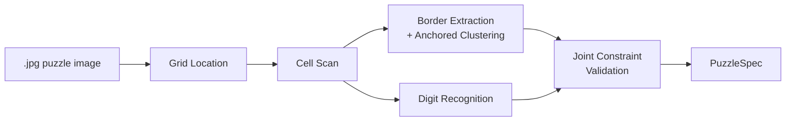
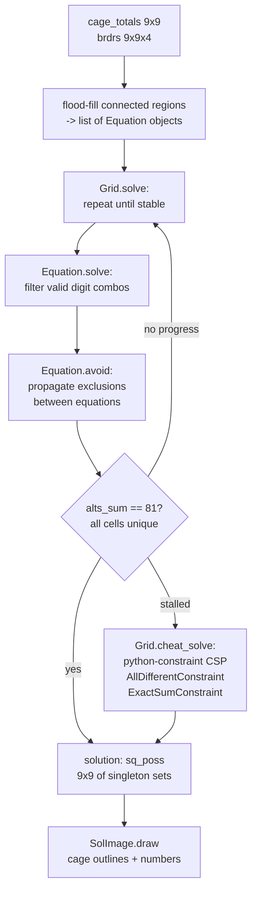

# Architecture

## Coaching Engine

The coaching engine is built on rules where each rule is derived from a class with
the following properties:

1. The constructor registers the rule in the rule database
2. There is a set of triggers which put the rule into the processing queue
3. There is an evaluation phase which determines where the rule applies and generates
   the set of solution state updates that the application would cause (this can be
   shared between hint and apply)
4. There is a hint method which forms a hint from the application state
5. There is an apply method which applies the generated updates

Each rule is configured to be auto-apply or hint-only.

The work queue contains rules which have triggered.  The queue is used in two modes:

1. In autonomous mode, all rules in the queue are processed until there are no more
2. In interactive mode, all auto-apply rules are drained from the queue, leaving
   hint-only rules (unless the puzzle is fully solved) and the user has the option
   which rule to apply, whether to apply it automatically or by hand or to ignore
   the hints and go ahead with their changes.

Possible puzzle state changes are:

1. Solve a cell
2. Remove a candidate from a cell
3. Remove a solution from a cage
4. Add a virtual cage — this probably needs CellElimination or SolutionMap to be
   applied to check that some actions from 1–3 above are triggered

The application of a puzzle state change updates the trigger state and adds any
triggered rules to the queue.

It is important to maintain as much sharing as possible between the autonomous and
interactive modes in order to assure correctness of the interactive mode.

### Board State Hierarchy

`BoardState` (`web/src/engine/boardState.ts`) is the plain 9×9 sudoku skeleton — it
needs no `PuzzleSpec` to construct, owns only the 27 ROW/COL/BOX `units`,
`candidates`/`counts`/`unitVersions`, and `removeCandidate`'s row/col/box bookkeeping.
It has no notion of cages: no `regions`, `cageSolns`, `linearSystem`, or `spec`.

`KillerBoardState extends BoardState` adds every cage-related concept: `spec`,
`regions`, `cageSolns`, `linearSystem`, CAGE `units` (id ≥ 27), `addVirtualCage`,
`removeCageSolution`, and an `override removeCandidate` that additionally prunes cage
solutions. Classic puzzles run on a plain `BoardState`; killer puzzles (and the
one-shot OCR-validation/full-solve paths in `engine/index.ts`, which always receive a
real `PuzzleSpec`) run on `KillerBoardState`.

This split makes "classic has no cages" a structural fact enforced by the type
system — but generic infrastructure (`SolverEngine`, `mrvBacktrack`, the rule
contract) still needs to ask cage-shaped questions sometimes. Every such question is
routed through one of two channels, so that **no consumer ever tests
`instanceof KillerBoardState` to decide what to do** (the one exception —
`candidatesFromBoard`'s display-data extraction — is documented below as the single
deliberate exception):

- **A virtual method on the board itself**, when the answer depends only on the board
  (the board "knows what it is", the same template-method shape `removeCandidate`
  already used for cage-solution pruning):
  - `cageConstraints(): CageConstraints | null` — `KillerBoardState` builds
    `{ cageOf, cageTotal, cageCells }` from `regions`/`spec.cageTotals`; plain
    `BoardState` returns `null`. `mrvBacktrack` (`backtracker.ts`) calls this once and
    degrades to pure row/col/box backtracking when it gets `null` — it never asks
    what kind of board it has, the same way it already asks `board.cands(r, c)`.
  - `protected _onCellDetermined(cell, val)` on `SolverEngine` — a no-op hook;
    `KillerSolverEngine` overrides it to call `board.linearSystem.substituteLiveRows(cell,
    val)`, which is now **bookkeeping-only**: it returns derived `[cells, total,
    distinct]` constraints without mutating the board. For each `distinct` constraint,
    a single-cell result is golden-checked immediately via
    `_checkAgainstGolden('DerivedVirtualCage', cell, total)` (catches a determined cell
    whose value contradicts the golden solution as soon as it's derived, rather than
    waiting for a rule to act on it); multi-cell results are deduplicated against the
    cell-sets/totals of existing ROW/COL/BOX/CAGE units (ROW/COL/BOX always sum to 45)
    and, if genuinely new, pushed onto `board.linearSystem.pendingVirtualCages` for the
    `DerivedVirtualCage` rule to apply later. This replaced a `_linearSystemActive`
    boolean flag that gated the same block inline — the virtual hook makes "does this
    engine propagate through a `LinearSystem`" a property of *which engine class you
    have*, not a runtime flag that could drift out of sync with the board it was
    constructed against. `substituteCell` (which used to mutate candidates directly)
    has been removed entirely — all candidate narrowing for derived constraints now
    flows through `DerivedVirtualCage` + the existing cage rules (`SumPairConstraint`,
    `CageCandidateFilter`, etc.) reacting to the new virtual cage unit.
- **The single canonical `PuzzleState.isKiller(state)` predicate**
  (`session/types.ts`, a type guard — `'specData' in state`, narrowing to
  `KillerPuzzleState`), consulted once by `buildEngine` to decide which entire
  matching bundle to construct together:
  `KillerBoardState` + `KillerSolverEngine` + the full rule list, or `BoardState` +
  `SolverEngine` + `PuzzleState.rules(state)` (which excludes `killerOnly` rules for
  classic puzzles — see "`PuzzleState.rules()` and `Command` / `availableCommands`"
  below). No other call site re-derives "is this killer" from `state` or from `board`.

**`KillerOnlyRule`** (`web/src/engine/rule.ts`) is the one place a runtime
`instanceof KillerBoardState` narrow exists for rules — see Rule Contract below.

**`candidatesFromBoard`** (`session/actions.ts`) is the one deliberate exception that
*does* use `instanceof KillerBoardState` directly: it needs to decide whether the
board carries cage display data (`regions`/`cageSolns`) at all, which is a structural
question about the board's shape, not a "what kind of puzzle is this" dispatch — and
`buildEngine`'s `isKiller`-driven construction already guarantees the two always agree.
This replaced a `state.puzzleType === 'classic'` proxy test (with a
"cage solutions are always empty (dummy spec)" comment) that was testing the wrong
thing, because every board used to carry cage fields regardless of puzzle type. The
`puzzleType` discriminant has since been removed entirely: `PuzzleState` is the base
shape (no cage fields, `userGrid: number[][]`), and `KillerPuzzleState extends
PuzzleState` adds `specData`, `cageStates`, `virtualCages`, and `warpedImageUrl`.
Fresh states are built via `PuzzleState.createClassic(...)` and
`PuzzleState.createKiller(...)` factories rather than synthetic specs.

`userGrid` is always a real 9×9 grid — all-zero before `/confirm` (OCR review
phase). The "has this session been confirmed?" signal is
`state.goldenSolution === null` / `!== null` (an existing field that is `null`
until `confirmPuzzle` populates it), not `userGrid`.

---

## TypeScript Array Conventions

All 2-D arrays in the TypeScript codebase (`web/src/`) use **row-major `[row][col]`
ordering**, where `row` is the 0-based canvas row (y-axis, top = 0) and `col` is the
0-based canvas column (x-axis, left = 0).

This applies to every named array in `PuzzleSpec`, `BoardState`, and the engine:

| Array | Type | Convention |
|---|---|---|
| `PuzzleSpec.regions` | `number[][]` | `regions[row][col]` — 1-based cage index |
| `PuzzleSpec.cageTotals` | `number[][]` | `cageTotals[row][col]` — 0 except at cage head |
| `PuzzleSpec.borderX` | `boolean[][]` | `borderX[col][rowGap]` — wall between rows `rowGap` / `rowGap+1` in column `col` (shape 9×8) |
| `PuzzleSpec.borderY` | `boolean[][]` | `borderY[colGap][row]` — wall between cols `colGap` / `colGap+1` in row `row` (shape 8×9) |
| `BoardState.candidates` | `Set<number>[][]` | `candidates[row][col]` — remaining digit set |
| `KillerBoardState.regions` | `number[][]` | `regions[row][col]` — 0-based cage index |
| `Cell` (engine type) | `[number, number]` | `[row, col]` — 0-based |

**Why the `[col][row]` comments in some source files are misleading:**
The internal helper `buildCageTotals` (in `inpImage.ts`) processes contours in
x-order and stores intermediate pixel data with `numPixels[col][row]`, but its
*reading* loop is transposed (`numPixels[row][col]`), yielding a `cageTotals`
array that is effectively `[row][col]`. The `[col][row]` annotation in the
`PuzzleSpec` interface is therefore incorrect and should be read as `[row][col]`.
The `borderX`/`borderY` annotations are correct; their shape alone (9×8 and 8×9)
distinguishes them from the square region/total arrays.

**No transposition at any boundary:** Python `PuzzleSpec` (NumPy, row-major) maps
directly to TypeScript `PuzzleSpec` without transposition. The frontend canvas
also reads `spec_data.regions[row][col]` row-major. No coordinate flip occurs at
any stage of the pipeline.

---

## UI

See **`docs/ui.md`** for the full UI specification: screen flow, component
descriptions, interaction design, help facilities, and known UI issues.

---

## Image Pipeline

The image pipeline converts a photograph of a killer or classic sudoku puzzle into a
`PuzzleSpec` (cage layout and totals) consumed by the solver and coaching engine.  It
is **format-agnostic**: no newspaper-specific configuration or pre-trained border
model is required.

See **`docs/image-pipeline.md`** for the full pipeline architecture, stage
descriptions, training pipeline (T1/T2), threshold derivation guide, and migration plan.
The [Training Pipeline](image-pipeline.md#training-pipeline) section covers the T1
(collect numerals) and T2 (fit PCA + classifier) steps in detail.

### Web Recogniser Training

The web app bundles a HOG + LinearSVC model in `web/public/num_recogniser.{json,bin}`.
When a user corrects OCR errors and confirms a killer puzzle, the app automatically
uploads the digit thumbnails (user-verified labels, 64×64 uint8) to a remote
collection pipeline. A consent modal is shown on first upload; "Always send" sets a
1-year cookie that silences it thereafter.

#### Remote collection pipeline

```
Browser  →  POST /  →  Cloudflare Worker (cagedoku-training.gbarrett28.workers.dev)
                              │
                         validates schema (version 1 or 2), checks R2 pending count (cap: 50)
                              │
                         R2 PUT  training/<timestamp>-<uuid>.json      (digit thumbnails)
                              or  puzzle-spec/<timestamp>-<uuid>.json  (backtracking specs)
                              │
                         GitHub Issue #1 comment  (gbarrett28/cagedoku)
```

Three payload schemas are accepted:

| Version | Type | Trigger | R2 prefix |
|---|---|---|---|
| 1 | `TrainingExport` | User confirms killer puzzle with manual OCR edits | `training/` |
| 2 | `PuzzleSpecExport` | Solver required MRV backtracking (rules alone stalled) | `puzzle-spec/` |
| 3 | `StallStateExport` | Solver stalled; full candidate grid captured | `stall/` |

`PuzzleSpecExport` uploads silently (no consent modal) but only when the user has already
granted consent for digit training. Puzzle specs contain cage layout + totals and are used
to identify hard puzzles where constraint propagation alone fails, to guide rule-engine
improvement.

`StallStateExport` (`web/src/image/trainingExport.ts`) captures the full candidate grid
(`number[][][]` — 9×9 of sorted remaining-digit arrays) at the moment the rule engine
stalls, before backtracking fills the cells. Unlike `PuzzleSpecExport`, this is
independent of the original cage spec, making replay fast and deterministic.
`initiateStallUpload()` and `uploadStallState()` in `trainingUpload.ts` mirror the
existing training-data upload helpers. The Worker stores the payload under `stall/`
in R2 and posts a comment to issue #1, same as the other upload types.

**Stall fixtures and replay** — `web/src/engine/rules/stall-fixtures.ts` stores known
stall states as named entries. `solveFromStall(candidates)` in `engine/index.ts` loads a
candidate grid into a fresh `BoardState`, runs the full rule engine, and returns a
`SolveResult`. Tests in `stall-fixtures.test.ts` assert each puzzle solves without
backtracking — they are skipped (`it.skip`) until the required rule is identified
and implemented. Removing the skip is the signal that a new rule is sufficient.

Key files:

| File | Purpose |
|---|---|
| `web/src/image/trainingExport.ts` | `TrainingExport`, `PuzzleSpecExport`, `StallStateExport`, `extractTrainingData`, `buildPuzzleSpecExport`, `buildStallStateExport` |
| `web/src/image/trainingUpload.ts` | `hasConsent`, `grantConsent`, `uploadTrainingData`, `uploadPuzzleSpec`, `uploadStallState`, `initiateUpload`, `initiateStallUpload` |
| `web/src/session/feedbackSubmit.ts` | `buildFeedbackPayload`, `submitFeedback` — feedback payload construction and POST |
| `web/src/engine/rules/stall-fixtures.ts` | Known stall states as named `candidates` arrays |
| `web/src/engine/rules/stall-fixtures.test.ts` | Forward-failing replay tests (skipped until rule added) |
| `worker/src/index.ts` | Cloudflare Worker fetch handler — routes by schema version |
| `worker/src/validate.ts` | `isTrainingExport()`, `isPuzzleSpecExport()` schema guards |
| `worker/wrangler.toml` | Worker + R2 binding config |
| `scripts/collect_training.sh` | Download pending R2 uploads locally |
| `scripts/mark_processed.sh` | Delete R2 objects + react ✅ to Issue #1 comments |
| `scripts/_r2_list.py` | R2 object listing via Cloudflare API (wrangler v4 removed `r2 object list`) |

#### Phase 1 — manual retrain workflow

When new data appears as a comment on Issue #1:

```bash
bash scripts/collect_training.sh /tmp/training
python web/train_recogniser.py --browser-weight 1000 --svm-c 100 \
  web/browser_train.json /tmp/training/*.json
# verify accuracy, then:
bash scripts/mark_processed.sh /tmp/training
```

`train_recogniser.py` steps:
1. Loads labelled thumbnails from each JSON file
2. Optionally generates synthetic font samples
3. Applies dithering (translation ±2 px, morphological step, 1% pixel noise)
4. Extracts HOG features — 64 px window / 8 px cells / 16 px blocks / 9 bins = 1764 dims
5. Fits a LinearSVC OvO classifier (45 binary SVMs for digits 0–9)
6. Saves updated model files; the web app picks them up on next page reload

`--browser-weight 1000 --svm-c 100` up-weights real samples over synthetic fonts.
For purely synthetic training (no real data), omit both flags.

#### Phase 2 — scheduled auto-retrain

`.github/workflows/retrain.yml` runs weekly (03:00 UTC Sunday) and on
`workflow_dispatch`. It downloads pending R2 uploads, retrains, compares accuracy
against `web/public/eval_report.json`, commits the updated model on pass, and opens
a failure Issue on regression. Requires `CLOUDFLARE_API_TOKEN` and
`CLOUDFLARE_ACCOUNT_ID` repository secrets.

#### Infrastructure

| Resource | Name / URL |
|---|---|
| Cloudflare Worker | `https://cagedoku-training.gbarrett28.workers.dev` |
| R2 bucket | `cagedoku-training` (Cloudflare account `b6c5bf0f26c81c4901c4434c6a3ca23f`) |
| GitHub notification thread | `gbarrett28/cagedoku` Issue #1 |
| Worker secrets | `GITHUB_TOKEN` (issues:write PAT) |
| GitHub Actions secrets | `TRAINING_WORKER_URL`, `CLOUDFLARE_ACCOUNT_ID`, `CLOUDFLARE_API_TOKEN` |

**Worker tests:** `worker/src/index.test.ts` exercises the real worker `fetch`
handler against a `miniflare`-backed `R2Bucket` (in-memory, fresh per test —
no persistence/cleanup needed) rather than a hand-rolled mock, so R2 `put`/
`get`/`list` behaviour is real. `globalThis.fetch` (the GitHub API call)
remains mocked — tests never create real GitHub issues or comments.

See **`docs/classic-sudoku.md`** for the classic sudoku recognition feature design
(puzzle type detection, center digit reading, locked given digits, cage-structure
suppression in the UI).


```mermaid
flowchart LR
    A[.jpg puzzle image] --> B[Grid Location]
    B --> C[Cell Scan]
    C --> D[Border Extraction\n+ Anchored Clustering]
    C --> E[Digit Recognition]
    D --> F[Joint Constraint\nValidation]
    E --> F
    F --> G[PuzzleSpec]
```

---

## Exception Handling Policy

Four tiers applied consistently across all production code:

| Tier | Context | Rule |
|---|---|---|
| 1 | User-triggered actions | `setStatus(String(e), true)`; also call `reportBug(e, context)` for unexpected exceptions |
| 2 | Logic/solver internals | Only catch the expected error type; rethrow everything else |
| 3 | Image pipeline (post-grid) | `console.warn` + return degraded result; review screen always shown |
| 4 | Background/cosmetic | `console.warn` only |
| 5 | Settings storage | `console.warn` + return defaults |

**Pipeline invariant:** Once the grid is located in an uploaded image, the pipeline always proceeds to the OCR review screen. Any failure during cage detection or total extraction is logged (`console.warn`) and surfaced as a warning on that screen. Grid-detection failure (`GridNotFoundError`) is a hard error — the user is asked to crop the image and re-upload.

**Prohibited:** Bare `catch {}` or `catch (e) { /* comment */ }` with no log and no rethrow. Every catch must contain at least one of: a log call, a rethrow, or a `setStatus` call.

**Bug reporting:** `reportBug(e, context)` (in `main.ts`) stores the exception for the next feedback modal open. When the user submits feedback via the Feedback button, `handleFeedbackSubmit` reads the form fields and calls `buildFeedbackPayload()` (`session/feedbackSubmit.ts`) to construct a `FeedbackReport` — including `reportType: 'feedback'`, the exception string (if any), and (for `new-rule` suggestions with an active fixture) `fixtureName`/`unsolvedCells`/`totalCandidates`. `submitFeedback()` POSTs the payload to the training worker, which opens a GitHub issue via `FeedbackReport.githubAction()`.

**Assertion violations:** `checkSolutionAssertions()` (in `session/actions.ts`) validates the `goldenSolution` after every confirm. If the solution is incomplete or fails `validateSudokuSolution()`, an `AssertionViolation` is raised and shown in the assertion modal. The modal's "Submit bug report" button pre-fills `exceptionForSubmission` with the violation details and programmatically opens the feedback modal — no GitHub login required.

---

## Solving

The image pipeline output (`PuzzleSpec` — cage layout + totals) is consumed by two
independent solvers that serve different purposes:

**Batch solver** (`solver/grid.py`, `solver/equation.py`): used for the original
command-line workflow and as the golden-solution oracle for the coaching app.  Runs
constraint propagation to completion and falls back to a CSP solver if it stalls.

**Coaching engine** (`web/src/engine/`): used by the web app for interactive
candidate tracking and hint generation.  Event-driven, rule-based, designed for
partial application and incremental updates.  Does not solve to completion.

The batch solver receives `cage_totals` (a 9×9 array where non-zero cells are cage
heads) and `brdrs` (a 9×9×4 boolean array of [up, right, down, left] borders per
cell).  It first identifies connected regions (cages) using flood-fill through open
borders, then applies constraint propagation, and falls back to a generic CSP solver
if propagation stalls.

Each cage becomes an `Equation` with a known sum and number of cells.
`Equation.solve` eliminates impossible digit combinations; `Equation.avoid` propagates
exclusions from other constraints.  `Grid.solve` iterates until either all 81 cells
have a unique value (`alts_sum == 81`) or no further progress can be made.  In the
latter case, `Grid.cheat_solve` hands the remaining partial assignment to
`python-constraint`.


```mermaid
flowchart TD
    A[cage_totals 9x9\nbrdrs 9x9x4] --> B[flood-fill connected regions\n-> list of Equation objects]
    B --> C[Grid.solve:\nrepeat until stable]
    C --> D[Equation.solve:\nfilter valid digit combos]
    D --> E[Equation.avoid:\npropagate exclusions\nbetween equations]
    E --> F{alts_sum == 81?\nall cells unique}
    F -- yes --> G[solution: sq_poss\n9x9 of singleton sets]
    F -- no progress --> C
    F -- stalled --> H[Grid.cheat_solve:\npython-constraint CSP\nAllDifferentConstraint\nExactSumConstraint]
    H --> G
    G --> I[SolImage.draw\ncage outlines + numbers]
```

The solver has no tunable thresholds — it is exact by construction.

**MRV backtracker (`web/src/engine/backtracker.ts`):** The TypeScript coaching engine falls back to `mrvBacktrack()` when the rule engine stalls. It applies Minimum Remaining Values cell selection with arc-consistency propagation via `assign()`. After `search()` returns, a `gridValid()` defensive guard re-checks the extracted `number[][]` for row/column/box uniqueness before returning it — if the check fails the function logs a `console.error` and returns `null`, converting a corrupt `goldenSolution` into an `UnsolvedByRules` assertion instead of an `InvalidSolution` one.

**`LinearSystem` virtual-cage derivation (`web/src/engine/linearSystem.ts`):**
`_deriveNonburbVirtualCages` derives additional ("virtual") cages beyond the
puzzle's real cages by combining row/column/box/cage sum equations — e.g. "this
row sums to 45, this cage inside it sums to 14, so the remaining 6 cells sum to
31". Each candidate group is a `DeriveEq { cells: Set<string>; total: number }`.
`_reduceDerive` repeatedly subtracts one equation's cell-set from another when it
is a subset (`ej.cells = ej.cells.difference(ei.cells)`, `ej.total -= ei.total`)
until no further reduction is possible — pure cell-set/total arithmetic, the kind
of pencil-and-paper deduction a human solver performs.

For each surviving equation, `isBurb(cells)` determines whether the cells share a
row/column/box (`distinct: true`, digits must be distinct). For non-distinct
groups, `solSums(cells.length, 0, total)` is computed once to find the
intersection of possible digit-sets (`must`); the group is only emitted as a
virtual cage if `must` is non-empty. All derived virtual cages are pushed with
`precomputedSolns: null` — `KillerBoardState` computes `solSums(cells.length, 0,
total)` lazily when building `cageSolns` for the cage, so no information is lost.

This derivation intentionally does **not** track or recombine per-equation
solution sets across reduction steps (an earlier design did this and caused
exponential blow-up for cage layouts with cages larger than 2 cells — see
`web/scripts/fuzz-cage-rules.ts`). The resulting `precomputedSolns` values are a
superset of what the earlier cross-equation-narrowed values would have been,
which is strictly safer (cannot cause a new incorrect elimination) at the cost of
deriving fewer virtual cages / slightly less pruning power.

**`pendingVirtualCages` and `DerivedVirtualCage`:** `_deriveNonburbVirtualCages` runs
once at construction time from the puzzle's starting RREF. As the solve progresses,
`KillerSolverEngine._onCellDetermined` calls `substituteLiveRows(cell, val)` to
re-derive constraints against the *current* live rows (cells not yet determined) and
appends genuinely-new `{ cells, total }` pairs to the public field
`board.linearSystem.pendingVirtualCages: VirtualCageAddition[]` — a queue, not a
side-effecting mutation. `web/src/engine/rules/derivedVirtualCage.ts`
(`DerivedVirtualCage extends KillerOnlyRule`, GLOBAL trigger, priority 1) drains this
queue one entry per firing, returning it as a `virtualCageAdditions` entry in its
`RuleResult` (and surfacing every still-pending entry as a virtual-cage-suggestion
hint via `asHintsKiller`). `SolverEngine.solve()` is the only place that actually
applies a `virtualCageAdditions` entry: it golden-checks the cage's sum against
`_goldenSolution` (throwing/reporting a violation on mismatch, the same as any other
rule result), then calls `board.addVirtualCage(cells, total, [])`, shifts the entry off
`pendingVirtualCages`, and seeds `COUNT_DECREASED`/`SOLUTION_PRUNED` for the new CAGE
unit so cage rules (`SumPairConstraint`, `CageCandidateFilter`, etc.) react to it
within the same pass.

---

## Rule Mutations and Rule Steps

`web/src/session/ruleMutation.ts` represents rule effects as data rather than as an
external switch. Each concrete mutation type is an open interface carrying its own
`apply(state: PuzzleState): PuzzleState`, so dispatch lives on the value itself —
callers always write `mutation.apply(state)`:

```typescript
interface RuleMutation {
  readonly type: string;
  apply(state: PuzzleState): PuzzleState;
}

interface PlaceDigitMutation extends RuleMutation { readonly type: 'placeDigit'; readonly row: number; readonly col: number; readonly digit: number; }
interface EliminateCandidateMutation extends RuleMutation { readonly type: 'eliminateCandidate'; readonly row: number; readonly col: number; readonly digit: number; }
interface AddVirtualCageMutation extends RuleMutation { readonly type: 'addVirtualCage'; readonly cage: VirtualCage; }
interface EliminateCageSolutionMutation extends RuleMutation { readonly type: 'eliminateCageSolution'; readonly cageId: string; readonly solution: readonly number[]; }
```

`namespace RuleMutation` provides one factory per mutation type (`placeDigit`,
`eliminateCandidate`, `addVirtualCage`, `eliminateCageSolution`) plus `revive(data)`
— the single type-keyed switch in the system, used to reconstruct a mutation after a
JSON round-trip (`JSON.stringify` drops the `apply` closure a factory attaches).

**`RuleStep`** groups the consecutive same-rule mutations produced by one rule firing
during a solve pass:

```typescript
interface RuleStep {
  readonly ruleName: string;
  readonly displayName: string;
  readonly highlightCells: readonly Cell[];
  readonly mutations: readonly RuleMutation[];
}
```

**`buildEngine(state, opts?)`** (`web/src/session/engine.ts`) returns
`{ board, engine, ruleSteps, validationContext }`. `ruleSteps` is the ordered
transcript of every always-apply rule firing computed during the engine's `solve()`
pass, each wrapped as a `RuleStep`. `validationContext` is `null` unless a golden
solution is present and the board is not user-corrupted; when non-null it carries
`{ rules, golden, spec }` for the brute-force trigger-miss check. Folding every
`ruleSteps[i].mutations` via `.apply()` onto the pre-solve state reproduces `board`.

`opts.skipValidation` (default `false`) suppresses `buildEngine`'s own scheduling
of the brute-force trigger-miss check while still returning `validationContext`.
`recordTurn` (`web/src/session/engine.ts`) passes `skipValidation: true` and
schedules the check itself afterwards, against `finalState` (the state including
the newly recorded turn) rather than the pre-turn state passed into `buildEngine` —
`PuzzleState.isKiller`, the only state-derived field the check reads, is invariant
between the two.

**`ApplyHintAction`** (`web/src/session/types.ts`) carries
`mutations: readonly RuleMutation[]` — the same mutation objects produced by
`ruleSteps`. `UserAction.apply`'s `'applyHint'` case folds each mutation via
`.apply()` onto state, so a hint can place a digit, eliminate a candidate, add a
virtual cage, or eliminate a cage solution uniformly. `UserAction.updateRemovedList`
and `findFirstElimTurnIdx` (`web/src/session/actions.ts`) read the
`eliminateCandidate`-typed mutations out of `action.mutations` when replaying turn
history.

### `applyRuleSteps` and `recordTurn`'s contract

`applyRuleSteps(state)` (`web/src/session/engine.ts`) is the single primitive for
folding a `buildEngine()` solve pass onto state:

```typescript
export function applyRuleSteps(state: PuzzleState): { state: PuzzleState; ruleSteps: readonly RuleStep[]; board: BoardState }
```

It runs `buildEngine(state, { skipValidation: true })` once and reduces every
`ruleSteps[i].mutations` via `.apply()` onto `state` — placements, candidate
eliminations, virtual cages, and cage-solution eliminations alike. Folding
eliminations into `userRemovedCandidates` is what stops the *next* `buildEngine`
call from re-deriving and re-presenting the same deductions as new rule steps.
Calling `applyRuleSteps` again on its own output is a no-op (`ruleSteps` empty,
`state` unchanged). The returned `board` is `buildEngine`'s board for the
pre-fold `state` — by the no-op invariant above, this is identical to the board
`buildEngine(folded state)` would produce, so callers get a renderable `board`
for free.

`recordTurn(state, action)` returns
`{ state: PuzzleState; ruleSteps: readonly RuleStep[]; baseState: PuzzleState; board: BoardState }`:

1. `baseState = UserAction.apply(action, state)`.
2. `{ state: finalState, ruleSteps, board } = applyRuleSteps(baseState)` plus the
   new turn appended to `finalState.turns` — this is the only `buildEngine` call
   for the action.
3. Trigger validation is scheduled against `finalState` as before.

All `recordTurn`-based actions in `session/actions.ts` (`enterCell`,
`cycleCandidate`, the `eliminate*` family, `addVirtualCage`, `applyHint`,
`confirmPuzzle`, `refresh`) use `.state` directly — no separate
auto-placement pass is layered on afterwards. History-rewrite actions (`undo`,
`rewind`) call `applyRuleSteps(rebuildUserGrid(trimmed)).state`. `enterCellStep`
(the animated entry point used by `main.ts`) returns the full
`{ state, ruleSteps, baseState }` so the UI can drive an `AnimationPlayer` while
`state` is already the final, committed result.

### `checkPuzzleInvariant` and Rewind hints

`checkPuzzleInvariant(state)` (`web/src/session/engine.ts`) is the single entry point
`getHints()` (`web/src/session/actions.ts`) uses to detect that `state` has drifted
from `state.goldenSolution`. It returns `null` if `state.goldenSolution === null` (not
yet confirmed) or if no inconsistency is found, otherwise a
`PuzzleInvariantViolation`:

```typescript
export interface PuzzleInvariantViolation {
  readonly rewindTurnIdx: number | null;
  readonly missingCell: { r: number; c: number; gold: number } | null;
}
```

It runs three checks in order, returning on the first hit:

0. **(killer only)** `findWrongVirtualCageTurnIdx(state)` scans `state.turns` for an
   `addVirtualCage` action whose cage cells (accounting for `negativeCells`) don't sum
   to `total` against `goldenSolution`. Gated by `PuzzleState.isKiller(state)` — a user
   can only add virtual cages in a killer puzzle, so this check is meaningless (and
   `state.virtualCages`/`negativeCells` don't exist) for classic puzzles. On a hit,
   returns `{ rewindTurnIdx: <that turn's index>, missingCell: null }`.
1. A placed `userGrid` digit that disagrees with `goldenSolution` →
   `{ rewindTurnIdx: findLastConsistentTurnIdx(state), missingCell: null }`.
2. `findMissingGoldenCandidate(state)` — a cell whose golden digit has been eliminated
   from its candidate set → `{ rewindTurnIdx: findFirstElimTurnIdx(...), missingCell:
   {r, c, gold} }`.

`findFirstElimTurnIdx` and `findMissingGoldenCandidate` (moved here from
`actions.ts`) are otherwise unchanged from their pre-refactor behaviour.

**`getHints()`'s dispatch on the result** distinguishes Check 0 from Checks 1/2 by
*shape*, not by a discriminant field on `PuzzleInvariantViolation` — per project
convention (ask before adding a discriminant to a shared type; prefer deriving
per-puzzle-type behaviour from existing predicates at the call site):

```typescript
const violation = checkPuzzleInvariant(state);
if (violation !== null) {
  const { rewindTurnIdx, missingCell } = violation;
  if (missingCell === null && PuzzleState.isKiller(state) && findWrongVirtualCageTurnIdx(state) !== null) {
    return { hints: [makeRewindHint(rewindTurnIdx ?? 0)] };
  }
  // missingCell !== null -> Check 2's alt-solution search (unchanged)
  // missingCell === null, not a wrong-cage case -> Check 1's Rewind dispatch (unchanged)
}
```

Check 0 is handled with an immediate `Rewind` hint rather than falling into Check 2's
alt-solution search: that search assumes a wrong *placed or eliminated* digit and runs
`mrvBacktrack` to look for an alternative consistent grid, but a wrong virtual-cage
total leaves `userGrid` itself fully consistent with `goldenSolution` — `mrvBacktrack`
would just return `goldenSolution` again, the search would conclude "multiple/no new
solutions", and no hint would be produced at all.

### `SessionResult` and `namespace PuzzleStateOps`

`SessionResult` (`web/src/session/types.ts`) is the unified return type for
user-facing puzzle operations:

```typescript
export interface SessionResult {
  readonly state: PuzzleState;
  readonly board: BoardState;
  readonly ruleSteps: readonly RuleStep[];
}
```

`namespace PuzzleStateOps` (`web/src/session/engine.ts`, a separate namespace from
`namespace PuzzleState` in `types.ts` — TS only merges a `namespace` with a
same-named `interface`/`class` in the *same file*, and the two live in different
files for dependency-cycle reasons) provides one `SessionResult`-returning method
per user action: `placeDigit`, `removeDigit`, `eliminateCandidate`,
`restoreCandidate`, `resetCellCandidates`, `addVirtualCage`, `removeVirtualCage`,
`applyHint`, `undo`. Each calls a private `requireConfirmed(state)` guard (throws
`Error('Session not yet confirmed')` if `state.goldenSolution === null`), then
delegates to `recordTurn`/`applyRuleSteps` and repackages the result as a
`SessionResult`. `undo` additionally throws `UserFacingError('Nothing to undo')` if
`state.turns` is empty, and `UserFacingError('Cannot undo given digits')` if the
last turn is a given-digit `placeDigit`.

`session/actions.ts` wraps each `PuzzleStateOps` method in a thin function
(`enterCell`, `cycleCandidate`, `addVirtualCage`, `applyHint`, `undo`,
`removeVirtualCage`) that resolves the current `PuzzleState` via
`requireConfirmed()`, calls the corresponding `PuzzleStateOps` method, calls
`setState(result.state)`, and returns `result.state` — the `board` and
`ruleSteps` fields of the `SessionResult` are currently unused by these wrappers
but are available for future callers that need to render without a follow-up
`buildEngine` call. `enterCellStep` and `rewind` are unchanged — `enterCellStep`
still calls `recordTurn` directly because it needs `baseState` for
`AnimationPlayer`, which `SessionResult` doesn't carry.

### `PuzzleState.rules()` and `Command` / `availableCommands`

`namespace PuzzleState` (`session/types.ts`) provides two additional members:

- `rules(state): Iterable<SolverRule>` — yields the enabled rule set for `state`'s puzzle
  type (killer yields all non-`DISABLED_RULES` rules; classic additionally excludes
  `killerOnly` rules). `buildEngine` consumes this directly: `const rules = [...PuzzleState.rules(state)]`.
- `Command = 'undo' | 'inspectCage' | 'virtualCage' | 'reveal'` and
  `availableCommands(state): ReadonlySet<Command>` — centralizes the UI-gating conditions
  for these four commands (turn history / `source: 'given'` for undo, `isKiller` for the
  cage commands, `goldenSolution !== null` for reveal). `main.ts`'s `updateUndoButton`,
  `renderPlayingMode`, and `updateRevealButton` consume this instead of repeating the
  underlying state checks. UI-local concerns (e.g. `selectedCell` for the reveal button)
  remain in `main.ts`.

### `PuzzleState.candidateDisplay(state, board)`

Returns a 9×9 `readonly CellRender[][]` (row-major) of per-cell render
attributes, consolidating the digit/candidate "case analysis" (killer vs
classic, given vs user-placed, duplicate detection, must-contain
highlighting) that `main.ts`'s `drawDigits`/`drawCandidates` previously
computed themselves.

```typescript
export type RenderColour = 'black' | 'blue' | 'red' | 'grey' | 'essential';

export interface CandidateRender {
  readonly digit: number;        // 1-9
  readonly colour: RenderColour; // 'essential' if must-contain for its cage, else 'grey'
}

export interface CellRender {
  readonly placed: { readonly digit: number; readonly colour: RenderColour; readonly locked: boolean } | null;
  readonly candidates: readonly CandidateRender[];
}
```

- `candidates` only includes digits that are live candidates (`board.cands(r, c)`
  has the digit AND it is not in `state.userRemovedCandidates`). Both
  solver-eliminated and user-removed digits render blank — there is no
  strikethrough rendering for removed candidates.
- `placed.colour` is `'red'` for duplicate digits (row/col/box), `'blue'` for
  non-given cells once `goldenSolution` is set, else `'black'`.
- `placed.locked` is `true` only for classic given digits; always `false` for
  killer (which has no givens).
- `'essential'` candidates are digits in the must-contain set for their cage
  (`intersectAll` over `board.cageSolns[cageIdx]`); classic boards
  (`board.cageConstraints() === null`) never produce `'essential'`.

`main.ts`'s `drawGrid` computes a cheap `buildEngine(state, { skipSolve: true }).board`
for `drawDigits` (always called) and uses the fully-solved `currentBoard` (via
`computeBoard(state)`, set in `fetchCandidates`) for `drawCandidates` (called only
when `showCandidates` is on).

### `PuzzleState.cageBoundaries(state)` / `PuzzleState.cageLabels(state)`

Two more pure `PuzzleState` functions consolidating killer-cage geometry,
previously computed inline (with `isKiller`/`specData` checks) in `main.ts`'s
`drawCageBorders`/`drawCageTotals`. Both return `[]` for classic puzzles.

```typescript
export interface BorderSegment {
  readonly row: number;    // 0-8
  readonly col: number;    // 0-8
  readonly edge: 'bottom' | 'right'; // boundary on this cell's bottom or right edge
}

export interface CageLabelRender {
  readonly row: number;  // 0-8, head cell of the cage
  readonly col: number;  // 0-8
  readonly total: number;
}
```

- `cageBoundaries` compares `state.specData.regions[r][c]` against its bottom
  and right neighbours; a mismatch emits a `BorderSegment` for that edge.
- `cageLabels` emits one entry per non-zero `state.specData.cageTotals[r][c]`.
- `main.ts`'s `drawCageBorders`/`drawCageTotals` iterate these and draw; no
  `isKiller`/`specData` access remains in either drawing function (the empty
  array for classic makes the loop body a no-op).

`cageDisplay`/`virtualCageDisplay` from the original redesign spec are
satisfied by `candidatesFromBoard`'s existing `cages`/`virtualCages` output
(`session/actions.ts`), which already returns the same shape (label, cells,
total, solutions, allSolutions, autoImpossible, userEliminated, mustContain) —
no separate `PuzzleState` methods were added for these.

---

### `PuzzleState.serialize(state)` / `PuzzleState.deserialize(data)`

`SerializedPuzzleState` is the wire format for a complete `PuzzleState`/
`KillerPuzzleState` snapshot — used by bug reports (`FeedbackReport.puzzleSpec`)
and by a dev-only replay hook.

```typescript
export type SerializedPuzzleState =
  | (PuzzleState & { readonly kind: 'classic'; readonly version: 1 })
  | (KillerPuzzleState & { readonly kind: 'killer'; readonly version: 1 });

export function serialize(state: PuzzleState): SerializedPuzzleState
export function deserialize(data: unknown): PuzzleState
```

- `serialize` is a total, structural transform: `{ kind: isKiller(state) ? 'killer'
  : 'classic', version: 1, ...state }`. It includes `originalImageUrl`/
  `warpedImageUrl` as-is — callers that need a smaller payload (e.g. the
  feedback handler, to avoid embedding large data URLs in a GitHub issue body)
  null those fields out on their own copy.
- `deserialize` throws immediately if `data` is not an object, `kind` is not
  `'classic' | 'killer'`, or `version !== 1` — no migration path; pre-redesign
  reports and any future format change simply fail `deserialize`. It validates
  gross shape (array dimensions, primitive element types) of each top-level
  field at the same rigor as `shared/src/reports/*.ts`'s `is()` functions, but
  does **not** recursively validate `turns`/`UserAction`/`RuleMutation`/
  `AutoMutation` union variants — a malformed `turns` entry surfaces as a
  runtime error inside `buildEngine`, an acceptable failure mode for this
  debugging tool.
- The `kind` dispatch inside `serialize`/`deserialize` is the only place that
  knows about puzzle-type variants. `main.ts` and `shared/src/reports/` only
  ever call `PuzzleState.serialize`/`deserialize`.

`main.ts`'s `handleFeedbackSubmit` builds its `puzzleSpec` via
`{ ...PuzzleState.serialize(currentState), originalImageUrl: null, ...(isKiller
? { warpedImageUrl: null } : {}) }`. A dev-only `window.__loadSerializedState(data)`
(same dead-code-elimination pattern as `window.__testLoad`) calls `deserialize`
then `renderPlayingMode` to reproduce a reported state in the browser console.

---

## Animation Player

`web/src/session/animationPlayer.ts` is a pure-data module for navigating a
`buildEngine()`-produced `ruleSteps` list — the foundation for the rule-by-rule
auto-apply animation. It is never persisted (UI-only state) and follows the
namespace-merging pattern: `AnimationPlayer` is plain data, all behaviour lives in
the same-named namespace.

```typescript
interface AnimationPlayer {
  readonly baseState: PuzzleState;   // state right after the user's action, before any rule steps
  readonly ruleSteps: readonly RuleStep[];
  readonly cursor: number;            // 0..ruleSteps.length — steps fully applied so far
  readonly playing: boolean;
}
```

**Derivation:**
- `stateAtCursor(player)` folds `ruleSteps[0..cursor)` mutations onto `baseState` via
  `RuleMutation.apply`.
- `boardAtCursor(player)` is `computeAnimationCandidates(stateAtCursor(player))` —
  the existing lightweight board derivation (`session/actions.ts`), which calls
  `buildEngine(state, { skipSolve: true })` so scrubbing never re-triggers a full
  solve or validation.
- `currentStep(player)` is `ruleSteps[cursor] ?? null` — the step about to be (or
  being) animated, `null` once the cursor reaches the end.

**VCR cursor transitions** (all pure, returning a new `AnimationPlayer`):
- `rewind(player)` — if `cursor > 0`, resets to `{ cursor: 0, playing: false }`; if
  `cursor === 0`, returns `null` (the caller closes the player with no commit).
- `stepBack(player)` / `stepForward(player)` — move the cursor by one step, clamped
  to `[0, ruleSteps.length]`, forcing `playing: false`.
- `togglePlay(player)` — flips `playing`.
- `tick(player)` — auto-play step: advances `cursor` by one while
  `cursor < ruleSteps.length`; at the end, sets `playing: false` without advancing
  (a pause point, not a close/commit action).

**`main.ts` wiring:** `handleCellEntry`'s animated branch (`autoPlacementDelay > 0`)
calls `enterCellStep(row, col, digit)`, which both commits `finalState` via
`setState` and returns `{ state: finalState, ruleSteps, baseState }`. The UI builds
`{ baseState, ruleSteps, cursor: 0, playing: true }` and drives it with `tick()` in a
loop: each iteration reads `currentStep(player)` for the hint pill
(`displayName`), highlight cells, and eliminated-candidate cells, waits `delay` ms
(or `0` ms if fast-forward was requested), then advances via `tick()` and redraws
via `boardAtCursor(player)`. The loop is a pure visual replay — `finalState` was
already committed before the loop starts, so the animation never feeds back into
`currentState`. The `»` (fold-remaining-and-commit) control and manual
`rewind`/`stepBack`/`stepForward`/`togglePlay` scrubbing UI remain future work.

---

## Rule Contract

All solver rules live in `web/src/engine/rules/`.  Every rule implements the
`SolverRule` interface (`web/src/engine/rule.ts`):

```typescript
interface SolverRule {
  readonly name: string;           // matches class name exactly
  readonly description: string;    // shown in the config modal (i) tooltip
  readonly priority: number;       // lower = higher priority = fired first
  readonly killerOnly: boolean;    // true = rule requires cage constraints; excluded for classic puzzles
  readonly triggers: ReadonlySet<Trigger>;
  readonly unitKinds: ReadonlySet<UnitKind>; // empty = GLOBAL or cell-scoped

  apply(ctx: RuleContext): RuleResult;
  asHints(ctx: RuleContext, eliminations: readonly Elimination[]): HintResult[];
}
```

**`apply(ctx)`** must be pure — it reads `ctx.board` and returns a `RuleResult`
(eliminations, placements, solution eliminations, virtual cage additions).  It
must not mutate board state.

**`asHints(ctx, eliminations)`** converts the same deduction into human-readable
`HintResult[]` for the coaching UI.  It receives the eliminations that `apply()`
just produced, so both paths share the same detection logic.  Return `[]` if the
rule should not surface hints (always-apply-only rules).

**`RuleResult`** (`web/src/engine/types.ts`):

```typescript
interface RuleResult {
  eliminations:        readonly Elimination[];          // { cell, digit }
  placements:          readonly Placement[];            // { cell, digit }
  solutionEliminations: readonly SolutionElimination[]; // { cageIdx, solution }
  virtualCageAdditions: readonly VirtualCageAddition[]; // { cells, total }
}
```

Use `emptyResult()` to return no progress.

**`HintResult`** (`web/src/engine/hint.ts`):

```typescript
interface HintResult {
  ruleName:     string;
  displayName:  string;
  explanation:  string;                              // plain English; use cellLabel()
  highlightCells: readonly Cell[];                   // elimination targets only (0-based [row, col])
  eliminations: readonly Elimination[];
  placement:    readonly [number, number, number] | null;  // [row, col, digit] or null
  virtualCageSuggestion: readonly [readonly Cell[], number] | null;
  colourGroups?: readonly ColourGroup[];             // optional — bipartite chain colouring
}
```

**`colourGroups`** is populated by rules that use bipartite conjugate-pair reasoning
(SimpleColouring, Skyscraper, TwoStringKite, WWing). Each group specifies which chain
cells belong to the blue side and which to the green side. Chain cells are placed here
rather than in `highlightCells`; `highlightCells` contains only the elimination
targets (rendered yellow). See `CellColour` and `ColourGroup` in `web/src/engine/hint.ts`.

**`KillerOnlyRule`** (`web/src/engine/rule.ts`) is an abstract base class for rules
that require `KillerBoardState` (cage sums, cage solutions, the linear system —
`deltaConstraint`, `linearElimination`, `sumPairConstraint`, `cageCandidateFilter`,
`cageConfinement`, `cageIntersection`, `mustContain`, `mustContainOutie`,
`solutionMapFilter`, `unitPartitionFilter`). It sets `readonly killerOnly = true` once
(rather than each subclass repeating it), performs the one runtime
`ctx.board instanceof KillerBoardState` narrow that the type system requires to expose
`KillerBoardState`'s members, and hands subclasses a `KillerRuleContext` (whose `board`
is typed `KillerBoardState`) through `applyKiller`/`asHintsKiller`. In practice this
narrow is unreachable — `buildEngine` only ever constructs `killerOnly` rules with a
`KillerBoardState` (via `PuzzleState.isKiller`) — but it is the codebase's single point
of defense-in-depth for that invariant, exercised directly in `rule.test.ts` rather
than relying on it never being hit.

**Adding a new rule:**

1. Create `web/src/engine/rules/<camelCaseName>.ts` — one class per file.
2. Implement `SolverRule` directly for classic-compatible rules
   (`readonly killerOnly = false`), or extend `KillerOnlyRule` (implementing
   `applyKiller`/`asHintsKiller` against `KillerRuleContext`) for rules that require
   cage constraints. Import types from `../types.js`, `../rule.js`, `../hint.js`.
3. Add it to `defaultRules()` in `web/src/engine/rules/index.ts` at the right priority.
4. Co-locate tests as `<camelCaseName>.test.ts` using `makeTrivialSpec()` from
   `web/src/engine/fixtures.ts`.
5. Use `cellLabel([row, col])` from `web/src/engine/rules/_labels.ts` for all
   cell references in hint explanations — never inline `r${r+1}c${c+1}`.

The priority order and trigger assignments for all active rules are listed in the
comment block at the top of `web/src/engine/rules/index.ts`.

### Disabled rules

When a rule produces an elimination that contradicts the known golden solution, it
is automatically detected and suppressed.  The lifecycle is:

1. **Runtime detection** — `SolverEngine` (with `goldenSolution` + `onViolation`
   options set by `buildEngine()`) detects the bad elimination, calls `onViolation`,
   and skips applying the rule result.  The session-level callback:
   - Adds the rule name to the in-memory `_sessionDisabledRules` set in
     `web/src/session/store.ts` (fast-path: the rule won't be passed to any future
     `SolverEngine` constructed in this tab).
   - POSTs a `RuleBugReport` (version 4) to the Cloudflare Worker.

2. **Worker ingestion** — `POST /` with a `RuleBugReport` body stores the raw report
   under `rule-bugs/<ruleName>/` and a `RuleBugFixture`-shaped JSON under
   `rule-fixtures/<ruleName>/` in R2.

3. **Nightly Action** — `.github/workflows/rule-regression.yml` runs
   `npx vite-node web/scripts/sync-rule-fixtures.ts`, which derives the rule list
   dynamically from `defaultRules()`, fetches all `GET /rule-fixtures/<ruleName>`
   responses, appends new fixtures to `web/src/engine/rules/__fixtures__/index.ts`,
   and adds the rule name to `web/src/engine/rules/disabled-rules.ts`.  The Action
   then commits and pushes; the next `pages.yml` deployment picks up the change.

4. **Build-time exclusion** — `buildEngine()` in `web/src/session/engine.ts` and
   `getHints()` in `web/src/engine/index.ts` both filter `defaultRules()` by
   `DISABLED_RULES` before constructing a `SolverEngine`.  The spec validator
   (`solve()`) is intentionally **not** filtered so corrupted-spec detection still
   uses all rules.

5. **Regression tests** — each rule's test file has a describe block that runs
   fixture-based tests.  While the rule is in `DISABLED_RULES` the tests run as
   `it.skip` (visible but not counted as failures).  Once the rule is fixed and
   removed from `DISABLED_RULES`, the tests activate and must pass.

**To re-enable a rule after fixing it:**

1. Fix the rule implementation so it no longer produces eliminations that contradict
   the golden digit on any of its fixture boards.
2. Remove the rule name from `web/src/engine/rules/disabled-rules.ts`.
3. Change the `it.skip` → `it` guard in the rule's `*.test.ts` if it isn't driven
   automatically by `DISABLED_RULES`.  (The existing fixture tests read
   `DISABLED_RULES` directly, so removing the name is sufficient.)
4. Run the bronze gate — all fixture tests must now be green.
5. Commit on a feature branch, open a PR, verify CI passes, then merge.

---

## Stress-Test Tooling

### Scraper

`killer_sudoku/training/scrape_puzzles.py` downloads puzzle images from any
Guardian/Observer series index page.

```bash
# Classic sudoku, sorted into subdirectories by difficulty keyword in URL
python -m killer_sudoku.training.scrape_puzzles \
    --output-dir classic_guardian \
    --series-url "https://www.theguardian.com/lifeandstyle/series/sudoku?page={}" \
    --subdir-keywords easy medium hard diabolical
```

`--subdir-keywords` detects the first matching keyword in each article URL and
saves images into `<output-dir>/<keyword>/`. Articles matching none of the
keywords go into `other/`. The per-subdirectory guard (skip if directory already
exists) means re-runs are safe — existing images are never overwritten.

### Stress-Test Runner

`scripts/run-stress-test.sh <puzzle-dir> [workers] [--copy-stalls <dest>]` processes
every `.jpg`/`.png` in a directory through the production app via Playwright and
writes `eval_report.json` alongside the images.

```bash
bash scripts/run-stress-test.sh classic_guardian/diabolical 4
bash scripts/run-stress-test.sh classic_guardian 4 --copy-stalls web/stall-fixtures
```

Each Playwright worker compiles OpenCV.js WASM once (~60 s); 4 workers on
~500 images takes ~20 minutes at ~450 MB per worker.

Internally the runner:
1. Sets `STRESS_PUZZLE_DIR` and runs `web/e2e/stress.spec.ts` via
   `npx playwright test --workers=N`.
2. Each worker writes `eval_results_<pid>.json` to the puzzle directory.
3. `scripts/merge-stress-results.mjs` combines the worker files into
   `eval_report.json` and deletes the intermediates.

### Report Format

```json
{
  "timestamp": "...",
  "source": "diabolical",
  "total": 500,
  "pipeline_ok": 498,
  "solution_found": 496,
  "backtracker_required": 41,
  "pipeline_errors": 2,
  "work_queue": [
    { "file": "killer_sudoku_312.jpg", "unsolved_cells": 1, "total_candidates": 2 }
  ],
  "per_image": { ... }
}
```

`work_queue` lists backtracker puzzles sorted by `(unsolved_cells ASC,
total_candidates ASC)` — the easiest rule gaps to close first. A puzzle with
1 unsolved cell and 2 candidates needs only one new rule to eliminate one
candidate and place the digit. Rules found there often propagate to reduce
candidates in harder puzzles.

### Implementation Notes

`window.__lastSolverResult` is exposed by `main.ts` immediately after every
`solveCurrentSpec()` call in `handleProcess()`. It holds
`{ usedBacktracking: boolean, stalledCandidates: number[][][] | null, spec: PuzzleSpecData | null }`
where `stalledCandidates` is the candidate grid captured just before backtracking
(undefined when the rule engine solves the puzzle completely) and `spec` is the
full puzzle spec used for stall fixture capture. The stress runner reads this via
`page.evaluate()` after the review panel or playing mode appears.

When `usedBacktracking` is true, the stress test writes a `<name>.stall.json` file
alongside the source image. The `--copy-stalls <dest>` flag then copies these into
`web/stall-fixtures/` for regression testing.

---

## Stall Fixture Pipeline

Puzzle states where the rule engine cannot solve without MRV backtracking are
committed as **stall fixtures** in `web/stall-fixtures/`. They serve two purposes:
(a) regression tests that auto-delete solved fixtures when a new rule is added, and
(b) a dev-mode panel for loading fixtures directly into the solution screen.

### StallFixtureFile format

Each `<name>.stall.json` file contains:

```ts
interface StallFixtureFile {
  version: 1;
  source: string;            // corpus name: "guardian", "observer", "r2", …
  name: string;              // image filename without extension
  addedAt: string;           // ISO date (YYYY-MM-DD)
  puzzleType: 'killer' | 'classic';
  imagePath?: string;        // repo-root-relative; omitted for R2 uploads
  spec: PuzzleSpec;          // full puzzle spec
  stalledCandidates: number[][][];  // 9×9 candidate grid at stall time
  unsolvedCells: number;     // cells with >1 candidate at stall time
  totalCandidates: number;   // sum of candidate-list lengths for unsolved cells
}
```

Defined in `web/src/engine/rules/stallFixtureFile.ts`. The `spec` field matches
`web/src/solver/puzzleSpec.ts` and follows the project's row-major coordinate
convention (`spec.borderX[col][rowGap]` and `spec.borderY[colGap][row]` remain
col-first per the documented border exception).

### Regression test

`web/stall-fixtures/stall-fixtures-dir.test.ts` (Vitest) runs `solve(fixture.spec)`
for every `*.stall.json`. If a fixture now solves without backtracking,
the test **auto-deletes the file** and fails with a message naming the closed gap.
The developer commits the deletion to record which fixtures a new rule resolved.
If the directory is empty the test emits a single passing no-op.

### Dev panel

When the app runs under `vite dev` with `?dev=1` in the URL, a collapsible "Stall
Fixtures" panel appears at the top of the page. It calls:

- `GET /dev/stall-fixtures` — list endpoint (sorted by `unsolvedCells ASC,
  totalCandidates ASC`); strips `spec` and `stalledCandidates` for fast load
- `GET /dev/stall-fixtures/:name` — full fixture JSON

Clicking a row calls `loadSpecDirect(spec)` and transitions straight to the
solution screen, bypassing the image pipeline. The Vite middleware (`apply: 'serve'`)
is absent from production builds; the fetch returns 404 and the panel renders nothing.

### R2 review workflow

`.github/workflows/puzzle-spec-review.yml` (manual `workflow_dispatch`) downloads
`puzzle-spec/` objects from the `cagedoku-training` R2 bucket, runs
`web/scripts/check-puzzle-specs.ts` via vite-node to check each spec, commits any
stall fixtures to `web/stall-fixtures/`, and deletes all processed R2 objects.
`check-puzzle-specs.ts` deduplicates specs by content
(`JSON.stringify([spec.regions, spec.cageTotals])`) so identical puzzles uploaded
from different sessions produce only one fixture. Uses `R2_ACCESS_KEY_ID` and
`R2_SECRET_ACCESS_KEY` GitHub Actions secrets (same as the retrain workflow).

---

## E2E Test Environment

Playwright tests (`web/e2e/`) require a Chromium binary. The project pins
`@playwright/test` to a specific version that matches the browser revision
pre-installed in the Claude Code cloud execution environment.

| Playwright version | Chromium revision | Binary location (cloud) |
|---|---|---|
| `1.56.1` (current pin) | `1194` | `/opt/pw-browsers/chromium_headless_shell-1194/` |

Both `playwright.config.ts` and `playwright.dev.config.ts` set
`PLAYWRIGHT_BROWSERS_PATH ??= '/opt/pw-browsers'` so the correct binary is
found automatically without downloading anything. The `??=` guard is a no-op
when the variable is already set (developer machines, CI with its own cache).

**Upgrading Playwright:** when the cloud environment is updated to provide a
newer revision, bump the pin in `web/package.json` to the matching
`@playwright/test` version (revision→version mapping: check
`node_modules/playwright-core/browsers.json` after install), then remove or
update the `PLAYWRIGHT_BROWSERS_PATH` override if the path changes. Tracked
in issue #134.

---

## Deferred Work

Items considered during the §1-§7 puzzle-state redesign but deliberately not
implemented as part of it:

- **Big Apple puzzle type** — the extension point exists (`PuzzleState` is the
  base type; `KillerPuzzleState` shows the pattern for extending it with
  puzzle-type-specific fields and an `isX`-style guard), but no implementation
  is planned yet.
- **Performance monitoring** — `RuleStats` (`web/src/engine/`) already records
  per-rule timing; surfacing it in a bug report or dev panel is separate,
  not-yet-scoped work.
- **OCR pipeline symmetry** — the classic OCR path (`inpImage.ts:213-232`)
  never attempts cage-border/total detection, so a misdetected-as-classic
  image can never offer a real Killer candidate (the reverse direction works
  today, since the killer path also runs `readClassicDigits`). Closing this
  gap would require running cage detection unconditionally — real pipeline
  scope, deferred alongside the broader "make the OCR review screen fully
  editable" idea.
- **Hybrid-from-OCR candidate construction** — OCR-driven candidate
  construction always builds Killer candidates with `givenDigits: null`, even
  when digit artefacts were detected (which can be false positives on a Killer
  image). Building a hybrid candidate from OCR requires a digit-correction UI
  for the Killer review screen first — deferred.

The unified digit recogniser continues independently on
`feature/unified-digit-recogniser`, orthogonal to the puzzle-state redesign.

