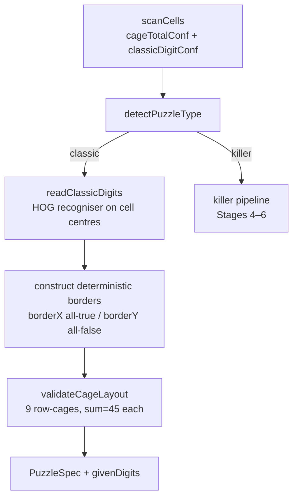

# Classic Sudoku Recognition

> Read this before touching puzzle-type detection, classic digit reading, or any
> UI branch conditioned on `puzzleType === 'classic'`.

Classic sudoku support is a branch of the main image pipeline that activates
automatically when the uploaded image contains large centred digits (pre-filled
givens) rather than small corner cage totals.  No user-facing format switch is
required.

---

## Puzzle Type Detection

`detectPuzzleType` (`web/src/image/cellScan.ts`) decides killer vs classic after
`scanCells` has scored all 81 cells.

`scanCells` returns two 9×9 confidence arrays (`[row][col]`):

| Array | Signal | Trigger condition |
|---|---|---|
| `cageTotalConfidence` | Small contour in top-left quadrant | Contour width ∈ `[subres/16, subres/2)` and height ∈ `[subres/8, subres/2)` |
| `classicDigitConfidence` | Large contour in central region | Contour width or height ≥ `subres × classicMinSizeFraction` |

`detectPuzzleType` sums `cageTotalConfidence` across all cells, divides by 81,
and compares to `tlFractionThreshold` (config: `cellScan.tlFractionThreshold`):

```
maxFraction = sum(cageTotalConfidence) / 81
puzzleType  = maxFraction >= tlFractionThreshold ? 'killer' : 'classic'
```

A killer puzzle typically has 15–25 cage heads (each scoring 1.0), giving a
fraction well above any reasonable threshold.  A classic puzzle scores near 0.

---

## Image Pipeline: Classic Path

`processImage` (`web/src/image/inpImage.ts`) branches at stage 3:



### Border construction

Classic borders are deterministic — no clustering or detection needed:

- `borderX[col][rowGap] = true` for all 72 entries — a full wall at every
  horizontal row boundary.
- `borderY[colGap][row] = false` for all 72 entries — no vertical walls within
  rows.

This produces 9 row-shaped cages each with total 45.

### `readClassicDigits`

For each cell `(r, c)` where `classicDigitConf[r][c] > 0`, extracts a
`patchSize × patchSize` crop (where `patchSize = subres - 2 * margin`,
`margin = subres / 6 | 0`, matching the detection region used by `scanCells`)
starting at `[margin, margin]` within the cell of the warped binary image.
It finds the largest contour within that crop, warps the contour's bounding rect
to a 64×64 thumbnail via `getWarpFromRect`, and passes it to `recognise()` (the
HOG + LinearSVC path — same recogniser used for cage totals).

Using the same `margin`/`patchSize` as `scanCells` prevents tall digits from being
clipped: a digit whose top edge is above `subres/4` (the old hardcoded offset) would
produce a clipped bounding rect and a distorted 64×64 thumbnail.

Returns `givenDigits[row][col]` — a 9×9 array where 0 means empty.

---

## Session State

`PuzzleState` (`web/src/session/types.ts`) carries two classic-specific fields:

```typescript
readonly puzzleType: 'killer' | 'classic';
readonly givenDigits: number[][] | null;  // 9×9 [row][col]; null for killer
```

`puzzleType` flows from the image pipeline result into the draft state on
`uploadPuzzle`, and can be overridden by the user via the type dropdown before
confirming.

---

## Confirm & Solve

`confirmPuzzle` (`web/src/session/actions.ts`) passes `givenDigits` to the
backtracker as pre-fixed cell values.  The solver treats each non-zero given as a
locked singleton before propagation begins.

After solving, every non-zero given is pre-populated into `userGrid` and recorded
as a `placeDigit` action with `source: 'given'`.  The undo handler treats
`source === 'given'` as the initial-state boundary — undo is blocked from
rewinding past given digits.

---

## UI Behaviour

### OCR Review Screen

- Heading reads **"Detected Layout — Classic Sudoku"** instead of the killer
  heading.
- The cage-border overlay and cage-total labels are suppressed.
- An inline edit hint is shown until the user confirms, allowing digit
  corrections directly on the canvas (click a cell, type 1–9 or Backspace).
- The **puzzle type dropdown** (`killer` / `classic`) allows the user to override
  the auto-detected type if the pipeline misclassified the image.

### Playing Screen

- Given-digit cells are rendered with a distinct background and are not
  interactive: no digit entry, no candidate toggling, undo cannot touch them.
- The cage-border overlay and cage-total labels are hidden.
- Standard 3×3 box lines are always shown regardless of puzzle type.
- All other playing-screen features (hints, candidates, virtual cages, reveal)
  behave identically to killer mode.

---

## Out of Scope

- **Classic-specific coaching rules** (hidden single, naked single, pointing
  pairs, etc.) are not yet implemented.  The coaching engine runs the same
  `defaultRules()` as killer mode; rules that are structurally valid for classic
  (e.g. `NakedSingle`, `CellSolutionElimination`) fire normally.
  `CellSolutionElimination` is **always forced active** for classic puzzles in
  `buildEngine` regardless of the user's Config settings — cage rules are no-ops
  on the classic dummy spec, so this rule is the sole mechanism that propagates
  placed digits to row/col/box peers.
- **Orientation correction** (90°/180°/270° rotation) is deferred.
