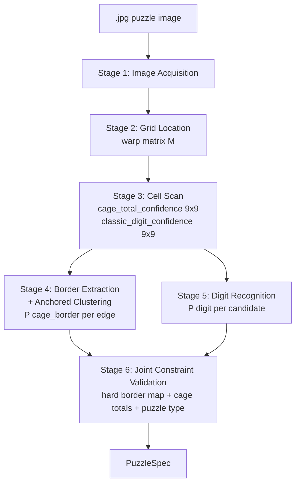
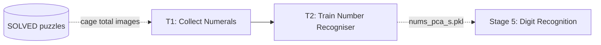
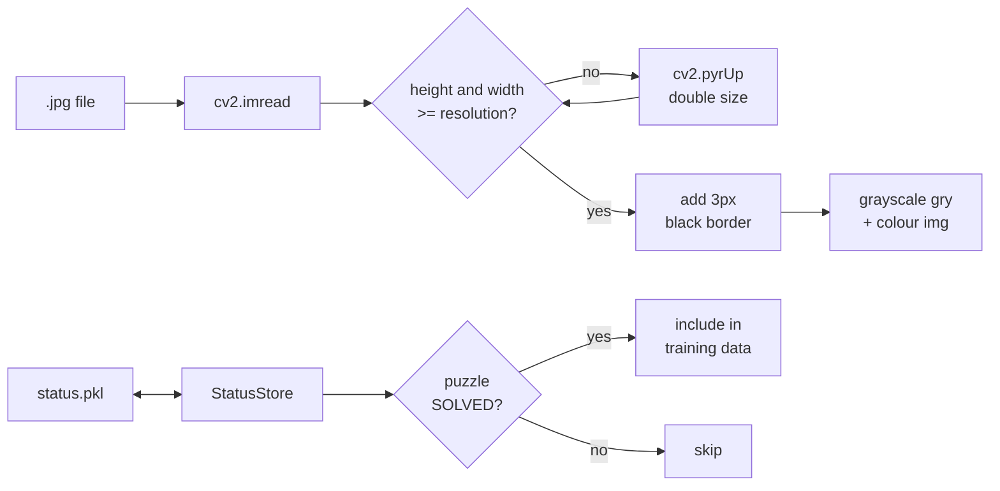
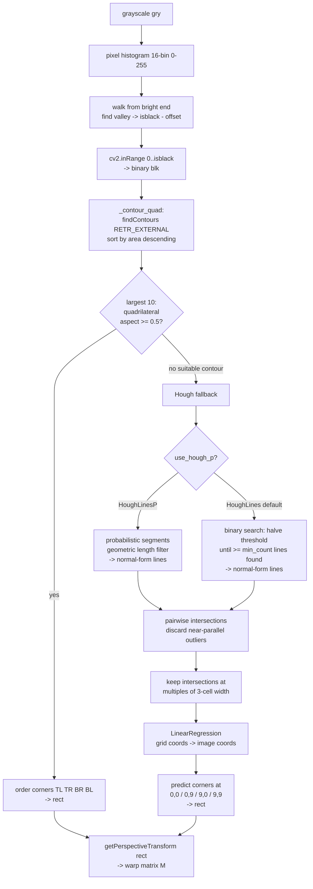
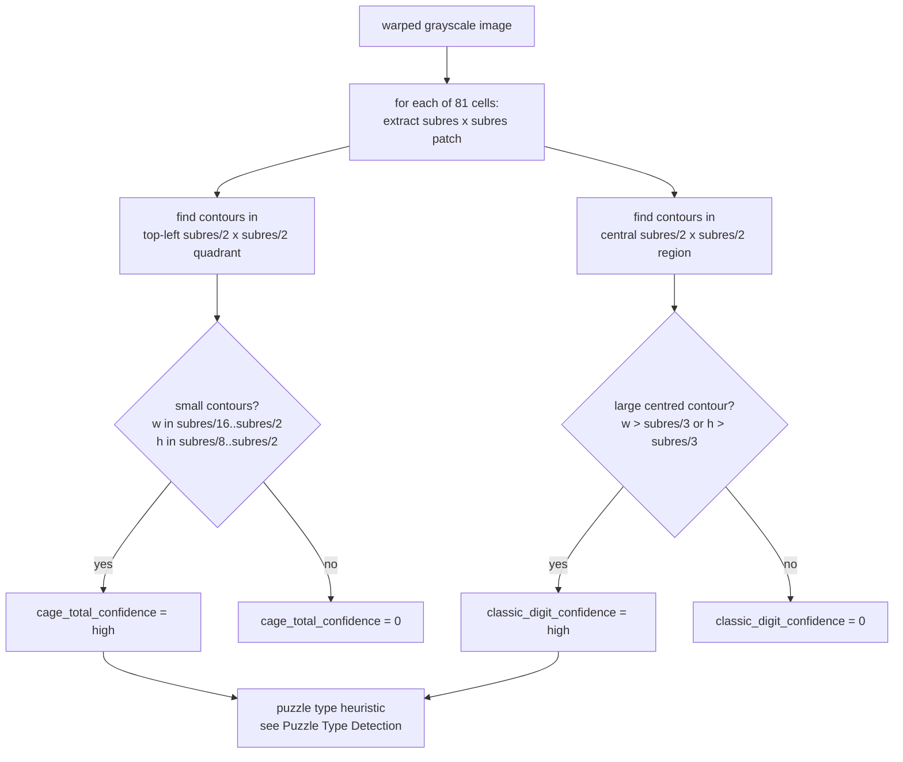
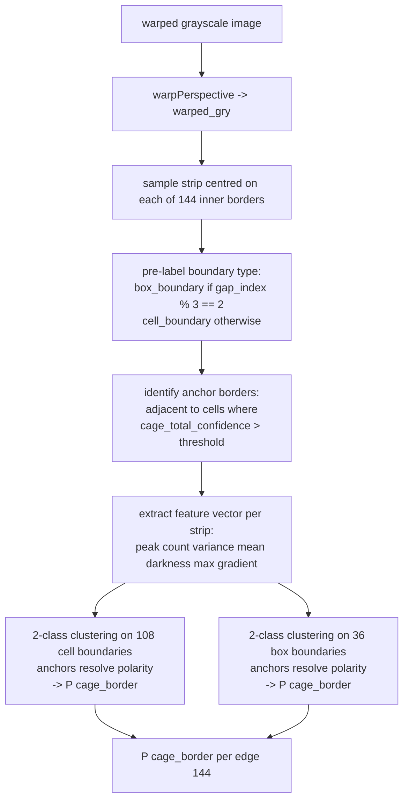
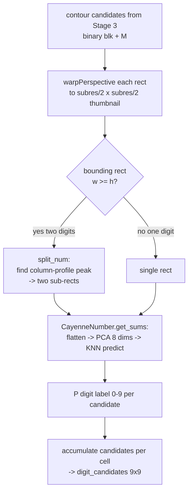
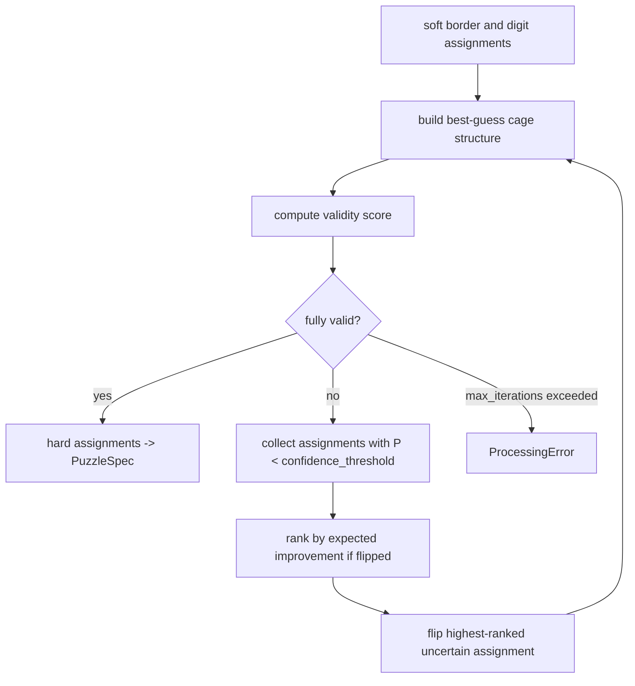
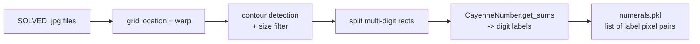
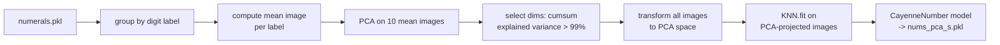

# Image Processing Pipeline

This document is the detailed reference for the image processing pipeline, which
converts a photograph of a killer or classic sudoku puzzle into a `PuzzleSpec`
(cage layout and totals).  For a high-level view of the full system see
`docs/architecture.md`.

The pipeline is **format-agnostic**: it requires no newspaper-specific configuration,
no pre-trained border model, and no user-facing format switch.  It works on any
killer or classic sudoku image encountered for the first time, without prior training
data for that format.

---

## System Overview

Two operating modes share the same image-to-PuzzleSpec stages.

**Inference mode** (normal use): photograph -> PuzzleSpec -> solver / coaching engine.

**Training mode**: human-verified solved puzzles -> updated ML models -> improved
inference.  Only the number-recogniser model (T2) remains in the training loop;
border-detector training (T3) is being retired (see [Training Pipeline](#training-pipeline)).

**Key design principles:**

- Each stage produces **soft outputs** (confidence scores or probabilities).
  Hard assignments are deferred entirely to Stage 6.
- **Cell classification precedes border detection** (Stage 3 before Stage 4) so that
  detected cage-total positions can anchor border clustering without prior knowledge
  of the puzzle format.
- **Global constraints** (cage connectivity, sum = 405, size/total consistency) are
  applied iteratively in Stage 6 to correct borderline assignments that individual
  stages cannot resolve alone.

---

## Stage 1: Image Acquisition and Status Tracking

Puzzle images are downloaded manually (or via `scrape_puzzles`) and stored as `.jpg`
files.  A companion `status.pkl` file maps each image path to a string status label:
`"SOLVED"`, `"CHEATED"` (CSP fallback used), `"ProcessingError"`, or
`"AssertionError"`.  Only `"SOLVED"` puzzles are used as training data.

`get_gry_img` reads a `.jpg`, upscales it with `cv2.pyrUp` until both dimensions
exceed the target resolution (1152 px by default), then adds a 3-pixel black border.
The border ensures Hough lines near the true image edge are picked up by the
transform.  It returns both the grayscale and BGR versions.

**Parameters**: `resolution = 9 * subres = 1152 px`.  Increasing `subres` gives more
pixels per cell at the cost of memory and compute.

[gb] Move pkl to something more robust — represent the path in an OS-independent way.

[gb] Could use "CHEATED" puzzles for training as well.

---

## Stage 2: Grid Location

The goal is to find the four corners of the 9x9 grid so the image can be warped into
a clean square.  Two strategies are tried in order; the second is a fallback only.

The grayscale image is first binarised in both strategies: a pixel histogram identifies
the darkest significant tone (the grid lines), and `cv2.inRange` keeps only those dark
pixels, producing binary image `blk`.

**Primary strategy — contour detection** (`_contour_quad`):
The outer border of the grid is a thick continuous rectangle and is reliably the
largest connected dark region in the image.  `cv2.findContours` finds all external
contours sorted by area; the top 10 are scanned for a quadrilateral whose short-to-long
side ratio is at least 0.5.  `cv2.approxPolyDP` reduces each contour to its corners.
If a valid quadrilateral is found, its four corners are ordered [TL, TR, BR, BL] and
returned immediately.

**Fallback strategy — Hough-line regression** (used only when contour detection fails,
e.g. the outer border has gaps or a large non-grid dark region dominates the image):
Lines are found via one of two Hough modes (controlled by `use_hough_p`).  Pairwise
intersections are computed; near-parallel pairs (whose intersection lies more than one
image-width outside the boundary) are discarded.  Intersections that align to multiples
of 3 cell widths are kept as major grid intersections.  Linear regression maps (row, col)
grid coordinates to (y, x) image coordinates, and the four corners are the regression
predictions at (0,0), (0,9), (9,0), (9,9).

**Parameters and derivation:**

| Parameter | Value | Derivation |
|-----------|-------|------------|
| `isblack_offset` | 56 | After finding the histogram valley, back off by this many grey levels to account for JPEG compression smearing dark ink.  Derive as the mean difference between Otsu's optimal threshold and the histogram-valley estimate on a representative image set. |
| `min_aspect` | 0.5 | Minimum short/long side ratio for a contour to be accepted as the grid rectangle.  Grids photographed at an angle can be quite skewed; 0.5 rejects thin slivers while accepting moderate perspective distortion. |
| `rho` | 2 px | Hough fallback: line position resolution.  Coarser than 1 px reduces noise sensitivity. |
| `hough_lines_theta_divisor` | 16 -> theta=pi/16 | HoughLines angular resolution (~11 degree steps).  Grid lines are within +/- 1 degree of horizontal/vertical, so coarse resolution is fine. |
| `hough_threshold_max` | 2048 | HoughLines binary search start.  Threshold is halved until at least `hough_lines_min_count` lines are found.  The adaptive search addresses the fragility of a fixed threshold. |
| `hough_lines_min_count` | 20 | Minimum lines accepted by the HoughLines binary search.  Images where the grid spans only part of the frame accumulate fewer votes per line, requiring the search to descend further. |
| `hough_theta_divisor` | 180 -> theta=pi/180 | HoughLinesP angular resolution (1 degree steps).  Finer than HoughLines because probabilistic detection is more noise-sensitive. |
| `min_line_length_fraction` | 0.3 | HoughLinesP minimum segment length as a fraction of image size.  A valid grid line must span at least one full 3-box row (~resolution/3). |

---

## Stage 3: Cell Scan

**Purpose:** lightweight per-cell classification that runs *before* border detection.
Its output anchors the border clustering in Stage 4, eliminating the need for any
format-specific border model.

**Input:** warped grayscale image (produced by applying M from Stage 2).

**Output:**
- `cage_total_confidence[9][9]` — float in [0, 1]; probability that cell (r, c) has
  a cage total printed in its top-left quadrant.
- `classic_digit_confidence[9][9]` — float in [0, 1]; probability that cell (r, c)
  has a large pre-filled digit centred in it (classic sudoku given).

**Confidence scoring:** contour area relative to the expected area for a digit at the
given resolution, clamped to [0, 1].  A binary (0 / 1) score is sufficient for the
initial implementation; a continuous score becomes valuable in Stage 6 for ranking
uncertain assignments.

**Parameters:**

| Parameter | Derivation |
|-----------|------------|
| Top-left quadrant: `subres/2 x subres/2` | Cage totals occupy the top-left quarter of their cell; this is an upper bound on the search region. |
| Contour width bounds: `subres/16 .. subres/2` | Same bounds as Stage 5 digit recognition.  Lower bound excludes grid lines; upper bound excludes whole-cell features. |
| Contour height bounds: `subres/8 .. subres/2` | Digits are taller than wide; same bounds as Stage 5. |
| Central region for classic digit: `subres/3 .. subres` | Pre-filled digits in classic sudoku occupy the centre two-thirds of a cell. |

---

## Stage 4: Border Feature Extraction and Anchored Clustering

**Purpose:** classify each of the 144 inner borders as cage border or non-cage border,
without any format-specific code or pre-trained model.

**Input:** warped grayscale image; `cage_total_confidence[9][9]` from Stage 3.

**Output:** `P(cage_border)` for each of the 144 inner edges, as a float in [0, 1].

### Structural pre-labelling

The cell/box boundary dimension is determined from grid position and requires no
detection:

- **Box boundaries** (36 total): horizontal borders at row-gap indices 2 and 5
  (between rows 2–3 and rows 5–6); vertical borders at column-gap indices 2 and 5.
  Condition: `gap_index % 3 == 2` (0-indexed over the 8 possible gaps).
- **Cell boundaries** (108 total): all remaining inner borders.

Classifying cage border vs non-cage border is two independent 2-class problems: one
over the 36 box boundaries and one over the 108 cell boundaries.  This prevents box
boundaries (which have a distinct visual signature from their thickness) from
contaminating the cell-boundary cluster.

### Anchoring

Any border adjacent to a high-confidence cage-total cell is a **positive anchor**:
it is (almost certainly) a cage border, because the cage-total cell is the top-left
cell of its cage and therefore has different-cage neighbours above and to its left.
For a cage-total cell at (r, c):

- The border above cell (r, c) — between rows r-1 and r in column c — is a cage border.
- The border to the left of cell (r, c) — between columns c-1 and c in row r — is a
  cage border.

A typical killer sudoku has 15–25 cage heads.  Cage heads on the top row have no
border above them, and cage heads on the left column have no border to their left —
both are outer edges, not inner edges.  The usable anchor count is therefore somewhat
less than 2 per cage head; in practice expect 15–35 positive anchor edges across both
clustering groups.

### Clustering

**Feature vector** per strip: peak count, mean, variance, maximum gradient.  These
features are sufficient to discriminate cage borders from non-cage borders across
formats without format-specific training.

**Parameters:**

| Parameter | Value | Derivation |
|-----------|-------|------------|
| `sample_fraction` | 4 -> +/- 32 px half-width | Must cover the border transition without reaching digit ink.  Derive as ~8x border width on representative images. |
| `sample_margin` | 16 -> +/- 8 px inset | Avoids sampling adjacent digit ink at strip ends.  Derive as maximum x-offset of digit pixels from bounding box. |
| Anchor confidence threshold | configurable | Minimum `cage_total_confidence` for a cell to contribute positive anchors.  Start at 0.5; tune to minimise false anchors on a representative image set. |

---

## Stage 5: Full Digit Recognition

Cage totals are printed in the top-left of the cage's top-left cell.  This stage
classifies each contour candidate (located in Stage 3) using PCA + KNN.

Each digit thumbnail is warped to a canonical `(subres/2) x (subres/2)` square.
`CayenneNumber.get_sums` projects each flattened thumbnail through the trained PCA
transform (8 components), then classifies with the stored KNN.

Wide bounding boxes (two adjacent digits merged in the contour tree) are split at
the peak of the column profile.

**Output:** `P(digit d)` per candidate position; confidence is the KNN vote fraction.

**Parameters:**

| Parameter | Value | Derivation |
|-----------|-------|------------|
| `subres/16 <= w < subres/2` | 8–63 px | Width bounds for digit bounding rect.  Lower bound excludes thin lines (~2 px); upper bound excludes whole-cell features. |
| `subres/8 <= h < subres/2` | 16–63 px | Height bounds.  Digits are taller than wide; same derivation method. |
| `height=4` in `find_peaks` | 4 px | Minimum peak height for splitting two-digit bounding rects.  Derive as minimum ink density at the centre of a digit (~4 px at subres=128). |
| PCA dims | 8 (auto) | Minimum dims explaining 99% of variance in mean digit images. |
| KNN k | 5 | sklearn default.  Tune by k-fold cross-validation; plot accuracy vs k and select the elbow. |

[gb] All the subres fractions are derived by trial and error.  Is there a better way?
How can we deal with rotated puzzles?

[gb] PCA + KNN does not seem to be as accurate as the literature suggests.
Is there a better approach altogether?

[gb] The training is done by labelling clusters by hand.  Can we be cleverer,
e.g. injecting known integers into the process and seeing which cluster they end up in?

---

## Stage 6: Joint Constraint Validation

**Purpose:** convert soft per-edge and per-digit probabilities into hard assignments by
iteratively applying global constraints that individual stages cannot enforce alone.

**Input:** `P(cage_border)` per edge (Stage 4); `P(digit d)` per candidate (Stage 5).

**Output:** hard border map (`border_x[9][8]`, `border_y[8][9]`), hard cage totals
(`cage_totals[9][9]`), puzzle type (killer / classic).

### Validity checks

| Check | Treatment |
|-------|-----------|
| All cages are connected regions | Hard reject: flip lowest-confidence adjacent border |
| Each cage has exactly one total | Hard reject: flip lowest-confidence border in affected cage |
| Total in top-left cell of cage's top-left cell | Hard reject: flip border, or flag as possible orientation error |
| Sum of all cage totals = 405 | Hard reject: re-score ambiguous digits first, then flip borders |
| Cage size and total are mutually consistent | Soft penalty: prune implausible digit readings |
| Classic sudoku: no duplicate digits in any partial row / col / box | Soft penalty |

### Iteration

`confidence_threshold` and `max_iterations` are configurable.  Exhausting iterations
surfaces a `ProcessingError` to the user; no automatic recovery is attempted since
no recovery is sound without user input.

### Classic sudoku path

If `cage_total_confidence` is uniformly low across all cells, the validator switches
to classic-sudoku mode: all inner borders are treated as non-cage borders (each cell
is its own region), and the validity check becomes partial-sudoku consistency — no
duplicate digit in any row, column, or 3x3 box.

---

## Puzzle Type Detection

Detection is based on the aggregate confidence from Stage 3.

| Condition | Puzzle type |
|-----------|-------------|
| `sum(cage_total_confidence) > threshold_killer` | Killer sudoku |
| `sum(classic_digit_confidence) > threshold_classic` and `sum(cage_total_confidence) < threshold_killer` | Classic sudoku |
| Neither threshold met | Ambiguous: surface as `ProcessingError` or attempt orientation correction |

**Orientation correction (deferred):** if detected cage totals appear in a corner
other than the top-left of their cell, the image may be rotated by a multiple of
90 degrees.  Rotating the warped image and re-running Stages 3–6 until the validity
score is maximised is a principled correction.  This is deferred until the core
pipeline is proven.

---

## Training Pipeline

The training pipeline converts solved puzzles into updated ML models.  Only T1 and T2
remain; T3 (Observer border detector) is being retired — see [Migration Plan](#migration-plan).

### T1: Collect Numerals

For each `SOLVED` puzzle, re-run contour detection on the raw image and classify each
digit thumbnail using the current model.  The resulting `(label, pixel_image)` pairs
are saved to `numerals.pkl`.

### T2: Train Number Recogniser

Groups digit images by label, computes per-label mean image, fits PCA on those 10
means, selects minimum PCA dims explaining 99% of variance, trains KNN on all
projected images.

### T3: Observer Border Detector (RETIRING)

The `BorderPCA1D` model trained on solved Observer puzzles is being retired once Stage
4 anchored clustering is validated.  During the proof-of-concept phase, T3 runs in
parallel with Stage 4 for comparison logging; see [Migration Plan](#migration-plan).

---

## Threshold Derivation Guide

Most numeric thresholds in `config.py` were set empirically.  This section explains
systematic derivation so the pipeline can be adapted to new image sources or
resolutions without guesswork.

### Principle: Parameters Should Scale with `subres`

Many thresholds that appear as raw integers are really fractions of the cell size
(`subres = 128`).  Re-expressing them as ratios makes their derivation clear:

| Parameter | Current | As fraction of subres | Principled derivation |
|-----------|---------|----------------------|----------------------|
| `adaptive_block_size` | 31 | ~subres/4 | Must be larger than the widest border line and smaller than a cell.  Measure border width; set to 6x border width, rounded to odd integer. |
| `sample_fraction` (+/- 32 px strip) | 4 | subres/4 | Must cover the border transition without entering the digit region.  Measure border width; set strip half-width to ~8x border width. |
| `sample_margin` (+/- 8 px inset) | 16 | subres/16 | Prevents strip from sampling adjacent digit ink.  Set to maximum x-offset of digit pixels from bounding box. |
| digit min width | subres/16 | subres/16 | Just below the narrowest digit (typically "1").  Measure on a sample set. |
| digit max width/height | subres/2 | subres/2 | Cage totals occupy the top-left quarter of a cell; subres/2 is a safe upper bound. |

### Hough Threshold (`hough_threshold_max = 2048`, fallback only)

The Hough fallback uses an adaptive binary search: starting from `hough_threshold_max`,
the threshold is halved until at least `hough_lines_min_count` lines are found.  This
eliminates the fragility of a fixed threshold across images where the grid occupies
different fractions of the frame.

`hough_threshold_max` should be set high enough that it rejects noise on a
well-photographed image, and `hough_lines_min_count` low enough that the search
terminates quickly on a partial-frame image.  Current values (2048, 20) are empirically
validated on the Guardian and Observer training sets.

### Black Threshold Offset (`isblack_offset = 56`)

The histogram valley finding selects the bin where count first rises from the dark
end.  JPEG compression smears the darkest ink, so true grid-line pixels are somewhat
brighter than nominal black.  The offset shifts the threshold up to capture them.

**Derivation:** measure actual pixel values of grid-line centres vs adjacent background
on a dozen representative images.  Set to the 95th percentile of grid-line brightness
minus the histogram-valley estimate.

### Stage 4 Anchor Confidence Threshold

Minimum `cage_total_confidence` for a cell to contribute positive anchor edges to
border clustering.

**Derivation:** on a representative image set, plot the distribution of
`cage_total_confidence` for true cage heads vs non-heads.  Set the threshold at the
valley between the two distributions.

### PCA Variance Threshold (99%)

The number of PCA components kept explains 99% of variance in mean digit images.
This is a conventional value; tune by cross-validation at 90%, 95%, 99%, 99.5%.

---

## Migration Plan

### Phase 1: Proof of Concept

- Implement Stages 3–6 alongside the existing Guardian / Observer pipeline.
- Both pipelines run on every image; results are compared and discrepancies logged.
- No change to the `PuzzleSpec` output or anything downstream.
- The `newspaper` field and UI switch remain in place during this phase only.

### Phase 2: Validation

- Count consecutive puzzles where the new pipeline matches the existing one on all
  border assignments.  Target: 20 consecutive solved puzzles with no discrepancy
  (configurable).
- Run on the full Guardian training set as well as Observer to confirm compatibility.

### Phase 3: Retirement

Remove in a single commit once Phase 2 criteria are met:

- `BorderPCA1D` class and `load_observer_border_detector`
- `detect_borders_peak_count` (Guardian-specific)
- T3 training pipeline
- `newspaper: Literal["guardian", "observer"]` field from `ImagePipelineConfig`
- `is_guardian` / `is_observer` properties
- `newspaper` parameter from API schema (`schemas.py`) and router (`routers/puzzle.py`)
- `<select id="newspaper-select">` from `static/index.html` and `main.ts`
- `puzzle_dir(newspaper)` method from `api/config.py`

### Phase 4: Extensions (future)

- **Orientation correction:** rotate the warped image by 0 / 90 / 180 / 270 degrees
  and select the orientation that maximises the Stage 6 validity score.  Enables
  photos taken with the phone sideways or upside-down.
- **Classic sudoku coaching rules:** hidden single, naked single, etc.  These are a
  superset of killer sudoku rules and will improve hint coverage for both puzzle types.
