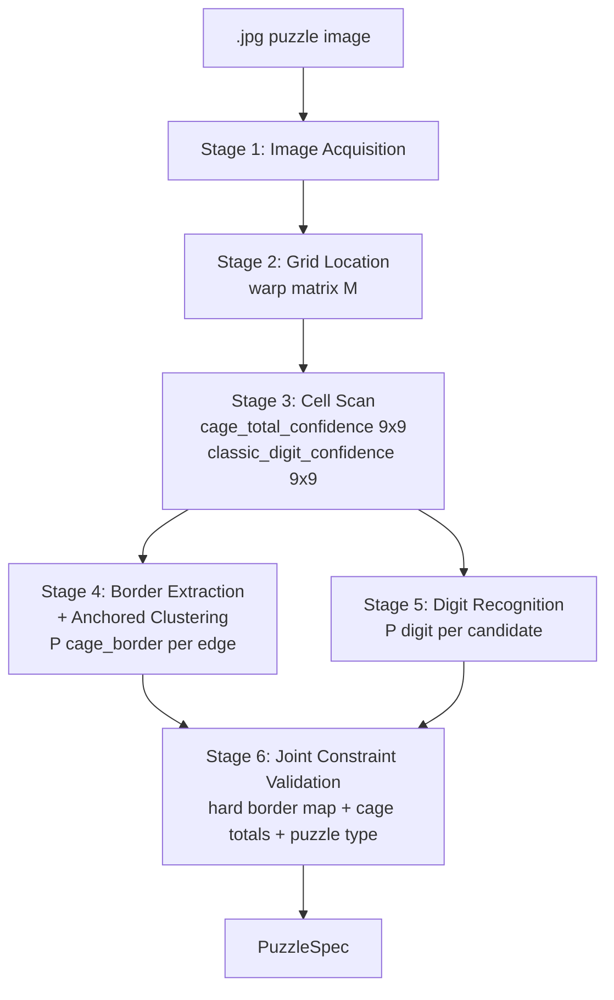
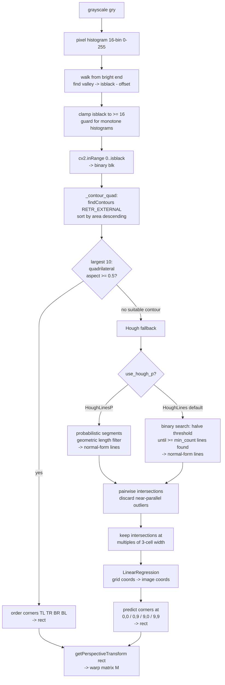
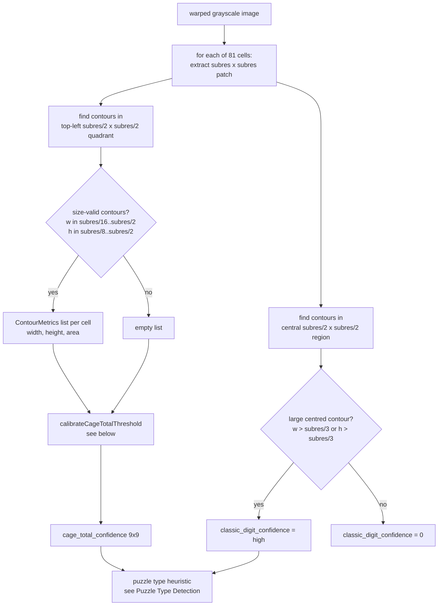
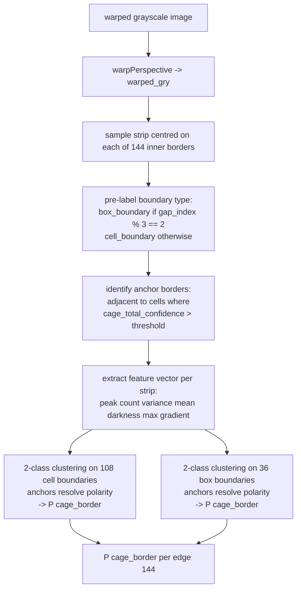
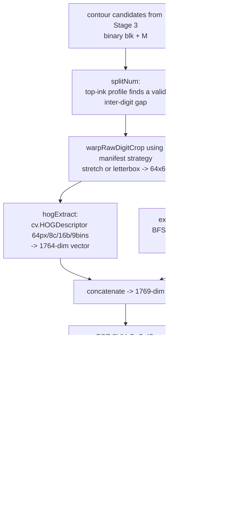
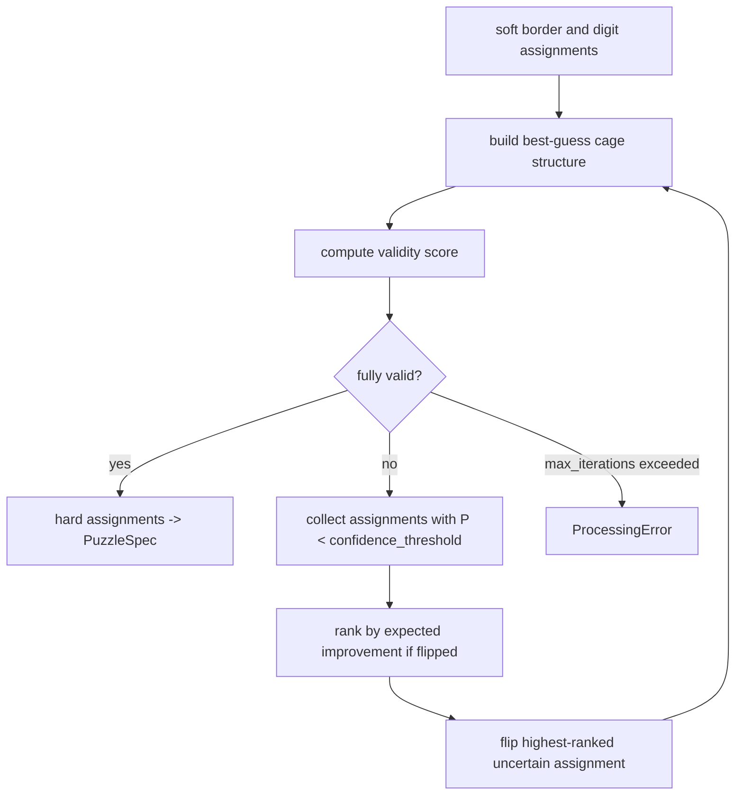
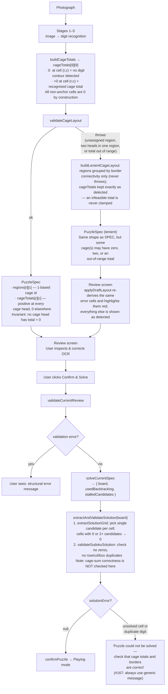
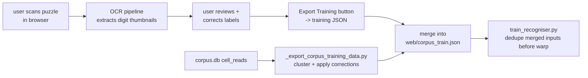
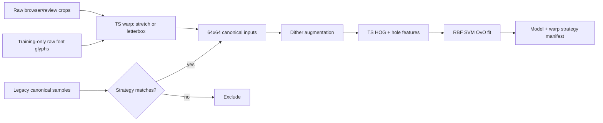

# Image Processing Pipeline

This document is the detailed reference for the image processing pipeline, which
converts a photograph of a killer or classic sudoku puzzle into a `PuzzleSpec`
(cage layout and totals).  For a high-level view of the full system see
`docs/architecture.md`.

The pipeline is **format-agnostic**: it requires no newspaper-specific configuration,
no pre-trained border model, and no user-facing format switch.  It works on any
killer or classic sudoku image encountered for the first time, without prior training
data for that format.

---

## System Overview

Two operating modes share the same image-to-PuzzleSpec stages.

**Inference mode** (normal use): photograph -> PuzzleSpec -> solver / coaching engine.

**Training mode**: human-verified solved puzzles -> updated ML models -> improved
inference.  Only the number-recogniser model (T2) remains in the training loop;
border-detector training (T3) has been retired (see [Training Pipeline](#training-pipeline)).


```mermaid
flowchart TD
    A[.jpg puzzle image] --> B[Stage 1: Image Acquisition]
    B --> C[Stage 2: Grid Location\nwarp matrix M]
    C --> D[Stage 3: Cell Scan\ncage_total_confidence 9x9\nclassic_digit_confidence 9x9]
    D --> E[Stage 4: Border Extraction\n+ Anchored Clustering\nP cage_border per edge]
    D --> F[Stage 5: Digit Recognition\nP digit per candidate]
    E --> G[Stage 6: Joint Constraint Validation\nhard border map + cage totals + puzzle type]
    F --> G
    G --> H[PuzzleSpec]
```


```mermaid
flowchart LR
    S[(browser sessions)] -.->|labelled thumbnails| T1[T1: Collect Numerals]
    T1 --> T2[T2: Train Number Recogniser]
    T2 -.->|num_recogniser.bin/.json| F[Stage 5: Digit Recognition]
```

**Key design principles:**

- Each stage produces **soft outputs** (confidence scores or probabilities).
  Hard assignments are deferred entirely to Stage 6.
- **Cell classification precedes border detection** (Stage 3 before Stage 4) so that
  detected cage-total positions can anchor border clustering without prior knowledge
  of the puzzle format.
- **Global constraints** (cage connectivity, sum = 405, size/total consistency) are
  applied iteratively in Stage 6 to correct borderline assignments that individual
  stages cannot resolve alone.

---

## Stage 1: Image Acquisition

The deployable pipeline acquires puzzle images in the browser and processes them
with OpenCV.js. Offline corpus evaluation uses the same production bundle:
`web/scripts/evaluate-corpus.ts` content-hashes images, drives a production Vite
preview with Playwright, and stores outcomes and raw/derived crop evidence in
`corpus.db`.

Scheduled retraining uses the committed `web/eval-fixtures/` smoke corpus and
compares the candidate model's browser-produced report with
`web/eval-baseline.json`. The retired Python `status.pkl` evaluator is not a
production or training authority.

---

## Stage 2: Grid Location

The goal is to find the four corners of the 9x9 grid so the image can be warped into
a clean square.  Two strategies are tried in order; the second is a fallback only.

The grayscale image is first binarised in both strategies: a pixel histogram identifies
the darkest significant tone (the grid lines), and `cv2.inRange` keeps only those dark
pixels, producing binary image `blk`.

**Primary strategy — contour detection** (`_contour_quad`):
The outer border of the grid is a thick continuous rectangle and is reliably the
largest connected dark region in the image.  `cv2.findContours` finds all external
contours sorted by area; the top 10 are scanned for a quadrilateral whose short-to-long
side ratio is at least 0.5.  `cv2.approxPolyDP` reduces each contour to its corners.
If a valid quadrilateral is found, its four corners are ordered [TL, TR, BR, BL] and
returned immediately.

**Fallback strategy — Hough-line regression** (used only when contour detection fails,
e.g. the outer border has gaps or a large non-grid dark region dominates the image):
Lines are found via one of two Hough modes (controlled by `use_hough_p`).  Pairwise
intersections are computed; near-parallel pairs (whose intersection lies more than one
image-width outside the boundary) are discarded.  Intersections that align to multiples
of 3 cell widths are kept as major grid intersections.  Linear regression maps (row, col)
grid coordinates to (y, x) image coordinates, and the four corners are the regression
predictions at (0,0), (0,9), (9,0), (9,9).


```mermaid
flowchart TD
    A[grayscale gry] --> B[pixel histogram 16-bin 0-255]
    B --> C[walk from bright end\nfind valley -> isblack - offset]
    C --> Cclamp[clamp isblack to >= 16\nguard for monotone histograms]
    Cclamp --> D[cv2.inRange 0..isblack\n-> binary blk]
    D --> E[_contour_quad:\nfindContours RETR_EXTERNAL\nsort by area descending]
    E --> F{largest 10:\nquadrilateral\naspect >= 0.5?}
    F -- yes --> G[order corners TL TR BR BL\n-> rect]
    F -- no suitable contour --> H[Hough fallback]
    H --> I{use_hough_p?}
    I -- HoughLinesP --> J[probabilistic segments\ngeometric length filter\n-> normal-form lines]
    I -- HoughLines default --> K[binary search: halve threshold\nuntil >= min_count lines found\n-> normal-form lines]
    J --> L[pairwise intersections\ndiscard near-parallel outliers]
    K --> L
    L --> M[keep intersections at\nmultiples of 3-cell width]
    M --> N[LinearRegression\ngrid coords -> image coords]
    N --> O[predict corners at\n0,0 / 0,9 / 9,0 / 9,9\n-> rect]
    G --> P[getPerspectiveTransform rect\n-> warp matrix M]
    O --> P
```

**Parameters and derivation:**

| Parameter | Value | Derivation |
|-----------|-------|------------|
| `isblack_offset` | 56 | After finding the histogram valley, back off by this many grey levels to account for JPEG compression smearing dark ink.  Derive as the mean difference between Otsu's optimal threshold and the histogram-valley estimate on a representative image set.  When the histogram is monotonically decreasing (no valley — common for clean digital screenshots), the loop reaches bin 0, giving `isblack = 0 - offset = -56`; `isblack` is therefore clamped to a minimum of 16 to ensure near-black pixels are always captured. |
| `min_aspect` | 0.5 | Minimum short/long side ratio for a contour to be accepted as the grid rectangle.  Grids photographed at an angle can be quite skewed; 0.5 rejects thin slivers while accepting moderate perspective distortion. |
| `rho` | 2 px | Hough fallback: line position resolution.  Coarser than 1 px reduces noise sensitivity. |
| `hough_lines_theta_divisor` | 16 -> theta=pi/16 | HoughLines angular resolution (~11 degree steps).  Grid lines are within +/- 1 degree of horizontal/vertical, so coarse resolution is fine. |
| `hough_threshold_max` | 2048 | HoughLines binary search start.  Threshold is halved until at least `hough_lines_min_count` lines are found.  The adaptive search addresses the fragility of a fixed threshold. |
| `hough_lines_min_count` | 20 | Minimum lines accepted by the HoughLines binary search.  Images where the grid spans only part of the frame accumulate fewer votes per line, requiring the search to descend further. |
| `hough_theta_divisor` | 180 -> theta=pi/180 | HoughLinesP angular resolution (1 degree steps).  Finer than HoughLines because probabilistic detection is more noise-sensitive. |
| `min_line_length_fraction` | 0.3 | HoughLinesP minimum segment length as a fraction of image size.  A valid grid line must span at least one full 3-box row (~resolution/3). |

---

## Stage 3: Cell Scan

**Purpose:** lightweight per-cell classification that runs *before* border detection.
Its output anchors the border clustering in Stage 4, eliminating the need for any
format-specific border model.

**Input:** warped grayscale image (produced by applying M from Stage 2).

**Output:**
- `cage_total_confidence[9][9]` — float in [0, 1]; probability that cell (r, c) has
  a cage total printed in its top-left quadrant.
- `classic_digit_confidence[9][9]` — float in [0, 1]; probability that cell (r, c)
  has a large pre-filled digit centred in it (classic sudoku given).


```mermaid
flowchart TD
    A[warped grayscale image] --> B[for each of 81 cells:\nextract subres x subres patch]
    B --> C[find contours in\ntop-left subres/2 x subres/2 quadrant]
    C --> D{size-valid contours?\nw in subres/16..subres/2\nh in subres/8..subres/2}
    D -- yes --> E[ContourMetrics list per cell\nwidth, height, area]
    D -- no --> F[empty list]
    E --> CAL[calibrateCageTotalThreshold\nsee below]
    F --> CAL
    CAL --> CC[cage_total_confidence 9x9]
    B --> G[find contours in\ncentral subres/2 x subres/2 region]
    G --> H{large centred contour?\nw > subres/3 or h > subres/3}
    H -- yes --> I[classic_digit_confidence = high]
    H -- no --> J[classic_digit_confidence = 0]
    CC --> K[puzzle type heuristic\nsee Puzzle Type Detection]
    I --> K
```

**Contour collection:** `collectCageTotalContours` runs adaptiveThreshold +
findContours once per cell's top-left quadrant and keeps every contour passing
`isCageTotalContourSize` (the bounding-box check), recording `{width, height, area}`
for each. No fill-ratio threshold is applied at this stage — that decision is
deferred to calibration so it can be evaluated for many candidate thresholds without
re-running OpenCV.

**Per-image fill-ratio calibration:** `calibrateCageTotalThreshold`
(`web/src/image/cellScan.ts`) searches `cageTotalFillRatioCandidates` (a fixed list
spanning ~0.10-0.50) for the threshold that best separates real digit glyphs
(observed fillRatio 0.50-0.81) from thin dashed cage-border-line segments (fillRatio
~0.15), which both pass the size check but must be told apart. For each candidate:

1. Derive `cage_total_confidence` via `cageConfFromContours` (1.0 if any contour's
   `area / (width * height) >= threshold`, else 0.0).
2. Run Stage 4's `clusterBorders` with that confidence as anchors.
3. Threshold the resulting border probabilities at >0.5 and check structural
   plausibility with `validateCageGeometry` — every cell in exactly one connected
   component, every component with exactly one cage head, no double-heads.

Among candidates that validate, the one with the largest `thresholdMargin` (minimum
distance from the threshold to any contour's fillRatio — i.e. the cleanest
separation between the dash and digit clusters) is chosen, and its
`cage_total_confidence`/`borderX`/`borderY`/`borderXProb`/`borderYProb` are used
directly by Stage 4/5 (no second `clusterBorders` run). If no candidate validates,
the pipeline falls back to the fixed `cageTotalMinFillRatio` (0.3).

Each run submits a `CageThresholdCalibrationReport` (consent-gated, stored in R2
under `cage-threshold-calibration/`) recording the chosen threshold, whether the
fallback was used, the full candidate sweep, and the raw flattened contour fill
ratios — data for re-tuning the candidate list or margin rule later.

**Parameters:**

| Parameter | Derivation |
|-----------|------------|
| Top-left quadrant: `subres/2 x subres/2` | Cage totals occupy the top-left quarter of their cell; this is an upper bound on the search region. |
| Contour width bounds: `subres/16 .. subres/2` | Same bounds as Stage 5 digit recognition.  Lower bound excludes grid lines; upper bound excludes whole-cell features. |
| Contour height bounds: `subres/8 .. subres/2` | Digits are taller than wide; same bounds as Stage 5. |
| `cageTotalFillRatioCandidates` | `[0.10, 0.15, ..., 0.50]` — spans the observed dash cluster (~0.15) to digit cluster (0.50-0.81). |
| `cageTotalMinFillRatio` | 0.3 — fallback threshold used only when no candidate validates. |
| Central region for classic digit: `subres/3 .. subres` | Pre-filled digits in classic sudoku occupy the centre two-thirds of a cell. |

---

## Stage 4: Border Feature Extraction and Anchored Clustering

**Purpose:** classify each of the 144 inner borders as cage border or non-cage border,
without any format-specific code or pre-trained model.

**Input:** warped grayscale image; `cage_total_confidence[9][9]` from Stage 3.

**Output:** `P(cage_border)` for each of the 144 inner edges, as a float in [0, 1].

### Structural pre-labelling

The cell/box boundary dimension is determined from grid position and requires no
detection:

- **Box boundaries** (36 total): horizontal borders at row-gap indices 2 and 5
  (between rows 2–3 and rows 5–6); vertical borders at column-gap indices 2 and 5.
  Condition: `gap_index % 3 == 2` (0-indexed over the 8 possible gaps).
- **Cell boundaries** (108 total): all remaining inner borders.

Classifying cage border vs non-cage border is two independent 2-class problems: one
over the 36 box boundaries and one over the 108 cell boundaries.  This prevents box
boundaries (which have a distinct visual signature from their thickness) from
contaminating the cell-boundary cluster.

### Anchoring

Any border adjacent to a high-confidence cage-total cell is a **positive anchor**:
it is (almost certainly) a cage border, because the cage-total cell is the top-left
cell of its cage and therefore has different-cage neighbours above and to its left.
For a cage-total cell at (r, c):

- The border above cell (r, c) — between rows r-1 and r in column c — is a cage border.
- The border to the left of cell (r, c) — between columns c-1 and c in row r — is a
  cage border.

A typical killer sudoku has 15–25 cage heads.  Cage heads on the top row have no
border above them, and cage heads on the left column have no border to their left —
both are outer edges, not inner edges.  The usable anchor count is therefore somewhat
less than 2 per cage head; in practice expect 15–35 positive anchor edges across both
clustering groups.

### Clustering


```mermaid
flowchart TD
    A[warped grayscale image] --> B[warpPerspective -> warped_gry]
    B --> C[sample strip centred on each of 144 inner borders]
    C --> D[pre-label boundary type:\nbox_boundary if gap_index % 3 == 2\ncell_boundary otherwise]
    D --> E[identify anchor borders:\nadjacent to cells where\ncage_total_confidence > threshold]
    E --> F[extract feature vector per strip:\npeak count variance mean darkness max gradient]
    F --> G[2-class clustering on 108 cell boundaries\nanchors resolve polarity\n-> P cage_border]
    F --> H[2-class clustering on 36 box boundaries\nanchors resolve polarity\n-> P cage_border]
    G --> I[P cage_border per edge 144]
    H --> I
```

**Feature vector** per strip: peak count, mean, variance, maximum gradient.  These
features are sufficient to discriminate cage borders from non-cage borders across
formats without format-specific training.

**Parameters:**

| Parameter | Value | Derivation |
|-----------|-------|------------|
| `sample_fraction` | 4 -> +/- 32 px half-width | Must cover the border transition without reaching digit ink.  Derive as ~8x border width on representative images. |
| `sample_margin` | 16 -> +/- 8 px inset | Avoids sampling adjacent digit ink at strip ends.  Derive as maximum x-offset of digit pixels from bounding box. |
| Anchor confidence threshold | configurable | Minimum `cage_total_confidence` for a cell to contribute positive anchors.  Start at 0.5; tune to minimise false anchors on a representative image set. |

---

## Stage 5: Full Digit Recognition

Cage totals are printed in the top-left of the cage's top-left cell.  This stage
classifies each contour candidate (located in Stage 3) using the deployed model's
recogniser architecture.

> The browser supports two recogniser architectures, selected by the manifest's
> `recogniser_type` field (`loadNumRecogniser` dispatches on it; absent means
> `"hog"`, for backward compatibility with every manifest committed before
> 2026-07-31): `HogRecogniser` (HOG + hole-count features, OvO RBF SVM — see
> below) and `PcaRecogniser` (cluster-mean-template match with an RBF-SVM
> fallback — see "Cluster-mean PCA recogniser" below). Both require
> `classifier_type: "rbf"`. Every manifest's required `warp_strategy` selects
> production `stretch`, aspect-preserving `letterbox`, or centroid-centred
> `letterbox-centered` (§ below) before recognition; missing/unsupported
> strategies are rejected explicitly. As of 2026-07-31, `PcaRecogniser` with
> `letterbox-centered` is the deployed default (see "Cluster-mean PCA
> recogniser").

`buildCageTotals` (`inpImage.ts`) runs `cv.findContours` once over the whole warped
board (`RETR_TREE`), walks the resulting hierarchy (`contourHier`), and keeps contours
matching `contourIsNumber` — a digit-sized bounding rect (`isDigitSizedContour`: width
in `[subres>>4, subres>>1)`, height in `[subres>>3, subres>>1)`) at a vertical position
consistent with a cage total rather than a centred solution digit (a parity check on
`y`, since solution digits and cage totals occupy alternating vertical "rows" within
`contourIsNumber`'s scan). `isDigitSizedContour` is factored out so production digit
acquisition shares one width/height gate without forcing callers that already scoped a
candidate glyph to inherit the whole-board parity check.

Each digit thumbnail is a 64×64 binary uint8 image produced by `letterboxWarp` —
the digit's natural aspect ratio is preserved and it is centred with black letterbox
bars on the narrower axis, rather than stretched to fill the square (the previous
`squarePadSrc` approach centred the rect in a square *before* warping, which is
equivalent for single digits but interacted badly with multi-digit splits; see Classic
digit reading below for the shared rationale). `splitNum` decides whether a raw contour represents one or two digits from the
column-wise topmost-ink-row profile and the last valid inter-glyph peak. It validates
both halves with `contourIsNumber`; no secondary model or fallback branch participates.
Each selected rectangle is independently `letterboxWarp`-ed, and no pre-split merged
thumbnail is produced or threaded through training export.

Before either recognition warp, `extractRawDigitCrop` copies the exact bounding-box
pixels from the warped binary grid into a `RawDigitCrop`. `warpRawDigitCrop` then applies
the recogniser's named `stretch`, `letterbox`, or `letterbox-centered` strategy using the shared production
perspective-warp geometry. `ParseResult.cellSourceCrops` retains those strategy-neutral
pixels in the same per-cell order as `cellThumbs` and the recognition results. The
Node bridge exposes this same `warpRawDigitCrop` implementation to Python training in
batches; bridge failures are hard errors and there is no Python warp fallback.

HOG features are extracted via `cv.HOGDescriptor` (OpenCV.js) with a 64 px window,
8 px cells, 16 px blocks, and 9 orientation bins — producing a 1764-dimensional vector.
A 5-dimensional hole-count feature (`extractHoleFeatures`, called from Python through
`ts_bridge.py`) is concatenated: a BFS flood-fill from
every border background pixel marks "outside"; unvisited background pixels are
enclosed "holes", labelled and sized (regions under 6px discarded as anti-aliasing
noise), encoded as `[onehot(0 holes), onehot(1), onehot(2+), frac(largest), frac(2nd
largest)]`. This gives the classifier a global-topology signal HOG's local gradient
histograms cannot encode — e.g. distinguishing "3" (0 holes) from "8" (2 holes), a
confirmed confusion pair before this feature was added. The combined 1769-dimensional
vector feeds an OvO RBF SVM (45 binary classifiers); the winner's vote fraction is
the read's confidence, flagged uncertain below 0.7.


```mermaid
flowchart TD
    A[contour candidates from Stage 3\nbinary blk + M] --> B[splitNum:\ntop-ink profile finds a valid\ninter-digit gap]
    B --> C[warpRawDigitCrop using manifest strategy\nstretch or letterbox -> 64x64]
    C --> D[hogExtract:\ncv.HOGDescriptor 64px/8c/16b/9bins\n-> 1764-dim vector]
    C --> E[extractHoleFeatures:\nBFS flood-fill from border\n-> 5-dim vector]
    D --> F[concatenate -> 1769-dim]
    E --> F
    F --> G[RBF SVM OvO 45 classifiers\n-> vote count per digit]
    G --> H[Recognition: label + confident flag\nper candidate]
    H --> I[accumulate candidates per cell\n-> digit_candidates 9x9]
```

**Output:** `{ label: number, confident: boolean }` per candidate position.

**Parameters:**

| Parameter | Value | Derivation |
|-----------|-------|------------|
| Thumbnail size | 64 × 64 px | HOG window size; matches either `warpRawDigitCrop` strategy |
| HOG cell size | 8 × 8 px | 8 cells/dim; captures local edge orientation |
| HOG block size | 16 × 16 px | 2×2 cells; block normalisation neighbourhood |
| HOG bins | 9 | Unsigned gradient; ~40° per bin |
| HOG feature length | 1764 | `((64−16)/8+1)² × (16/8)² × 9` |
| Hole-count feature length | 5 | onehot(0/1/2+ holes) + 2 size fractions |
| Combined feature length | 1769 | HOG ⊕ hole-count, concatenated |
| Minimum hole area | 6 px | Below this, treated as anti-aliasing noise, not a real hole |
| OVO pairs | 45 | `10 × 9 / 2` for digits 0–9 |
| Confidence threshold | 0.7 | Vote fraction above which a read is `confident` |
| Digit width bounds | `subres>>4 .. subres>>1` | `isDigitSizedContour`/`is_num_contour` |
| Digit height bounds | `subres>>3 .. subres>>1` | `isDigitSizedContour`/`is_num_contour` |

### Cluster-mean PCA recogniser (`PcaRecogniser`)

Deployed 2026-07-31, replacing `HogRecogniser` as the production default after HOG +
aspect-ratio features repeatedly failed to separate 1-vs-7 in full retrains (see
`docs/superpowers/specs/2026-07-31-cluster-mean-pca-recogniser-design.md`, retained in
git history). `PcaRecogniser` is a two-stage recogniser:

1. **Template match (fast path).** Each crop is compared via normalized cross-correlation
   (`normalizedCrossCorrelation`) against a small bank of per-cluster template images
   (`template_pixels`/`template_labels` in the manifest). A confident match returns
   immediately with no SVM involved. Acceptance requires two conditions, both tuned
   empirically (2026-08-01):
   - `bestScore >= templateThreshold` (0.74) -- the winning template's raw score.
   - `bestScore - runnerUpScore >= templateMargin` (0.04), where `runnerUpScore` is
     the best score among templates belonging to any *other* digit -- an
     ambiguity check in the spirit of Lowe's ratio test. A flat threshold alone
     can't distinguish "confidently right" from "confidently matches the wrong
     digit": a first candidate (threshold 0.83, no margin) passed its own sweep
     but a full corpus eval found 26 cells (19 puzzles) where a real "6" crop
     scored higher against digit 8's template than any digit-6 template.
   The original 0.9 placeholder was untuned and deferred to the RBF fallback far
   more than necessary -- a narrow-oval "0" font (from the observer/guardian
   corpora) reliably scores 0.83-0.87 against its own correct template, well
   above what's needed once a margin check guards against wrong-digit ties, but
   below 0.9, so it used to fall through to RBF, which then confidently
   mispredicted 6/8/9/3.
   `(threshold, margin)` was swept jointly against four sources: `corpus_train.json`
   (4000 labeled samples, in-sample since these generated the templates), 103
   independently pixel-verified hard cases of the narrow-oval "0" font, the 26
   known digit-6/8 regressions, and -- for real statistical power -- ~92k crops
   pulled from every digit cell of every corpus puzzle that solved cleanly under
   a prior run (a misread cage-total or given digit almost never lets a killer
   sudoku solve to a unique, consistent grid, so a clean solve is strong evidence
   every digit in it was read correctly; this set is disjoint from the training
   data but structurally excludes the exact hard boundary cases, since those
   broke their puzzle's solve -- it validates precision at scale, not recall).
   0.74/0.04 has zero errors across all four sources while recovering 101/103
   (98%) of the digit-0 fix, sitting right at the edge of the zero-error
   frontier (0.72/0.04 already shows errors in the 92k-sample set). A full
   corpus eval (2968 puzzles) confirmed it end-to-end: clean rate rose from
   97.98% to 99.87% (2905/2965 -> 2964/2968) with zero regressions and 56 fixes;
   the 4 remaining failures are unrelated pre-existing defects (e.g. a known bad
   border-detection case) or a single residual digit misread.
2. **RBF-SVM fallback.** Crops that don't match a template confidently are projected
   through a class-mean-PCA basis (`classMeanProject`, `ClassMeanReduction` — the same
   between-class-mean reduction `HogRecogniser`'s optional `--class-mean-residual-components`
   uses) and classified by an OvO RBF-SVM, identically to `HogRecogniser`'s classifier
   stage.

**Training (`web/train_recogniser.py --recogniser pca`):** raw pixels are the only
feature — `PcaRecogniser.extract_features` is a flatten, no HOG/hole computation.
Templates and the PCA basis are both derived from a training-time-only **per-digit GMM
clustering** (`cluster_pseudo_labels`, `CLUSTER_N_CLUSTERS = 4`) on HOG+hole+aspect
features — used purely to discover visually distinct sub-populations within a digit
(different newspaper fonts), never computed at inference. Each sample gets a pseudo-label
`digit * 10 + cluster_id`; `compute_label_means` over those pseudo-labels gives one
template per cluster (40 in the 2026-07-31 model: 10 digits × 4 clusters), and
`fit_class_mean_pca`'s SVD of those pseudo-label means gives the between-cluster-mean PCA
components (39 = 40 − 1 directions in that model; no residual PCA layer was added, so
within-cluster variance beyond those directions is discarded, not retained via a second
stage). The RBF-SVM is fit on all samples projected into that space, labelled by true
digit (not pseudo-label).

**Crop normalization (`letterbox-centered` warp, `centerByCentroid`):** letterbox to
64×64 as before, then the ink's centre-of-mass is shifted to canvas centre via integer
pixel translation (no interpolation/blur). Because centring is now deterministic rather
than relying on augmentation to teach translation robustness, `dither_batch`/
`build_dataset`'s translate-jitter augmentation is disabled for this recogniser
(`translate=False` — erode/dilate/noise augmentation unaffected).

**Manifest:** `recogniser_type: "pca"`, plus `template_pixels`, `template_labels`,
`cm_mean_of_means`, `cm_between_components` (and optional `cm_residual_mean`/
`cm_residual_components`) alongside the standard `rbf_*` arrays. No `hog_*` or
`pca_*` (the older optional ordinary-PCA-before-SVM) arrays are written.

### Constrained digit candidates

Deployed 2026-08-01. Both `recognise()` call sites narrow the set of digit labels the
recogniser is allowed to output *before* classification runs, using structural
constraints already known at that point in the pipeline, rather than relying solely on
post-hoc spec validation (`validateCageLayout`'s cage-sum range check) to catch
impossible results after the fact:

- **Given digits** (`readClassicDigits`): always restricted to `1-9` — a classic clue is
  never 0.
- **Cage-total digits** (`buildCageTotals`): restricted per digit position via
  `allowedDigitsForPosition(cageSize, digitIndex, digitCount)`, which enumerates every
  valid total in `cageSumRange(cageSize)` with exactly `digitCount` digits and collects
  which digit can appear at `digitIndex`. Cage size comes from `computeCageSizes`
  (`validation.ts`, shared with `validateCageLayout` so cage-size computation has exactly
  one implementation) — border detection already precedes cage-total reading in
  `parsePuzzleImage`, so this needs no new pipeline stage, just passing the already-derived
  sizes through. `digitCount` is simply the crop count for that cell, already known from
  contour geometry. If no valid total has exactly `digitCount` digits (a symptom of
  upstream detection being wrong), the restriction falls back to unrestricted (0-9) rather
  than an impossible-to-satisfy empty set — the true answer is always inside a
  correctly-computed restriction, since a cage's real total structurally must fall in
  `cageSumRange`, but a wrong cage size could otherwise exclude it.

`PcaRecogniser.recognise()` takes an optional `allowedLabels` parameter (parallel to
`imgs`, `undefined` meaning unrestricted) and applies it at both stages:

- **Template match**: templates whose label isn't allowed are skipped in both the
  best-match and margin/runner-up search — cheaper (fewer NCC comparisons) and more
  correct (an excluded digit's template can no longer win the margin/ambiguity check
  against a genuinely possible one).
- **RBF fallback** (`ovoVote`/`rbfPredictWithConfidence`): the classifier is restricted to
  the allowed classes from the start — kernel evaluations skip disallowed classes'
  support vectors, and pairwise comparisons only run between pairs of allowed classes,
  rather than computing the full unrestricted classifier and filtering the winner
  afterward. A singleton allowed set (common for cage sizes with a narrow total range,
  e.g. size-9 must total exactly 45) short-circuits entirely — no kernel/vote computation
  needed. `HogRecogniser` accepts the same `allowedLabels` parameter (required by the
  shared `NumRecogniser` signature) but ignores it — it isn't deployed, so it doesn't
  warrant restriction-logic investment.

Full corpus eval (2968 puzzles) confirmed no accuracy change (99.87% clean, identical to
the pre-restriction baseline, zero regressions) alongside a real speedup: average parse
time dropped from 5318.5ms to 4037.8ms (~24%) and average total pipeline time from
9415.9ms to 7221.0ms (~23%) — most crops in this killer-heavy corpus are cage-total
digits, where restriction often narrows the candidate set to 1-3 digits per position
instead of 10, cutting both template comparisons and RBF kernel/pairwise work
substantially.

### Classic digit reading (`readClassicDigits`)

For classic puzzles (and as a fallback for type-switching on killer puzzles),
`readClassicDigits` extracts the pre-filled given digits from each cell where
`classicConf[r][c] > 0`.

**Thumbnail extraction — letterboxed crop:**

The contour bounding rect for a classic digit is not square (a "1" has an
aspect ratio of roughly 1:4).  Warping a non-square rect directly to 64×64
distorts gradient orientations — a thin "1" stretched 4× horizontally produces
HOG features that can fall inside the "9" decision boundary.

Instead, `letterboxWarp` maps the bounding rect into a 64×64 canvas at the
largest scale that fits both dimensions, centring the result and leaving
black letterbox bars on the narrower axis — preserving natural aspect ratio
without the stretch a plain square-pad-then-resize would introduce when the
two square-pad call sites (single-digit and post-split halves) disagreed on
canvas size:

```typescript
// letterboxWarp(ax, ay, bw, bh) — scale-to-fit into a 64x64 canvas, centred
const scale = Math.min((64 - 1) / bw, (64 - 1) / bh);
const destW = bw * scale, destH = bh * scale;
const offX = ((64 - 1) - destW) / 2, offY = ((64 - 1) - destH) / 2;
// dest quad: [[offX,offY],[offX+destW,offY],[offX+destW,offY+destH],[offX,offY+destH]]
```

**Return value:** `{ digits; thumbs; sourceCrops; recognitions }`

`thumbs` and `sourceCrops` are keyed `"r,c"` (0-indexed), with one aligned entry per
given digit. The raw source crop remains available for later training strategies while
the thumbnail records the exact deployed recogniser input.

**Training pipeline note:** archived Python extraction and migration paths have been
removed. New training inputs preserve the raw bounding-box crop so the selected
production TypeScript warp can be applied without changing crop acquisition.

---

## Stage 6: Joint Constraint Validation

**Purpose:** convert soft per-edge and per-digit probabilities into hard assignments by
iteratively applying global constraints that individual stages cannot enforce alone.

**Input:** `P(cage_border)` per edge (Stage 4); `P(digit d)` per candidate (Stage 5).

**Output:** hard border map (`border_x[9][8]`, `border_y[8][9]`), hard cage totals
(`cage_totals[9][9]`), puzzle type (killer / classic).

### Validity checks

| Check | Treatment |
|-------|-----------|
| All cages are connected regions | Hard reject: flip lowest-confidence adjacent border |
| Each cage has exactly one total | Hard reject: flip lowest-confidence border in affected cage |
| Total in top-left cell of cage's top-left cell | Hard reject: flip border, or flag as possible orientation error |
| Sum of all cage totals = 405 | Hard reject: re-score ambiguous digits first, then flip borders |
| Cage size and total are mutually consistent | Soft penalty: prune implausible digit readings |
| Classic sudoku: no duplicate digits in any partial row / col / box | Soft penalty |

### Iteration


```mermaid
flowchart TD
    A[soft border and digit assignments] --> B[build best-guess cage structure]
    B --> C[compute validity score]
    C --> D{fully valid?}
    D -- yes --> E[hard assignments -> PuzzleSpec]
    D -- no --> F[collect assignments with P < confidence_threshold]
    F --> G[rank by expected improvement if flipped]
    G --> H[flip highest-ranked uncertain assignment]
    H --> B
    D -- max_iterations exceeded --> I[ProcessingError]
```

`confidence_threshold` and `max_iterations` are configurable.  Exhausting iterations
surfaces a `ProcessingError` to the user; no automatic recovery is attempted since
no recovery is sound without user input.

### Classic sudoku path

If `cage_total_confidence` is uniformly low across all cells, the validator switches
to classic-sudoku mode: all inner borders are treated as non-cage borders (each cell
is its own region), and the validity check becomes partial-sudoku consistency — no
duplicate digit in any row, column, or 3x3 box.

---

## OCR Execution and Error Paths

This section maps the complete execution path from raw photograph to the playing
screen, showing every failure point and the error surface presented to the user.

### Pipeline overview


```mermaid
flowchart TD
    IMG[Photograph] --> S15[Stages 1–5\nimage → digit recognition]
    S15 --> BCT["buildCageTotals → cageTotals[9][9]\n· 0  at cell (r,c) = no digit contour detected\n· >0 at cell (r,c) = recognised cage total\nAll non-anchor cells are 0 by construction"]

    BCT --> VCL[validateCageLayout]
    VCL -- ok --> SPEC["PuzzleSpec\n· regions[r][c] — 1-based cage id\n· cageTotals[r][c] — positive at every\n  cage head, 0 elsewhere\nInvariant: no cage head has total = 0"]
    VCL -- throws\n(unassigned region,\ntwo heads in one region,\nor total out of range) --> BLC["buildLenientCageLayout:\nregions grouped by border\nconnectivity only (never throws);\ncageTotals kept exactly as detected\n— an infeasible total is never clamped"]
    BLC --> SPEC2["PuzzleSpec (lenient)\nSame shape as SPEC, but some\ncage(s) may have zero, two, or an\nout-of-range total"]

    SPEC --> REV[Review screen\nUser inspects & corrects OCR]
    SPEC2 --> REV2["Review screen\napplyDraftLayout re-derives the same\nerror cells and highlights them red;\neverything else is shown as detected"]
    REV2 --> REV
    REV --> CNF[User clicks Confirm & Solve]

    CNF --> VCR[validateCurrentReview]
    VCR --> CHK3{validation error?}
    CHK3 -- yes --> VE[User sees: structural error message]
    CHK3 -- no --> SLV["solveCurrentSpec\n→ { board, usedBacktracking, stalledCandidates }"]

    SLV --> EVAL["extractAndValidateSolution(board)\n1. extractSolutionGrid: pick single candidate per cell;\n   cells with 0 or 2+ candidates → 0\n2. validateSudokuSolution: check no zeros,\n   no row/col/box duplicates\nNote: cage-sum correctness is NOT checked here"]

    EVAL --> CHK4{solutionError?}
    CHK4 -- null --> OK[confirmPuzzle → Playing mode]
    CHK4 -- "unsolved cell or\nduplicate digit" --> MSG_GEN["'Puzzle could not be solved —\ncheck that cage totals and borders\nare correct'\n(#167: always use generic message)"]
```

### What `solutionError` means in practice

`validateSudokuSolution` returns a description of the **first** violation it finds:

| Error string | Most likely cause |
|---|---|
| `"Cell rXcY is unsolved (0)"` | Solver stalled — cells with 2+ candidates or no candidates. Happens for wrong cage total (contradiction → cells drain to 0 candidates) and for ambiguous puzzles (rules alone can't narrow to 1). |
| `"Row N has duplicate digit D"` | Solver placed a duplicate. Rare; more likely a logic bug than OCR error. |
| `"Col N has duplicate digit D"` | Same. |
| `"Box (M,N) has duplicate digit D"` | Same. |

### Data available at the error branch

All of these are in scope when `solutionError !== null`:

| Variable | Type | Notes |
|---|---|---|
| `solutionError` | `string` | First violation found by `validateSudokuSolution` |
| `usedBacktracking` | `boolean` | True if the solver fell back to MRV backtracking |
| `stalledCandidates` | `number[][][]` | Candidate sets when rules stalled (before backtracking) |
| `state.specData.cageTotals` | `number[][]` | Cage head cells have positive totals; non-head cells are 0 by construction |

### Error message choice (Sprint #167)

`handleConfirm` always uses the generic message: *"Puzzle could not be solved — check
that cage totals and borders are correct."*

A zero-total OCR fingerprint cannot work here for two reasons:
- `validateCageLayout` guarantees every cage head has a positive total before
  `handleConfirm` runs, so cage-head zeros are impossible at this point.
- Non-head cells are always 0 by construction, so any zero-check on the full
  `cageTotals` array is trivially true and not discriminating.

The `usedBacktracking` and `stalledCandidates` signals could theoretically
distinguish contradicted (OCR error) from ambiguous puzzles, but no single signal
is reliable enough to justify a more specific message.

---

## Puzzle Type Detection

Detection is based on the aggregate confidence from Stage 3.

| Condition | Puzzle type |
|-----------|-------------|
| `sum(cage_total_confidence) > threshold_killer` | Killer sudoku |
| `sum(classic_digit_confidence) > threshold_classic` and `sum(cage_total_confidence) < threshold_killer` | Classic sudoku |
| Neither threshold met | Ambiguous: surface as `ProcessingError` or attempt orientation correction |

**Orientation correction (deferred):** if detected cage totals appear in a corner
other than the top-left of their cell, the image may be rotated by a multiple of
90 degrees.  Rotating the warped image and re-running Stages 3–6 until the validity
score is maximised is a principled correction.  This is deferred until the core
pipeline is proven.

---

## Training Pipeline

The training pipeline converts solved puzzles into updated ML models.  Only T1 and T2
remain; T3 (Observer border detector) has been retired — see [Migration Plan](#migration-plan).

### T1: Collect Numerals

Two independent sources feed training data:

**Browser-exported ground truth.** The web app collects training data in-browser.
After the user reviews and corrects the OCR output, schema-v2 exports retain each
labelled digit's raw, variable-sized bounding-box crop (`sourceRect`,
`sourceWidth`, `sourceHeight`, `sourcePixels`) together with the deployed 64×64
audit input (`recognitionPixels`) and its named `warpStrategy`. The raw pixels
are copied from the warped grid before any stretch or letterbox operation, so
training can later compare those strategies without changing the crop.
Multiple export files are merged into `web/corpus_train.json` over time.
`web/train_recogniser.py` deduplicates all merged inputs before production warping,
weighting, or dithering. The key includes label, raw/canonical kind, geometry, pixels,
and (for canonical samples) warp strategy; the first occurrence wins, so a later
duplicate cannot be multiply-counted under `--browser-weight`.

As of 2026-07-31, `web/corpus_train.json` was rebuilt from scratch via
`scripts/_export_corpus_training_data.py`, which pulls given-digit and
cage-total-digit crops directly from `corpus.db`'s `cell_reads` (all from a
single evaluation run, so every sample shares a known, uniform `warpStrategy`)
rather than from accumulated browser exports. The prior `browser_train.json`
had no schema version and no per-sample `warpStrategy` tag on many samples,
making its provenance and warp consistency unverifiable; it was deleted rather
than migrated. Known label corrections (found via per-digit clustering — see
`killer_sudoku/training/digit_corrections.json`) are applied during export, not
after the fact. The export sources pixels from `cell_reads.source_pixels` (the
raw, pre-warp bounding-box crop) rather than the derived `recognition_pixels`
column — only the former is trustworthy ground truth; anything derived from it
(64×64 `recognition_pixels`, HOG/hole features) is a debug aid, not a source of
truth. Crops are re-warped fresh through the selected production strategy
(`letterbox-centered` for the 2026-07-31 rebuild) rather than reusing whatever
warp produced the cached `recognition_pixels`.


```mermaid
flowchart LR
    A[user scans puzzle\nin browser] --> B[OCR pipeline\nextracts digit thumbnails]
    B --> C[user reviews +\ncorrects labels]
    C --> D[Export Training button\n-> training JSON]
    D --> E[merge into\nweb/corpus_train.json]
    E --> F[train_recogniser.py\ndedupe merged inputs before warp]
    G[corpus.db cell_reads] --> H[_export_corpus_training_data.py\ncluster + apply corrections]
    H --> E
```

**Historical bulk exports.** The archived Python newspaper extractor and pickle-cache
migration utility were removed because they had no current user or CI entry point and
reimplemented doomed acquisition/warp behaviour. Existing labelled JSON files may be
used only as explicitly tagged legacy inputs; no retained tool regenerates them.

The cached bulk exports are historical labelled training inputs. Candidate-model
regression gating is separate: it runs the production browser over
`web/eval-fixtures/` and compares the resulting content-hash-keyed outcomes with
`web/eval-baseline.json`.

### T2: Train Number Recogniser

The trainer accepts strategy-neutral raw crops from schema-v2 browser exports and
human-review overrides, optionally-capped historical bulk inputs, and training-only raw
font glyphs. `--warp-strategy {stretch,letterbox,letterbox-centered}` selects the
production TypeScript warp; its default is read from the currently deployed model
manifest. Every raw sample passes once through `warpRawDigitCrop` via the batched TS
bridge before dithering. Historical version-1 64×64 samples are explicitly treated as
canonical `letterbox` inputs, never as raw crops, and are eligible only when
`letterbox` is selected. `--recogniser {hog,pca}` (default `hog`) selects the
architecture to train — see "Cluster-mean PCA recogniser" above for the `pca` option,
which also disables dither translation jitter regardless of `--dither`. Python is
limited to orchestration, augmentation, scikit-learn fitting, and human label
curation; the human entry points are the trainer, low-confidence review, and applying
review corrections.

```bash
python web/train_recogniser.py --recogniser pca --warp-strategy letterbox-centered --browser-weight 1000 --max-per-class 1500 --no-synthetic --dither 18 guardian/guardian_train_sq.json observer/observer_train_sq.json
```

`--browser-weight` up-weights hand-verified browser/review samples relative to
bulk/synthetic ones; `--max-per-class` caps each bulk digit class before any warp or
dithering, bounding worst-case OVO fit time without doing doomed work. For `--recogniser
hog`, HOG and hole features are also extracted through the production TypeScript bridge;
for `--recogniser pca`, raw pixels feed the fit directly and HOG/hole features are used
only training-side, for clustering. The selected strategy and `recogniser_type` are
written into `num_recogniser.json`, and the browser refuses missing or unsupported
values.


```mermaid
flowchart LR
    A["Raw browser/review crops"] --> D["TS warp: stretch or letterbox"]
    B["Legacy canonical samples"] --> E{"Strategy matches?"}
    C["Training-only raw font glyphs"] --> D
    D --> F["64x64 canonical inputs"]
    E -- yes --> F
    E -- no --> X["Exclude"]
    F --> G["Dither augmentation"]
    G --> H["TS HOG + hole features"]
    H --> I["RBF SVM OvO fit"]
    I --> J["Model + warp strategy manifest"]
```

### T3: Observer Border Detector (RETIRED)

The `BorderPCA1D` model and all newspaper-specific code (`detect_borders_peak_count`,
`is_guardian`/`is_observer`, the `newspaper` select UI) have been removed.  Stage 4
anchored clustering is the sole border classification path.

---

## Threshold Derivation Guide

Most numeric thresholds in `config.py` were set empirically.  This section explains
systematic derivation so the pipeline can be adapted to new image sources or
resolutions without guesswork.

### Principle: Parameters Should Scale with `subres`

Many thresholds that appear as raw integers are really fractions of the cell size
(`subres = 128`).  Re-expressing them as ratios makes their derivation clear:

| Parameter | Current | As fraction of subres | Principled derivation |
|-----------|---------|----------------------|----------------------|
| `adaptive_block_size` | 31 | ~subres/4 | Must be larger than the widest border line and smaller than a cell.  Measure border width; set to 6x border width, rounded to odd integer. |
| `sample_fraction` (+/- 32 px strip) | 4 | subres/4 | Must cover the border transition without entering the digit region.  Measure border width; set strip half-width to ~8x border width. |
| `sample_margin` (+/- 8 px inset) | 16 | subres/16 | Prevents strip from sampling adjacent digit ink.  Set to maximum x-offset of digit pixels from bounding box. |
| digit min width | subres/16 | subres/16 | Just below the narrowest digit (typically "1").  Measure on a sample set. |
| digit max width/height | subres/2 | subres/2 | Cage totals occupy the top-left quarter of a cell; subres/2 is a safe upper bound. |

### Hough Threshold (`hough_threshold_max = 2048`, fallback only)

The Hough fallback uses an adaptive binary search: starting from `hough_threshold_max`,
the threshold is halved until at least `hough_lines_min_count` lines are found.  This
eliminates the fragility of a fixed threshold across images where the grid occupies
different fractions of the frame.

`hough_threshold_max` should be set high enough that it rejects noise on a
well-photographed image, and `hough_lines_min_count` low enough that the search
terminates quickly on a partial-frame image.  Current values (2048, 20) are empirically
validated on the Guardian and Observer training sets.

### Black Threshold Offset (`isblack_offset = 56`)

The histogram valley finding selects the bin where count first rises from the dark
end.  JPEG compression smears the darkest ink, so true grid-line pixels are somewhat
brighter than nominal black.  The offset shifts the threshold up to capture them.

**Derivation:** measure actual pixel values of grid-line centres vs adjacent background
on a dozen representative images.  Set to the 95th percentile of grid-line brightness
minus the histogram-valley estimate.

### Stage 4 Anchor Confidence Threshold

Minimum `cage_total_confidence` for a cell to contribute positive anchor edges to
border clustering.

**Derivation:** on a representative image set, plot the distribution of
`cage_total_confidence` for true cage heads vs non-heads.  Set the threshold at the
valley between the two distributions.

---

## Migration Plan

### Phase 1: Proof of Concept ✅ (complete)

- Implement Stages 3–6 alongside the existing Guardian / Observer pipeline.
- Both pipelines run on every image; results are compared and discrepancies logged.
- No change to the `PuzzleSpec` output or anything downstream.
- The `newspaper` field and UI switch remain in place during this phase only.

### Phase 2: Validation ✅ (complete)

- Count consecutive puzzles where the new pipeline matches the existing one on all
  border assignments.  Target: 20 consecutive solved puzzles with no discrepancy
  (configurable).
- Run on the full Guardian training set as well as Observer to confirm compatibility.

### Phase 3: Retirement ✅ (complete)

Removed in a single commit:

- `BorderPCA1D` class and `load_observer_border_detector`
- `detect_borders_peak_count` (Guardian-specific)
- T3 training pipeline
- `newspaper: Literal["guardian", "observer"]` field from `ImagePipelineConfig`
- `is_guardian` / `is_observer` properties
- `newspaper` parameter from API schema and router
- `<select id="newspaper-select">` from the UI
- `puzzle_dir(newspaper)` config method

### Phase 4: Extensions (future)

- **Orientation correction:** rotate the warped image by 0 / 90 / 180 / 270 degrees
  and select the orientation that maximises the Stage 6 validity score.  Enables
  photos taken with the phone sideways or upside-down.
- **Classic sudoku coaching rules:** hidden single, naked single, etc.  These are a
  superset of killer sudoku rules and will improve hint coverage for both puzzle types.

---

## Testing

### Row-Major Orientation Contract

`buildCageTotals` must produce a row-major `cageTotals[row][col]` array. The
Vitest unit tests in `web/src/image/inpImage.test.ts` cover the `connectivityScore`
function in isolation. The end-to-end row-major contract is verified in
`web/e2e/app.spec.ts` via a gated Playwright test.

**Dev hook — `window.__lastPipelineResult`**

`main.ts` sets this global in `handleProcess()` immediately after a successful
`applyUploadResult()` call:

```ts
(window as unknown as Record<string, unknown>)['__lastPipelineResult'] = {
  cageTotals: state.specData.cageTotals,  // 9×9 row-major from buildCageTotals
  borderX: draftBorderX,                  // 9×8 [col][rowGap]
  borderY: draftBorderY,                  // 8×9 [colGap][row]
};
```

The hook is only set on success — if `parsePuzzleImage` throws, the hook is not set.

**Playwright test — `cageTotals row-major orientation — connectivityScore ≥ threshold`**

Gated by `PLAYWRIGHT_PIPELINE_TESTS=1` (requires the Chunk 4 minimal OpenCV build;
see `app.spec.ts` header comments). Uploads `guardian/killer_sudoku_0.jpg`, waits for
`window.__lastPipelineResult` to be set, then runs an inline union-find over
`borderX`/`borderY` to count cage regions that contain exactly one non-zero
`cageTotals` cell (the connectivity score). Asserts `score >= 10`.

**Threshold rationale:** a Guardian killer sudoku has ~26 cages. Correct row-major
orientation → score ≈ 26. Transposed (col-major) orientation → most cage heads land in
the wrong region → score ≤ 2. Threshold 10 is conservative and immune to minor OCR
misses.

---

## Contour tree

`buildCageTotals` (Stage 5) walks the OpenCV `RETR_TREE` contour hierarchy once
per upload via `contourHier()`, producing `ContourInfo[]` nodes of `[br, children]`
(bounding rect + recursive children only — no point list, no area; both were
found to be unused outside a since-removed diagnostic dump, and extracting a
full point array for every contour, including the thousands of noise-speck
contours `RETR_TREE` returns on a noisy mobile photo, was a real per-upload
cost with no production consumer). `getNumContours` walks this tree looking for
digit-sized bounding rects via `contourIsNumber`.

A prior experimental contour-tree-based border detector (compared against the
existing border-clustering pipeline via `ct_*` corpus.db columns) and its
supporting diagnostic-dump/analysis tooling were removed as dead code — the
comparison was never wired up to run in this codebase (the `ct_*` columns were
always NULL) and the diagnostic capture path was gated behind a flag
(`window.__reportContourTree`) no code ever set outside a Playwright harness
that had itself already been deleted.
