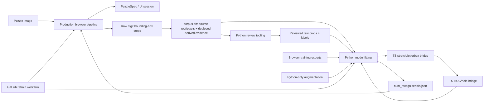

# Python/TypeScript Production-Boundary Cleanup Design

**Date:** 2026-07-28

**Status:** Approved direction, based on the repository audit and the user's
explicit requirements in the review conversation.

## Decision

TypeScript is the sole source of truth for every operation that contributes to
the deployed puzzle interpretation or reproduces deployed recogniser behaviour.
Python remains only where it has a distinct offline responsibility:

- fitting the deployed digit recogniser with `scikit-learn`;
- generating training-only augmentation;
- curating human-reviewed labels;
- selecting a named crop-warp strategy and orchestrating TypeScript crop
  warping/feature extraction in batches; and
- serving as a private implementation language for GitHub Actions' R2 helpers.

Python must not locate grids, implement crop warping, find digit rectangles, build
cage totals, detect borders, validate puzzle layouts, solve puzzles, reconstruct
deployed classifier votes, or emulate production crop geometry.

The cleanup is deletion-first. A caller that has no place in the target
architecture is removed before its dependencies are refactored. Within a
retained file, an unused branch or function is deleted before the surviving
code is reorganised. Tests are migrated or deleted with the behaviour they
protect; they are not rewritten to preserve an API that is about to disappear.

## Why this cleanup is necessary

### Independent production implementations drift

The browser is the only deployable runtime, but the repository contains a
second image pipeline under `killer_sudoku/image/`. It independently performs:

- grayscale preparation and grid location;
- perspective warping and rotation;
- puzzle-type classification;
- classic-digit and killer-total localisation;
- cage-border detection;
- contour-tree walking and digit splitting;
- number recognition;
- cage-layout validation and `PuzzleSpec` construction.

Running the same corpus through this Python pipeline does not test the browser
pipeline. It tests a different implementation. A passing Python result can
therefore conceal a browser regression, which has already happened in grid
location and crop extraction.

The same issue exists below the image level. Python contains independent
implementations of:

- RBF-SVM one-vs-one voting;
- HOG-model loading and prediction;
- recognition crop stretch/letterboxing;
- digit-rectangle localisation; and
- solver-facing coordinate conversion.

The correct response is not to add agreement tests between implementations.
The correct response is to remove the second implementation and call or consume
the production TypeScript result.

### Exercised code can still be redundant

Reachability alone is not evidence that code deserves to survive. Several
Python paths are reachable only from manual tools, historical comparison
harnesses, or tests written specifically for those paths.

Examples:

- `InpImage` is reached by `evaluate.py`, `agreement_pool.py`, and Python OCR
  tests. None is part of the deployed web application.
- `agreement_pool.py` is reached by `train_combinations.py` and by
  `review_low_confidence.py` only because the review tool refits a model before
  showing already-cached production crops.
- `hog_model_loader.py` is test-only after TypeScript prediction was introduced.
- `border_detection.py` has no callers.
- the split recogniser is downloaded at web-app startup and threaded into
  `parsePuzzleImage`, but `parsePuzzleImage` never reads it.

Refactoring these paths because they are reachable would preserve the wrong
architecture. Their callers must first be classified as retained or removed.

## Inconsistencies found during the review

### Scheduled “Evaluate accuracy” does not evaluate the new model

`.github/workflows/retrain.yml` invokes:

```text
python -m killer_sudoku.training.evaluate ... --compare web/public/eval_report.json
```

`evaluate.main()` handles `--compare` by comparing existing reports and
returning. It does not call `collect_status`, does not run `InpImage`, and does
not evaluate the newly trained `web/public/num_recogniser.*` files.

Consequences:

- CI provides no evidence that the new model works in the browser.
- The old implementation plan incorrectly cites this workflow as a reason the
  Python image pipeline must remain.
- Maintaining or refactoring `evaluate.py` does not improve the real gate.

The replacement gate must run the production browser pipeline against the
newly written model and fail on per-puzzle regressions.

### The active recogniser is HOG/RBF, while docs and a test say PCA/RBF

The current sources disagree:

- `web/public/num_recogniser.json` has `classifier_type: "rbf"`;
- `web/train_recogniser.py` sets `ACTIVE_RECOGNISER = HogRecogniser()`;
- `docs/architecture.md` and `docs/image-pipeline.md` say PCA/RBF is currently
  shipped; and
- `tests/test_train_recogniser.py` expects `ACTIVE_RECOGNISER` to be
  `PcaRbfRecogniser`.

This is not a useful pluggable architecture. It is an ambiguous choice of
production model with stale alternate paths. The cleanup standardises on the
model actually shipped and trained by CI: HOG/hole features plus the exported
RBF classifier. PCA training, conversion, package data, and browser loader
branches are removed unless a separate future design supplies a concrete
retained use.

### The current cache loses strategy-neutral crops and then double-warps thumbnails

`cell_reads.crop_pixels` currently contains the 64×64 thumbnail used by the
active production recogniser. It is useful for reproducing a deployed
prediction, but it has already committed to that recogniser's stretch or
letterbox strategy. It cannot support a fair training comparison between crop
warps.

The review/training path compounds the problem: it treats this canonical
thumbnail as a raw bounding-box crop and sends it through
`HogRecogniser.warp_from_rect` or `ACTIVE_RECOGNISER.fit_to_thumbnail` again.
Comments call the crop raw while the stored data is already warped.

The corrected cache contract stores both source and derived evidence per digit:

```text
source_x/source_y/source_width/source_height
source_pixels          # exact bounding-box pixels copied from the warped grid
warp_strategy          # strategy used for the deployed prediction
recognition_pixels     # derived 64×64 production recogniser input
hog_features/hole_features/prediction
```

`source_pixels` is strategy-neutral and its length must equal
`source_width * source_height`. Cropping remains exclusively in the browser
pipeline: Python never chooses or adjusts the bounding box. Python training may
choose `stretch` or `letterbox`, but it obtains the derived 64×64 thumbnails by
calling the TypeScript warp implementation used by production.

Review candidates and manual overrides preserve the raw source crop and its
dimensions. This lets a corrected label be re-used under either warp strategy.
The cached `recognition_pixels` remain available for audits that must reproduce
the exact deployed prediction.

Historical browser-training records that contain only a 64×64 thumbnail cannot
be made strategy-neutral after the fact. They are explicitly tagged as legacy
canonical samples with the strategy that produced them and are eligible only
when that same strategy is selected. They are never relabelled as raw. New
browser exports, corpus rows, and review overrides carry the raw source crop.

### Python coordinate conventions contradict the repository convention

The project requires row-major grids, but the Python `PuzzleSpec` structures
used by `ts_bridge.solve()` are transposed before entering TypeScript. The
bridge contains comments explaining that the Python implementation is
col-major despite stale docstrings.

The target architecture removes the Python puzzle-spec and solver bridge path
instead of repairing coordinates in code that has no retained caller.

### The split recogniser performs startup work with no consumer

`main.ts` waits for `loadSplitRec()`. `store.ts` fetches and parses
`split_recogniser.bin` and `.json`. `parsePuzzleImage()` accepts `_splitRec`,
but never reads it; digit splitting uses the ink-profile implementation.

This is production code that is exercised but cannot affect the resulting
puzzle. It and its trainer/assets are removed as an early, self-contained
deletion.

### The old implementation plan closed its essential tasks for stale reasons

`docs/superpowers/plans/2026-07-26-ts-single-source-of-truth.md` originally
planned to retire Python grid/image logic, digit rectangles, and classifier
implementations in Tasks 9–11, then recorded those tasks as non-goals.

The recorded blockers are not architectural requirements:

- two recognisers need two predictions, not two geometry pipelines;
- the scheduled Python evaluation is compare-only;
- production browser evaluation can run on demand and need not rely only on an
  existing cache; and
- current TypeScript already supports the shipped HOG/RBF model, so the legacy
  PCA checkpoint need not be preserved merely to support a manual agreement
  harness.

This design supersedes that post-implementation decision.

## Retained external surface

### Human-invoked Python

Only recogniser-training and recogniser-curation commands remain:

- `python web/train_recogniser.py ...`
- `python killer_sudoku/training/review_low_confidence.py ...`
- `python killer_sudoku/training/apply_review_corrections.py ...`

The latter two are part of the recogniser-training workflow, not general image
or puzzle-processing CLIs.

There are no installed `ks-*` console scripts. In particular,
`ks-train-numbers`, `ks-scrape`, and `ks-evaluate` are removed.

### GitHub Actions Python

The following scripts remain private CI helpers:

- `scripts/_r2_list.py`
- `scripts/_r2_download.py`
- `scripts/_r2_delete.py`

The retrain workflow may invoke `web/train_recogniser.py`. Model evaluation is
TypeScript/browser-driven.

### Python-to-TypeScript bridge

After caller removal, the bridge exposes two operations:

```python
@dataclass(frozen=True)
class RawDigitCrop:
    pixels: npt.NDArray[np.uint8]  # shape (height, width)


def warp_crops(
    crops: Sequence[RawDigitCrop],
    strategy: Literal["stretch", "letterbox"],
    size: int = 64,
) -> npt.NDArray[np.uint8]: ...  # shape (n, size, size)


def extract_features(
    crops: Sequence[npt.NDArray[np.uint8]],
) -> tuple[npt.NDArray[np.float64], npt.NDArray[np.float64]]: ...
```

`warp_crops` calls TypeScript/OpenCV.js code shared with the browser recogniser.
Python selects the named strategy but never implements it. `extract_features`
accepts only canonical square arrays and calls the production `hogExtract` and
`extractHoleFeatures` implementations. Both operations batch requests.

`predict` and `solve` are removed when their manual/legacy Python callers are
removed. Prediction validation belongs in TypeScript; puzzle solving has no
retained Python consumer.

## Target data flow



Python never reconstructs the path from `IMG` to `SPEC`, `RAW`, `DB`, or a
deployed prediction. It receives browser-selected raw crops and may request a
named TypeScript warp strategy before fitting.

## Deletion-first execution rules

### Whole-module rule

For any module proposed for refactoring:

1. enumerate external callers;
2. classify every caller as retained or removed;
3. remove non-retained callers first;
4. delete the module if no retained caller remains; and
5. refactor only if a retained caller still requires it.

`InpImage` must therefore be deleted after `evaluate.py` and
`agreement_pool.py` are removed; it must not be converted into a cache adapter.

### Function-level rule

Within a retained file:

1. find references to the function or branch;
2. delete unused modes and their tests;
3. collapse single-implementation abstractions;
4. then simplify names, types, and control flow.

Examples:

- remove review “confidence” scoring and model fitting before simplifying the
  conflict-review renderer;
- remove `PcaRbfRecogniser` before simplifying the surviving HOG trainer;
- remove `fit_to_thumbnail`/`warp_from_rect` callers before deleting those
  methods;
- remove `predict`/`solve` bridge callers before narrowing the dispatcher.

### Test rule

A test survives only if it protects retained behaviour. Do not rewrite:

- Python OCR tests against a cache-backed `InpImage`;
- legacy PCA loader accuracy tests against another adapter;
- agreement-pool tests against production cached crops; or
- Python evaluator tests against a TypeScript wrapper.

Delete those tests with their subject. Add replacement tests at the retained
boundary: browser evaluation, raw-crop persistence plus derived-evidence schema,
HOG model loading, warp parity, and feature-bridge batching.

## Error handling

- A raw crop with non-positive dimensions or `pixels.length !== width * height`
  is a hard validation error containing the source file and sample key.
- A TypeScript warp/feature-bridge failure raises; Python never falls back to
  local warping or feature extraction.
- A canonical crop returned by the warp bridge must be exactly 64×64 before it
  enters augmentation or feature extraction.
- Browser CI evaluation fails if any puzzle's outcome rank is worse than the
  committed baseline: `clean > backtracked > notSolved`.
- Missing model files, malformed manifests, or an unsupported classifier type
  fail browser startup and CI explicitly.
- Cache absence in review tooling is an instruction to run the browser corpus
  evaluator; it never invokes Python OCR.

## Out of scope

- Changing OCR thresholds, border heuristics, or recogniser hyperparameters.
- Changing Sudoku coaching rules or UI behaviour.
- Preserving historical PCA or split-recogniser experiments for hypothetical
  future comparisons.
- Aesthetic frontend work.
- Replacing the R2 Python helpers solely to reach a zero-Python repository.

## Success criteria

- No Python file imports `killer_sudoku.image` or `killer_sudoku.solver`.
- Those two packages no longer exist.
- No Python code implements grid location, perspective crop warping, contour
  selection, deployed model prediction, or puzzle solving.
- `pyproject.toml` exposes no `ks-*` scripts.
- The only human-facing Python files are recogniser training/curation.
- The only other executable Python files are the three R2 helpers and local
  quality/tooling hooks.
- `cell_reads` stores every digit's raw bounding-box pixels and dimensions,
  alongside the deployed strategy and derived 64×64 recognition evidence.
- `ts_bridge.py` exposes only batched TypeScript warping and feature extraction.
- The web app makes no request for split-recogniser assets.
- Reviewed raw crops can be rewarped once as either stretch or letterbox during
  training; canonical deployed thumbnails are never treated as raw.
- CI evaluates the newly trained model through the production browser pipeline.
- Architecture and pipeline docs name HOG/RBF as the sole shipped recogniser.
- Bronze and silver gates pass.
